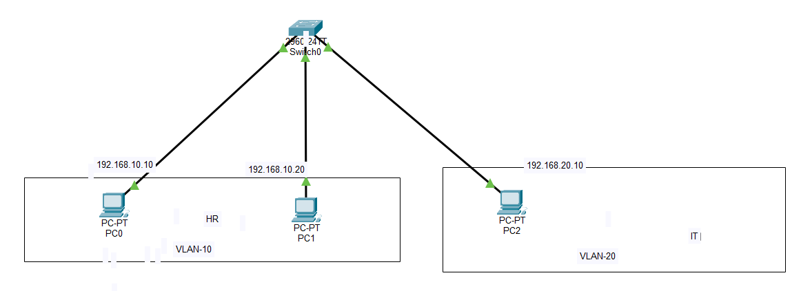
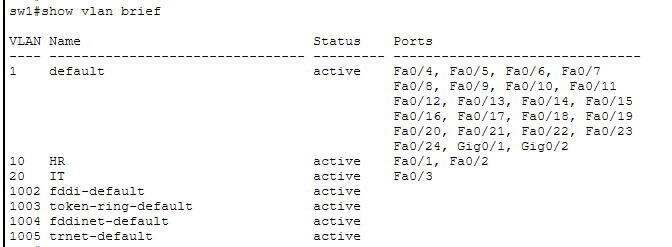
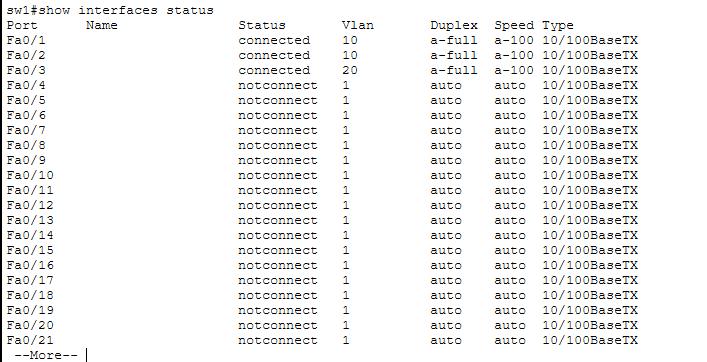

# LAB 02 — VLAN Access Port Configuration

## 📌 Overview

This lab demonstrates the creation and configuration of VLANs on a Cisco Layer 2 switch using Cisco Packet Tracer.

Access ports are assigned to different VLANs to logically separate devices within the same physical switch.

---

## 🎯 Objective

The objectives of this lab are to:

* Create VLAN 10 and VLAN 20.
* Assign switch access ports to the appropriate VLANs.
* Configure ports as static access ports.
* Verify VLAN membership.
* Verify switch-port configuration.
* Understand basic Layer 2 network segmentation.

---

## 🧪 Lab Environment

| Component       | Details              |
| --------------- | -------------------- |
| Simulation Tool | Cisco Packet Tracer  |
| Network Device  | Cisco Layer 2 Switch |
| Switch Hostname | SW1                  |
| VLANs           | VLAN 10, VLAN 20     |
| Port Type       | Access Port          |
| Network Layer   | Layer 2              |

---

## 🌐 VLAN Design

| VLAN    | Purpose      | Switch Ports |
| ------- | ------------ | ------------ |
| VLAN 10 | User Network | Fa0/1, Fa0/2 |
| VLAN 20 | User Network | Fa0/3        |

### Port Assignment

```text
SW1
│
├── Fa0/1 → VLAN 10
├── Fa0/2 → VLAN 10
└── Fa0/3 → VLAN 20
```

---

## ⚙️ Configuration Performed

The following configuration was performed on switch `SW1`:

* Created VLAN 10.
* Created VLAN 20.
* Configured `FastEthernet0/1` as an access port in VLAN 10.
* Configured `FastEthernet0/2` as an access port in VLAN 10.
* Configured `FastEthernet0/3` as an access port in VLAN 20.
* Verified the VLAN and interface configuration.

---

## 💻 Key Configuration Commands

### Create VLANs

```cisco
enable
configure terminal

vlan 10
exit

vlan 20
exit
```

### Configure VLAN 10 Access Ports

```cisco
interface range fastethernet 0/1 - 2
switchport mode access
switchport access vlan 10
exit
```

### Configure VLAN 20 Access Port

```cisco
interface fastethernet 0/3
switchport mode access
switchport access vlan 20
exit
```

---

## 🔎 Verification

### 1. Verify VLANs

```cisco
show vlan brief
```

This command verifies:

* VLAN 10 exists.
* VLAN 20 exists.
* Fa0/1 and Fa0/2 belong to VLAN 10.
* Fa0/3 belongs to VLAN 20.

---

### 2. Verify Interface Status

```cisco
show interfaces status
```

This command verifies the operational status and VLAN assignment of switch ports.

---

### 3. Verify Specific Interface Configuration

```cisco
show running-config
```

The running configuration confirms:

```cisco
interface FastEthernet0/1
 switchport access vlan 10
 switchport mode access

interface FastEthernet0/2
 switchport access vlan 10
 switchport mode access

interface FastEthernet0/3
 switchport access vlan 20
 switchport mode access
```

---

## 🖥️ Expected VLAN Behavior

Devices connected to ports in the **same VLAN** should be able to communicate at Layer 2, assuming their IP addressing is correctly configured.

For example:

```text
VLAN 10
PC0 ─── Fa0/1 ──┐
                │
PC1 ─── Fa0/2 ──┤ SW1
                │
VLAN 20         │
PC2 ─── Fa0/3 ──┘
```

Devices in VLAN 10 are separated from devices in VLAN 20 at Layer 2.

> **Important:** VLANs cannot communicate with each other through a Layer 2 switch alone. Inter-VLAN communication requires a Layer 3 device such as a router or Layer 3 switch.

---

## 📸 Lab Screenshots

### VLAN Topology



### VLAN Verification



### Port Status



> Add the corresponding screenshots to this folder and update the filenames above if necessary.

---

## 📋 Actual Configuration Verification

The switch running configuration showed the following access-port assignments:

```text
FastEthernet0/1 → VLAN 10
FastEthernet0/2 → VLAN 10
FastEthernet0/3 → VLAN 20
```

The ports were configured using:

```cisco
switchport mode access
switchport access vlan <VLAN-ID>
```

---

## 🔐 Security Considerations

Access ports should normally be configured explicitly as access ports rather than relying on automatic negotiation.

This lab uses:

```cisco
switchport mode access
```

This helps ensure that the intended ports operate as Layer 2 access ports.

For production environments, additional access-port security measures such as:

* Port Security
* Unused-port shutdown
* BPDU Guard
* Storm Control

may also be considered.

---

## 🛠️ Skills Demonstrated

* Cisco IOS CLI
* VLAN creation
* VLAN configuration
* Access-port configuration
* Static VLAN assignment
* Layer 2 network segmentation
* VLAN verification
* `show vlan brief`
* `show interfaces status`
* `show running-config`
* Cisco Packet Tracer

---

## 📂 Lab Files

| File                    | Description                                 |
| ----------------------- | ------------------------------------------- |
| `README.md`             | Lab documentation and configuration details |
| `Lab-02.pkt`            | Cisco Packet Tracer lab file                |
| `topology.png`          | VLAN network topology                       |
| `vlan-verification.png` | VLAN verification screenshot                |
| `port-status.png`       | Switch-port status screenshot               |

---

## 📚 CCNA 200-301

This lab is part of my **CCNA 200-301 Networking Lab Series**.

### Topics Covered

* Basic Switch Configuration
* VLANs
* Access Ports
* Trunking
* Inter-VLAN Routing
* DHCP
* Layer 2 Switching
* Network Segmentation

**Lab Status:** ✅ Completed
