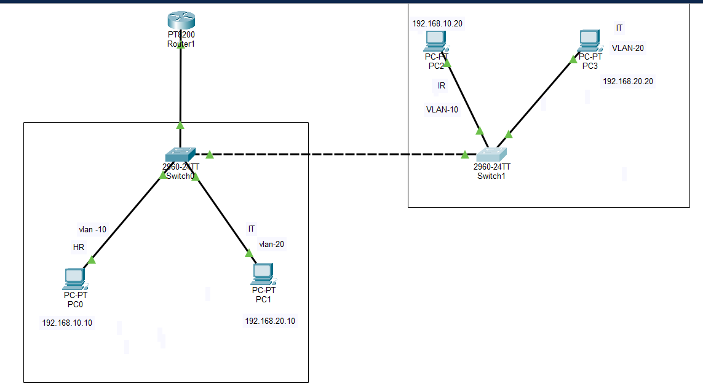
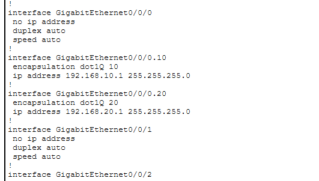
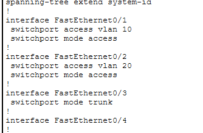
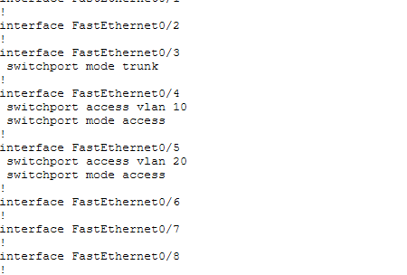
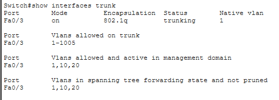
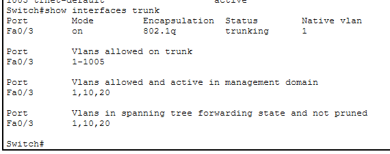
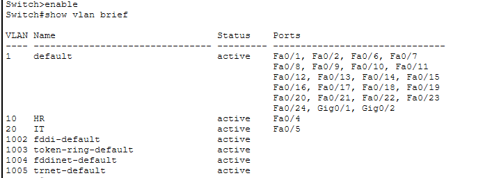
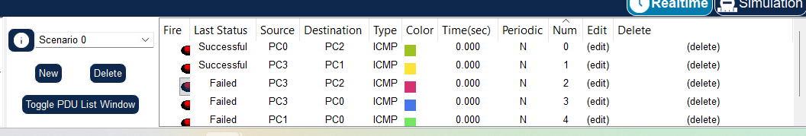

# LAB 04 — Inter-VLAN Routing (Router-on-a-Stick)

## 📌 Overview

This lab demonstrates **Inter-VLAN Routing** using the **Router-on-a-Stick** method with a Cisco router and two Layer 2 switches.

The lab uses **IEEE 802.1Q trunking** and router subinterfaces to enable communication between **VLAN 10 (HR)** and **VLAN 20 (IT)**.

---

## 🎯 Objective

The objectives of this lab are to:

* Configure VLAN 10 and VLAN 20.
* Assign PC-facing switch ports to the appropriate VLANs.
* Configure IEEE 802.1Q trunk links.
* Configure Router-on-a-Stick using router subinterfaces.
* Configure default gateways for each VLAN.
* Enable communication between different VLANs.
* Verify VLAN and trunk configurations.
* Test Layer 3 connectivity using ICMP ping.

---

## 🧪 Lab Environment

| Component       | Details             |
| --------------- | ------------------- |
| Simulation Tool | Cisco Packet Tracer |
| Router          | Cisco PT Router     |
| Switches        | 2 × Cisco 2960-24TT |
| VLANs           | VLAN 10 and VLAN 20 |
| Routing Method  | Router-on-a-Stick   |
| Trunk Protocol  | IEEE 802.1Q         |
| Network Layer   | Layer 3             |

---

## 🌐 Network Topology



---

## 🗂️ VLAN and IP Addressing

### VLAN Configuration

| VLAN    | Department | Network         | Default Gateway |
| ------- | ---------- | --------------- | --------------- |
| VLAN 10 | HR         | 192.168.10.0/24 | 192.168.10.1    |
| VLAN 20 | IT         | 192.168.20.0/24 | 192.168.20.1    |

### End Device Addressing

| Device | VLAN    | IP Address    | Default Gateway |
| ------ | ------- | ------------- | --------------- |
| PC0    | VLAN 10 | 192.168.10.10 | 192.168.10.1    |
| PC2    | VLAN 10 | 192.168.10.20 | 192.168.10.1    |
| PC1    | VLAN 20 | 192.168.20.10 | 192.168.20.1    |
| PC3    | VLAN 20 | 192.168.20.20 | 192.168.20.1    |

---

## ⚙️ Configuration Performed

The following configurations were performed:

* VLAN 10 configured for HR.
* VLAN 20 configured for IT.
* PC-facing ports configured as access ports.
* Trunk links configured between network devices.
* Router-on-a-Stick configured using router subinterfaces.
* IEEE 802.1Q encapsulation configured.
* Default gateways configured for VLAN 10 and VLAN 20.
* VLAN and trunk configurations verified.
* Router configuration verified.
* Inter-VLAN connectivity tested using ICMP.

---

# 🔹 Router-on-a-Stick Configuration

## Physical Interface

```cisco
interface GigabitEthernet0/0/0
 no ip address
 duplex auto
 speed auto
```

## VLAN 10 Subinterface

```cisco
interface GigabitEthernet0/0/0.10
 encapsulation dot1Q 10
 ip address 192.168.10.1 255.255.255.0
```

**VLAN 10 Default Gateway:** `192.168.10.1`

## VLAN 20 Subinterface

```cisco
interface GigabitEthernet0/0/0.20
 encapsulation dot1Q 20
 ip address 192.168.20.1 255.255.255.0
```

**VLAN 20 Default Gateway:** `192.168.20.1`

---

# 🔹 Switch Configuration

## VLAN 10 Access Port

```cisco
interface FastEthernet0/1
 switchport access vlan 10
 switchport mode access
```

## VLAN 20 Access Port

```cisco
interface FastEthernet0/2
 switchport access vlan 20
 switchport mode access
```

## Trunk Ports

```cisco
interface FastEthernet0/3
 switchport mode trunk

interface FastEthernet0/4
 switchport mode trunk
```

The trunk links carry **VLAN 10 and VLAN 20 traffic** between the switches and router.

---

# 🔎 Verification Commands

## Verify Router Configuration

```cisco
show running-config
```

## Verify Router Interfaces

```cisco
show ip interface brief
```

## Verify VLANs

```cisco
show vlan brief
```

## Verify Trunk Configuration

```cisco
show interfaces trunk
```

---

# 📸 Verification Screenshots

## Router Running Configuration



---

## Trunk Running Configuration — Switch 1



---

## Trunk Running Configuration — Switch 2



---

## Trunk Verification — Switch 1



---

## Trunk Verification — Switch 2



---

## VLAN Verification — Switch 1


---

## VLAN Verification — Switch 2



---

# 🌐 Connectivity Testing

Inter-VLAN connectivity was tested using **ICMP ping**.

### Test Examples

```text
PC0 → PC1
192.168.10.10 → 192.168.20.10

PC1 → PC3
192.168.20.10 → 192.168.20.20

PC2 → PC0
192.168.10.20 → 192.168.10.10
```

The Packet Tracer connectivity test demonstrated successful communication between devices in different VLANs.



---

# 🔄 How Inter-VLAN Routing Works

VLAN 10 and VLAN 20 are separate **Layer 2 broadcast domains**.

The router provides **Layer 3 communication** between the VLANs using router subinterfaces.

```text
VLAN 10
192.168.10.0/24
        |
        | 802.1Q
        |
G0/0/0.10
192.168.10.1
        |
      Router
        |
G0/0/0.20
192.168.20.1
        |
        | 802.1Q
        |
VLAN 20
192.168.20.0/24
```

The `encapsulation dot1Q` command identifies the VLAN associated with each router subinterface.

For example:

```cisco
interface GigabitEthernet0/0/0.10
 encapsulation dot1Q 10
```

This associates subinterface `G0/0/0.10` with **VLAN 10**.

Similarly:

```cisco
interface GigabitEthernet0/0/0.20
 encapsulation dot1Q 20
```

associates the subinterface with **VLAN 20**.

---

# ✅ Expected Result

After completing the configuration:

* VLAN 10 and VLAN 20 are configured.
* PC-facing interfaces operate as access ports.
* Trunk links carry VLAN 10 and VLAN 20 traffic.
* Router subinterface `G0/0/0.10` provides the gateway for VLAN 10.
* Router subinterface `G0/0/0.20` provides the gateway for VLAN 20.
* IEEE 802.1Q encapsulation is configured.
* Devices within the same VLAN can communicate.
* Devices in different VLANs can communicate through the router.
* Inter-VLAN routing works successfully.

---

# 🛠️ Skills Demonstrated

* Cisco IOS CLI
* VLAN configuration
* Access-port configuration
* IEEE 802.1Q trunking
* Router-on-a-Stick
* Router subinterfaces
* Inter-VLAN routing
* IP addressing
* Default gateway configuration
* Layer 2 switching
* Layer 3 routing
* Network troubleshooting
* Cisco Packet Tracer
* Network verification
* ICMP connectivity testing

---

# 📂 Lab Files

| File                                              | Description                       |
| ------------------------------------------------- | --------------------------------- |
| `README.md`                                       | Lab documentation                 |
| `Lab-04-Inter-VLAN-Routing-Router-on-a-Stick.pkt` | Cisco Packet Tracer lab           |
| `topology.png`                                    | Network topology                  |
| `router-running-config.png`                       | Router running configuration      |
| `trunk-running-config.png`                        | Switch 1 trunk configuration      |
| `trunk-running-config-sw2.png`                    | Switch 2 trunk configuration      |
| `trunk-verification.png`                          | Switch 1 trunk verification       |
| `trunk-verification-sw2.png`                      | Switch 2 trunk verification       |
| `vlan-verification.png`                           | Switch 1 VLAN verification        |
| `vlan-verification-sw2.png`                       | Switch 2 VLAN verification        |
| `vlan-connectivity-test.png`                      | VLAN/inter-VLAN connectivity test |

---

# 📚 CCNA 200-301

This lab is part of my **CCNA 200-301 Practical Networking Lab Series**.

### Topics Covered

* VLANs
* IEEE 802.1Q Trunking
* Router-on-a-Stick
* Inter-VLAN Routing
* Router Subinterfaces
* Default Gateways
* Layer 2 Switching
* Layer 3 Routing
* Network Verification
* ICMP Connectivity Testing

---

## 🏁 Lab Status

**COMPLETED ✅**
