# LAB 06 — Static Routing

## 📌 Overview

This lab demonstrates how to configure **IPv4 Static Routing** between two separate Local Area Networks (LANs) connected via a point-to-point Wide Area Network (WAN) transit link using Cisco Packet Tracer.

Unlike dynamic routing protocols, static routing involves the manual entry of remote network paths into individual router routing tables. This provides complete control over traffic paths, low processing overhead, and higher security for small-scale enterprise environments.

The lab also verifies path validation, routing tables, traceroute paths, and end-to-end host connectivity across different subnets.

---

## 🎯 Objective

The objectives of this lab are to:

* Configure a multi-router network layout using Cisco Packet Tracer.
* Configure interface IP addressing for LAN and WAN segments.
* Understand the concept of next-hop parameters and exit interfaces.
* Configure manual static routes on Router1 to reach the remote LAN 2 subnet.
* Configure manual static routes on Router2 to reach the remote LAN 1 subnet.
* Verify operational interface states and line protocols using Cisco IOS.
* Validate static route convergence inside the IP Routing Table.
* Test bidirectional end-to-end host connectivity using ICMP Ping.
* Track the exact network hops using Traceroute path verification.

---

## 🧪 Lab Environment

| Component       | Details             |
| --------------- | ------------------- |
| Simulation Tool | Cisco Packet Tracer |
| Routers         | Router1, Router2    |
| Switches        | Switch1, Switch2    |
| End Devices     | PC1, PC2            |
| Network Type    | Hybrid LAN / WAN    |
| LAN 1 Subnet    | 192.168.10.0/24     |
| WAN Subnet      | 10.0.0.0/30         |
| LAN 2 Subnet    | 192.168.20.0/24     |

---

# 🌐 Network Topology

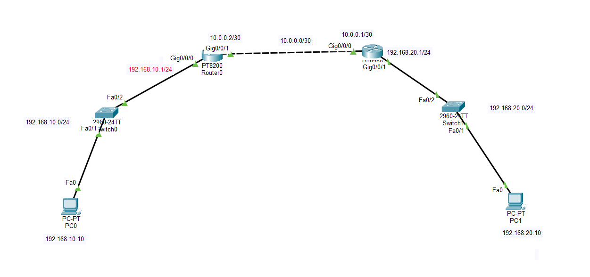

# 🗂️ IP Addressing

| Device  | Interface | IP Address      | Assignment | Default Gateway |
| ------- | --------- | --------------- | ---------- | --------------- |
| Router1 | G0/0/0    | 192.168.10.1/24 | Static     | N/A             |
| Router1 | G0/0/1    | 10.0.0.2/30     | Static     | N/A             |
| Router2 | G0/0/0    | 10.0.0.1/30     | Static     | N/A             |
| Router2 | G0/0/1    | 192.168.20.1/24 | Static     | N/A             |
| PC1     | NIC       | 192.168.10.10   | Static     | 192.168.10.1    |
| PC2     | NIC       | 192.168.20.10   | Static     | 192.168.20.1    |

### Static Routing Design

```text
Router1 Remote Subnet Target:  192.168.20.0/24 via Next-Hop IP: 10.0.0.1
Router2 Remote Subnet Target:  192.168.10.0/24 via Next-Hop IP: 10.0.0.2
```

---

# ⚙️ Static Route Configuration

## 1. Configure Router1 Static Route

Router1 requires an explicit path entry to reach the remote `192.168.20.0/24` network pointing to the WAN-facing interface of Router2.

```cisco
ip route 192.168.20.0 255.255.255.0 10.0.0.1
```

---

## 2. Configure Router2 Static Route

Router2 requires a matching asymmetric return path configuration targeting the `192.168.10.0/24` subnet via the WAN interface link of Router1.

```cisco
ip route 192.168.10.0 255.255.255.0 10.0.0.2
```

---

# 🔹 Router Interface Configuration

The routers' core LAN and WAN-facing interfaces were configured as follows:

### Router1 Configuration
```cisco
interface GigabitEthernet0/0/0
 ip address 192.168.10.1 255.255.255.0
 no shutdown
!
interface GigabitEthernet0/0/1
 ip address 10.0.0.2 255.255.255.252
 no shutdown
```

### Router2 Configuration
```cisco
interface GigabitEthernet0/0/0
 ip address 10.0.0.1 255.255.255.252
 no shutdown
!
interface GigabitEthernet0/0/1
 ip address 192.168.20.1 255.255.255.0
 no shutdown
```

---

# 💻 Complete Configuration

The complete configuration script used in this lab:

### Router1 Global Command Script
```cisco
enable
configure terminal
hostname Router1

interface GigabitEthernet0/0/0
 ip address 192.168.10.1 255.255.255.0
 no shutdown
exit

interface GigabitEthernet0/0/1
 ip address 10.0.0.2 255.255.255.252
 no shutdown
exit

ip route 192.168.20.0 255.255.255.0 10.0.0.1
end
write memory
```

### Router2 Global Command Script
```cisco
enable
configure terminal
hostname Router2

interface GigabitEthernet0/0/0
 ip address 10.0.0.1 255.255.255.252
 no shutdown
exit

interface GigabitEthernet0/0/1
 ip address 192.168.20.1 255.255.255.0
 no shutdown
exit

ip route 192.168.10.0 255.255.255.0 10.0.0.2
end
write memory
```

---

# 🖥️ Static Client Workspaces Verification

Each static endpoint properties setup was manually inspected on local interfaces.

### PC1 IP Configuration
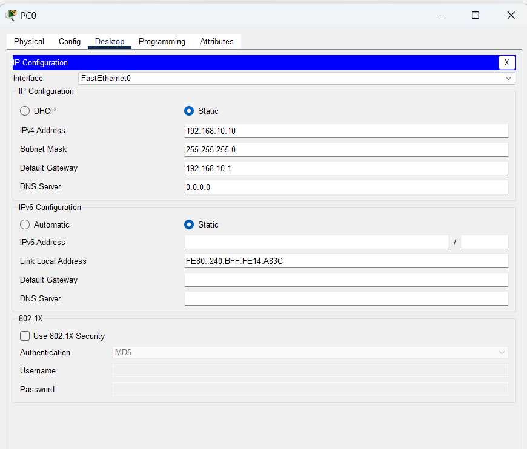

### PC2 IP Configuration
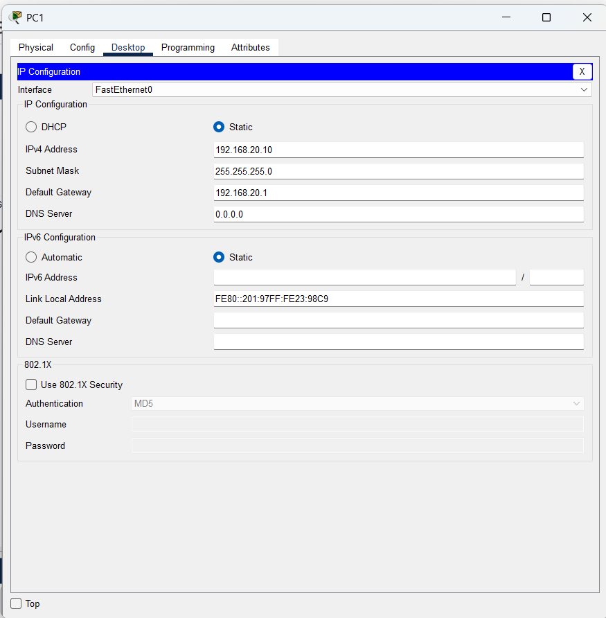

---

# 🔎 Verification & Screenshots

## 1. Verify Router Interface Status

The interface states and active IP address mappings were audited using the `show ip interface brief` command.

### Router1 Interface Properties
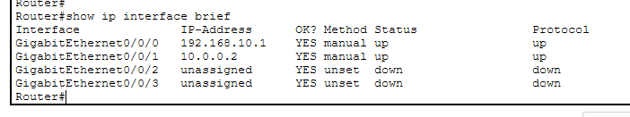

### Router2 Interface Properties
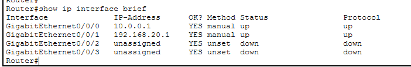

---

## 2. Verify Injected Static Routes Configuration

The active operational environment properties parameters were inspected inside the local config.

### Router1 Static Config Verification
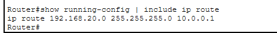

### Router2 Static Config Verification
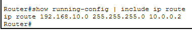

---

## 3. Verify IP Routing Table Matrices

The command `show ip route` prints the operational routing table convergence statistics from inside the hardware engine memory.

### Router1 IP Routing Table
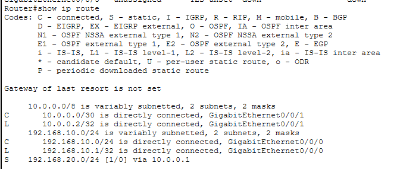

### Router2 IP Routing Table
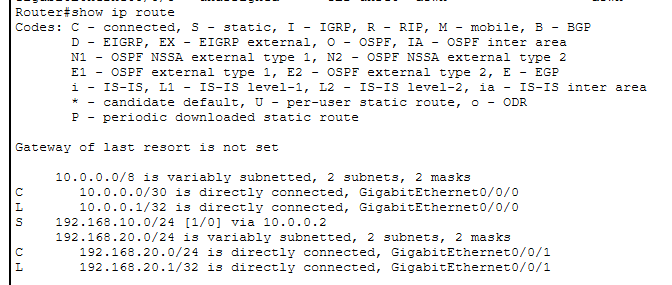

The presence of the network label designator prefix **`S` (Static)** denotes complete path operational correctness mapping out remote spaces.

---

# 🌐 Connectivity & Path Testing

## 1. ICMP End-to-End Ping Verification

After static routing successfully mapped the communication paths, bidirectional connectivity between the PCs was verified via standard **ICMP Echo Request** commands originating from Host **PC1** toward **PC2**.

```cmd
C:\> ping 192.168.20.10
```
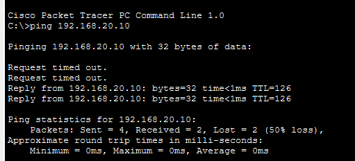

**ICMP Connectivity: SUCCESSFUL ✅ (0% packet loss)**

---

## 2. Traceroute Gateway Hop Diagnostics

To trace the path layer steps taken across the operational WAN boundaries, a `traceroute` check was performed from PC1 to confirm symmetrical gateway traversals.

```cmd
C:\> tracert 192.168.20.10
```
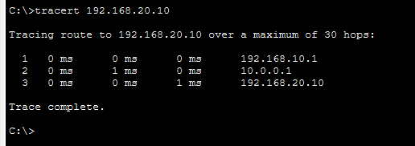

---

# 🔎 Verification Commands Summary

| Command                   | Purpose                                       |
| ------------------------- | --------------------------------------------- |
| `show ip interface brief` | Verify router interface status and IP address |
| `show ip route`           | Verify operational routing table paths map    |
| `show ip route static`    | Filter routing table entries to show static only|
| `show running-config`     | Verify active router configuration script     |
| `ping <Target-IP>`        | Test local and remote end-host reachability   |
| `tracert <Target-IP>`     | Trace network hops path behavior across WAN   |

---

# ✅ Expected Result

After completing the lab:
* Both Cisco routers successfully process manual network routing statements.
* Static paths explicitly route frames toward target remote spaces.
* PC1 successfully transports packets across the WAN network boundaries.
* PC2 responds correctly using symmetric static return mappings.
* End-to-end multi-segment host data communication occurs with 0% loss statistics.

---

# 📂 Lab Files

| File | Description |
| ---- | ----------- |
| `README.md` | Lab documentation (This File) |
| `LAB 06 — Static Routing Between Two Networks.pkt` | Cisco Packet Tracer lab network layout file |
| `01-Topology.png` | Network topology design layout |
| `02-PC1-IP-Configuration.png` | Static interface properties for PC1 |
| `03-PC2-IP-Configuration.png` | Static interface properties for PC2 |
| `04-R1-Interface-Configuration.png` | Router1 operational interface summary clip |
| `05-R2-Interface-Configuration.png` | Router2 operational interface summary clip |
| `06-R1-Static-Route.png` | Router1 global configuration verification clip |
| `07-R2-Static-Route.png` | Router2 global configuration verification clip |
| `08-R1-Routing-Table.png` | Router1 IP route engine tables snapshot |
| `09-R2-Routing-Table.png` | Router2 IP route engine tables snapshot |
| `10-Ping-Verification.png` | End-to-end success ping verification clip |
| `11-Traceroute-Verification.png` | Network path trace diagnostic hop analysis |

---

# 🔐 Security Considerations

This lab layout executes configuration models in an isolated network learning simulation environment.

For real production enterprise networks, additional perimeter and plane access controls must be deployed:

* Port Filters via standard Access Control Lists (ACLs) to block unintended network discovery.
* Unicast Reverse Path Forwarding (uRPF) interface validation to prevent IP spoofing attacks.
* VTY management terminal ingress access line rules restricting CLI control to authorized hosts only.
* Explicit Static Null0 Blackhole Route Configurations to drop traffic heading towards dead zones.
