# LAB 07 — Default Static Routing

## 📌 Overview

This lab demonstrates how to configure **IPv4 Default Static Routing** across a multi-hop linear environment using Cisco Packet Tracer. 

A Default Static Route (often referred to as the "Gateway of Last Resort") is configured with a destination address and subnet mask of `0.0.0.0 0.0.0.0`. This special route instructs a stub router that if it receives a packet destined for any remote network that does not explicitly match any other specific entry in its routing table, it must forward that packet to a designated next-hop upstream gateway. 

This lab illustrates how default routing minimizes routing table management and CPU overhead on stub edge devices (`Router1`) while establishing seamless end-to-end communication to deep networks via intermediate transit nodes (`Router2 -> Router3`).

---

## 🎯 Objective

The objectives of this lab are to:

* Configure a multi-router linear network backbone using Cisco Packet Tracer.
* Configure precise interface IPv4 addressing for local and sequential WAN transit segments.
* Analyze the concept of stub networks and evaluate why default routes are optimal for them.
* Configure a manual IPv4 Default Static Route (`0.0.0.0/0`) on the edge stub node (`Router1`).
* Configure intermediate static routes on transit nodes (`Router2`, `Router3`) to ensure symmetric reverse paths.
* Verify operational link states and line protocols across all networking infrastructure components.
* Validate the presence of the **`S*` (Static Default)** designator flag inside the IP Routing Engine.
* Test complete multi-hop data plane reachability using ICMP Echo Request/Reply routines.
* Track individual gateway hop transitions using Traceroute path diagnostics.

---

## 🧪 Lab Environment

| Component       | Details             |
| --------------- | ------------------- |
| Simulation Tool | Cisco Packet Tracer |
| Routers         | Router1, Router2, Router3 |
| Switches        | Cisco 2960-24TT     |
| End Devices     | PC1                 |
| Network Type    | Linear Stub-WAN Architecture |
| LAN Subnet      | 192.168.10.0/24     |
| WAN Link 1      | 10.0.0.0/30         |
| WAN Link 2      | 10.0.0.4/30         |

---

# 🌐 Network Topology

The lab topology maps an edge Local Area Network (LAN) terminating into a cascading serial/ethernet Wide Area Network (WAN) transit pipeline:

*   **LAN Subnet:** `192.168.10.0/24` (PC1 Host: `192.168.10.10`, Router1 Gateway: `192.168.10.1` on `Gig0/0`)
*   **WAN Transit Link 1:** `10.0.0.0/30` (Router1 IP: `10.0.0.1` on `Gig0/1`, Router2 IP: `10.0.0.2` on `Gig0/0`)
*   **WAN Transit Link 2:** `10.0.0.4/30` (Router2 IP: `10.0.0.5` on `Gig0/1`, Router3 IP: `10.0.0.6` on `Gig0/0`)

---

# 🗂️ IP Addressing Scheme

| Device  | Interface | IP Address      | Assignment | Default Gateway |
| ------- | --------- | --------------- | ---------- | --------------- |
| Router1 | G0/0 (LAN)| 192.168.10.1/24 | Static     | N/A             |
| Router1 | G0/1 (WAN)| 10.0.0.1/30     | Static     | N/A             |
| Router2 | G0/0 (WAN)| 10.0.0.2/30     | Static     | N/A             |
| Router2 | G0/1 (WAN)| 10.0.0.5/30     | Static     | N/A             |
| Router3 | G0/0 (WAN)| 10.0.0.6/30     | Static     | N/A             |
| PC1     | NIC       | 192.168.10.10   | Static     | 192.168.10.1    |

### Default Routing Logic Matrix

```text
Router1 (Stub Node) Target Profile: Any Destination (0.0.0.0/0) -> Forward to Upstream Next-Hop: 10.0.0.2
```

---

# ⚙️ Static Route Configuration

## 1. Configure Router1 Default Static Route
Since Router1 is a stub entity with only a single forwarding path leading out towards the rest of the operational network, a default static route pointing to Router2's ingress point is implemented.

```cisco
ip route 0.0.0.0 0.0.0.0 10.0.0.2
```

## 2. Configure Transit & Reverse Return Paths
To establish data-plane path symmetry, intermediate and remote systems must maintain accurate specific static route lines targeting the local LAN block.

### Router2 Transit Route
```cisco
ip route 192.168.10.0 255.255.255.0 10.0.0.1
```

### Router3 Remote Route
```cisco
ip route 192.168.10.0 255.255.255.0 10.0.0.5
```

---

# 🔹 Router Interface Configuration Script

Core architectural deployment blocks applied to system interfaces:

### Router1 Interface Provisioning
```cisco
interface GigabitEthernet0/0
 ip address 192.168.10.1 255.255.255.0
 no shutdown
exit

interface GigabitEthernet0/1
 ip address 10.0.0.1 255.255.255.252
 no shutdown
exit
```

### Router2 Interface Provisioning
```cisco
interface GigabitEthernet0/0
 ip address 10.0.0.2 255.255.255.252
 no shutdown
exit

interface GigabitEthernet0/1
 ip address 10.0.0.5 255.255.255.252
 no shutdown
exit
```

### Router3 Interface Provisioning
```cisco
interface GigabitEthernet0/0
 ip address 10.0.0.6 255.255.255.252
 no shutdown
exit
```

---

# 💻 Complete Configuration

The production CLI scripts configured within this environment:

### Router1 Global Config
```cisco
enable
configure terminal
hostname R1

interface GigabitEthernet0/0
 ip address 192.168.10.1 255.255.255.0
 no shutdown
exit

interface GigabitEthernet0/1
 ip address 10.0.0.1 255.255.255.252
 no shutdown
exit

ip route 0.0.0.0 0.0.0.0 10.0.0.2
end
write memory
```

### Router2 Global Config
```cisco
enable
configure terminal
hostname R2

interface GigabitEthernet0/0
 ip address 10.0.0.2 255.255.255.252
 no shutdown
exit

interface GigabitEthernet0/1
 ip address 10.0.0.5 255.255.255.252
 no shutdown
exit

ip route 192.168.10.0 255.255.255.0 10.0.0.1
end
write memory
```

### Router3 Global Config
```cisco
enable
configure terminal
hostname R3

interface GigabitEthernet0/0
 ip address 10.0.0.6 255.255.255.252
 no shutdown
exit

ip route 192.168.10.0 255.255.255.0 10.0.0.5
end
write memory
```

---

# 🔎 Verification & Screenshots

## 1. Verify Router Interface Status
Operational states and structural hardware parameters are audited using the `show ip interface brief` command string.

### Router1 Ingress Summary Status
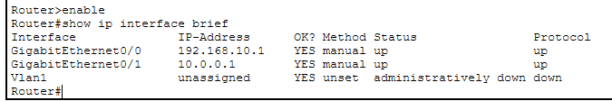

### Router2 Transit Summary Status
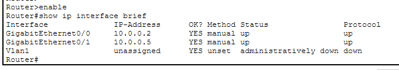

### Router3 Remote Summary Status
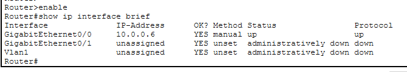

---

## 2. Verify Configured Routing Commands
The parameters verified inside the global status memory profiles indicate the correct entry structure.

### Router1 Active Configuration Verification
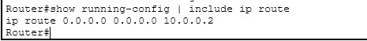

### Router2 Active Configuration Verification
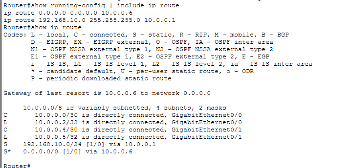

### Router3 Active Configuration Verification
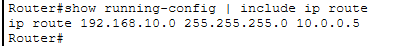

---

## 3. Verify IP Routing Table Convergence
The command `show ip route` captures the processing engine map paths from inside the active hardware memory base layers.

### Router1 Core Routing Table Database
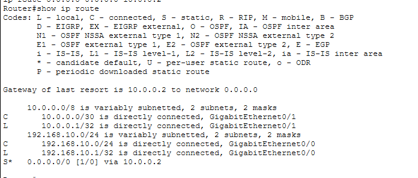

### Router2 Core Routing Table Database
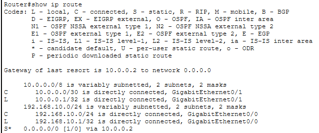

### Router3 Core Routing Table Database
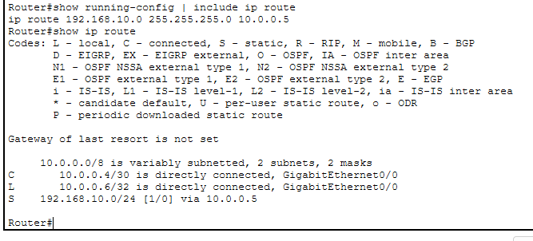

The strategic placement of the designator combination **`S*`** on Router1 confirms that the **Static Default Route** has integrated cleanly and the **Gateway of Last Resort** is operational.

---

# 🌐 Connectivity & Path Testing

## 1. ICMP Cross-WAN Reachability Verification
 Bidirectional packet forwarding across the multi-hop grid layout is verified via standard **ICMP Echo Request** commands originating from Host **PC1** toward the remote target endpoints.

```cmd
C:\> ping 10.0.0.6
```
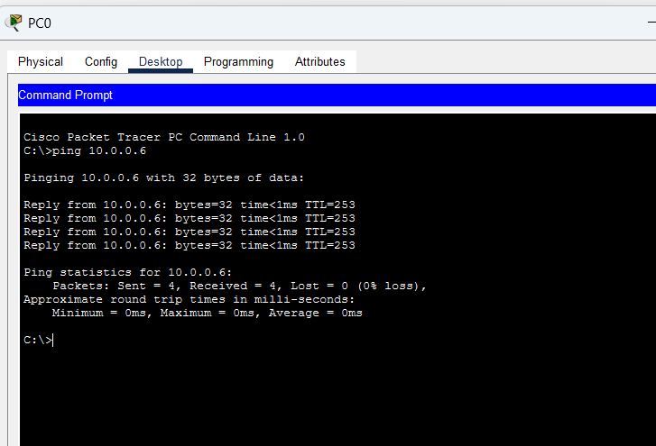

**ICMP Connectivity status: SUCCESSFUL ✅ (0% packet loss, stable round-trip metrics)**

---

## 2. Traceroute Hop Bound Diagnostics
To audit the structural line trajectory and count exact multi-hop handoffs over transit layers, a `tracert` routing check was executed from the client terminal workspace.

```cmd
C:\> tracert 10.0.0.6
```
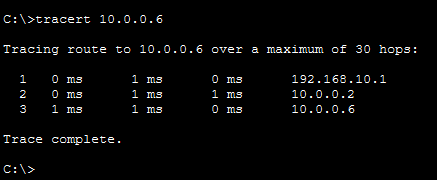

The clean sequential transition logs trace the correct layer routing mapping paths:
1. `192.168.10.1` (Local Default Gateway - R1)
2. `10.0.0.2` (Transit Network Intermediary Interface - R2)
3. `10.0.0.6` (Remote Target Hardware Ingress - R3)

---

# 🔎 Verification Commands Reference Guide

| Command                   | Functional Operational Purpose |
| ------------------------- | ------------------------------------------------------------- |
| `show ip interface brief` | Audit active hardware interface states and IP tracking address maps |
| `show ip route`           | Print entire live convergent routing engine path data engine  |
| `show ip route static`    | Filter routing table entries to show static/default entries only|
| `show running-config`     | Parse system startup config properties profiles data sheets   |
| `ping <Destination-IP>`   | Validate complete bidirectional packet flow accessibility grids |
| `tracert <Destination-IP>`| Map upstream boundary gateway path transitions behavior layout |

---

# ✅ Expected Lab Outcome

Upon correct application of configurations:
* Router1 acts as a lightweight stub agent carrying a simplified lookup database block.
