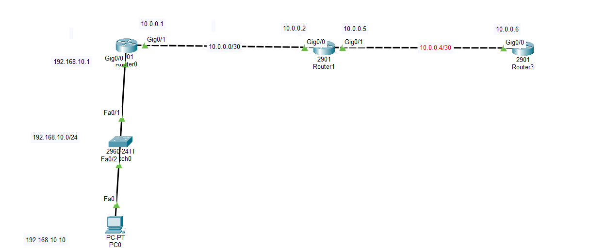
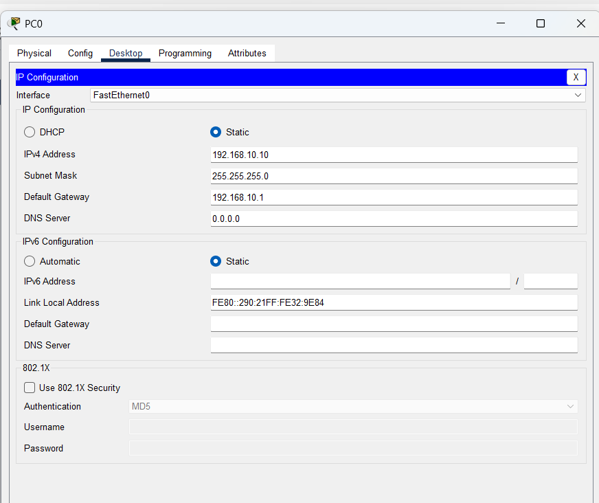
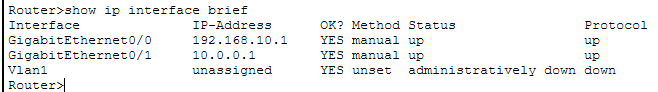
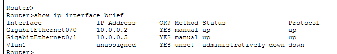
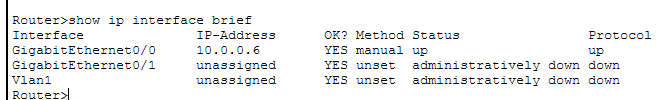
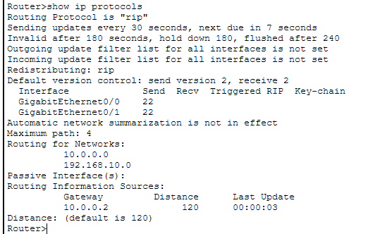
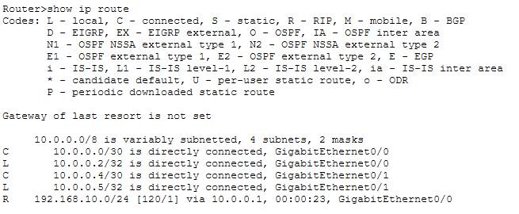
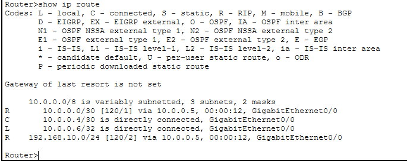
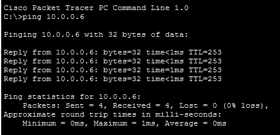
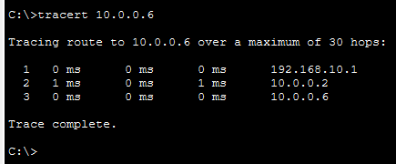

# LAB 08 — Dynamic Routing Using RIPv2

## 📌 Overview

This lab demonstrates how to configure **Routing Information Protocol Version 2 (RIPv2)** across a multi-hop cascading linear infrastructure using Cisco Packet Tracer.

Unlike static routing, RIPv2 is a classless, distance-vector dynamic routing protocol that uses hop count as its metric (maximum 15 hops) to automatically build and update network topologies. RIPv2 supports VLSM (Variable Length Subnet Masking), authentication, and uses multicast address `224.0.0.9` for routing updates every 30 seconds, ensuring faster convergence and zero manual route injection when remote networks scale.

The lab focuses on initializing dynamic network advertisements on edge and transit entities, disabling auto-summarization, and verifying loop-free routing engine databases.

---

## 🎯 Objective

The objectives of this lab are to:

* Configure a multi-router linear infrastructure backbone using Cisco Packet Tracer.
* Configure static IPv4 interface mappings for LAN hosts and sequential point-to-point WAN links.
* Understand the concept of distance-vector dynamic convergence and update intervals.
* Configure RIPv2 properties globally across all routers to advertise local subnets.
* Disable automatic network boundary route summarization (`no auto-summary`).
* Verify active dynamic database properties using Cisco IOS protocols verification commands.
* Validate dynamic route convergence marked with the **`R` (RIP)** designator prefix flag in routing tables.
* Test end-to-end bidirectional transport reachability using ICMP Echo routines.
* Track hop traversals over multi-segment environments using Traceroute path diagnostics.

---

## 🧪 Lab Environment

| Component       | Details             |
| --------------- | ------------------- |
| Simulation Tool | Cisco Packet Tracer |
| Routers         | Router0, Router1, Router3 |
| Switches         | Cisco 2960-24TT     |
| End Devices     | PC0                 |
| Network Type    | Linear WAN Topology |
| LAN Subnet      | 192.168.10.0/24     |
| WAN Link 1      | 10.0.0.0/30         |
| WAN Link 2      | 10.0.0.4/30         |

---

# 🌐 Network Topology

The network design maps a Local Area Network (LAN) edge environment terminating into two cascading Wide Area Network (WAN) transport layers:



*   **LAN Subnet:** `192.168.10.0/24` (PC0 Host: `192.168.10.10`, Router0 Gateway: `192.168.10.1` on `Gig0/0`)
*   **WAN Transit Link 1:** `10.0.0.0/30` (Router0 IP: `10.0.0.1` on `Gig0/1`, Router1 IP: `10.0.0.2` on `Gig0/0`)
*   **WAN Transit Link 2:** `10.0.0.4/30` (Router1 IP: `10.0.0.5` on `Gig0/1`, Router3 IP: `10.0.0.6` on `Gig0/0`)

---

# 🗂️ IP Addressing Blueprint

| Device  | Interface | IP Address      | Assignment | Default Gateway |
| ------- | --------- | --------------- | ---------- | --------------- |
| Router0 | G0/0 (LAN)| 192.168.10.1/24 | Static     | N/A             |
| Router0 | G0/1 (WAN)| 10.0.0.1/30     | Static     | N/A             |
| Router1 | G0/0 (WAN)| 10.0.0.2/30     | Static     | N/A             |
| Router1 | G0/1 (WAN)| 10.0.0.5/30     | Static     | N/A             |
| Router3 | G0/0 (WAN)| 10.0.0.6/30     | Static     | N/A             |
| PC0     | NIC       | 192.168.10.10   | Static     | 192.168.10.1    |

---

# ⚙️ RIPv2 Dynamic Protocol Configuration

To initialize global protocol properties, individual classful networks directly connected to each specific routing platform must be manually advertised.

### 1. Router0 Network Advertisements
```cisco
router rip
 version 2
 no auto-summary
 network 192.168.10.0
 network 10.0.0.0
```

### 2. Router1 Network Advertisements
```cisco
router rip
 version 2
 no auto-summary
 network 10.0.0.0
```
*(Note: Since classful boundary mapping covers both `10.0.0.0/30` and `10.0.0.4/30` subnets under the Class A `10.0.0.0` space, a single advertisement handles both transit links).*

### 3. Router3 Network Advertisements
```cisco
router rip
 version 2
 no auto-summary
 network 10.0.0.0
```

---

# 🔹 Router Interface Configuration Script

Baseline IP configurations deployed to hardware nodes:

### Router0 Interface Setup
```cisco
interface GigabitEthernet0/0
 ip address 192.168.10.1 255.255.255.0
 no shutdown
exit

interface GigabitEthernet0/1
 ip address 10.0.0.1 255.255.255.252
 no shutdown
exit
```

### Router1 Interface Setup
```cisco
interface GigabitEthernet0/0
 ip address 10.0.0.2 255.255.255.252
 no shutdown
exit

interface GigabitEthernet0/1
 ip address 10.0.0.5 255.255.255.252
 no shutdown
exit
```

### Router3 Interface Setup
```cisco
interface GigabitEthernet0/0
 ip address 10.0.0.6 255.255.255.252
 no shutdown
exit
```

---

# 💻 Complete Configuration

The final deployment script applied to individual IOS terminal prompts:

### Router0 Global Command Block
```cisco
enable
configure terminal
hostname Router0

interface GigabitEthernet0/0
 ip address 192.168.10.1 255.255.255.0
 no shutdown
exit

interface GigabitEthernet0/1
 ip address 10.0.0.1 255.255.255.252
 no shutdown
exit

router rip
 version 2
 no auto-summary
 network 192.168.10.0
 network 10.0.0.0
end
write memory
```

### Router1 Global Command Block
```cisco
enable
configure terminal
hostname Router1

interface GigabitEthernet0/0
 ip address 10.0.0.2 255.255.255.252
 no shutdown
exit

interface GigabitEthernet0/1
 ip address 10.0.0.5 255.255.255.252
 no shutdown
exit

router rip
 version 2
 no auto-summary
 network 10.0.0.0
end
write memory
```

### Router3 Global Command Block
```cisco
enable
configure terminal
hostname Router3

interface GigabitEthernet0/0
 ip address 10.0.0.6 255.255.255.252
 no shutdown
exit

router rip
 version 2
 no auto-summary
 network 10.0.0.0
end
write memory
```

---

# 🖥️ Static Client Workspaces Verification

Static fixed mapping profile parameters configured within the local host operating properties:

### PC0 IP Configuration


---

# 🔎 Verification & Screenshots

## 1. Verify Router Interface Status

Operational link protocol parameters were validated using the `show ip interface brief` execution string.

### Router0 Interface Properties


### Router1 Interface Properties


### Router3 Interface Properties


---

## 2. Verify Active Dynamic Protocol Parameters

To audit operational updates, send timers, and advertised parameters, the `show ip protocols` routing command line was reviewed.

### Router0 RIP Configuration Profile


---

## 3. Verify IP Routing Table Convergence

The routing engine database matrices were verified using the `show ip route` verification script.

### Router0 IP Routing Table


### Router1 IP Routing Table


### Router3 IP Routing Table


The strategic presence of the character prefix **`R` (RIP)** validates that remote network subnets are dynamically exchanged and added into the memory architecture with respective Administrative Distance (AD = 120) metrics.

---

# 🌐 Connectivity & Path Testing

## 1. ICMP Cross-WAN Reachability Verification

End-to-end transport layer testing was executed from **PC0** using **ICMP Echo Request** routines targeting the remote endpoints interface across the transit grids.

```cmd
C:\> ping 10.0.0.6
```


**ICMP Connectivity Status: SUCCESSFUL ✅ (0% packet loss, stable propagation times)**

---

## 2. Traceroute Hop Bound Diagnostics

To trace path behavior across intermediate layers, a `tracert` trace diagnostic tracking execution sequence was compiled from the host workspace:

```cmd
C:\> tracert 10.0.0.6
```


The sequence logs the explicit network boundary crossings:
1. `192.168.10.1` (Local Default Gateway Drop - Router0)
2. `10.0.0.2` (Intermediate Transit Hand-off Ingress - Router1)
3. `10.0.0.6` (Remote Target Termination Destination - Router3)

---

# 🔎 Verification Commands Summary

| Command                   | Purpose                                                     |
| ------------------------- | ----------------------------------------------------------- |
| `show ip interface brief` | Verify active interface hardware status and IP tracking maps|
| `show ip protocols`       | Verify active timers, parameters, and RIP version metrics   |
| `show ip route`           | Print the live converging routing table database engine     |
| `show ip route rip`       | Filter routing table entries to show RIPv2 routes only      |
| `show running-config`     | Verify running operational configurations lines script      |
| `ping <Destination-IP>`   | Test end-to-end bidirectional transport access over the WAN |
| `tracert <Destination-IP>`| Map explicit upstream packet flow and intermediate path hops|

---

# ✅ Expected Result

After completing the lab:
* RIPv2 actively converges across the network segments.
* Automatic network summarization stays disabled, supporting classless subnet routes.
