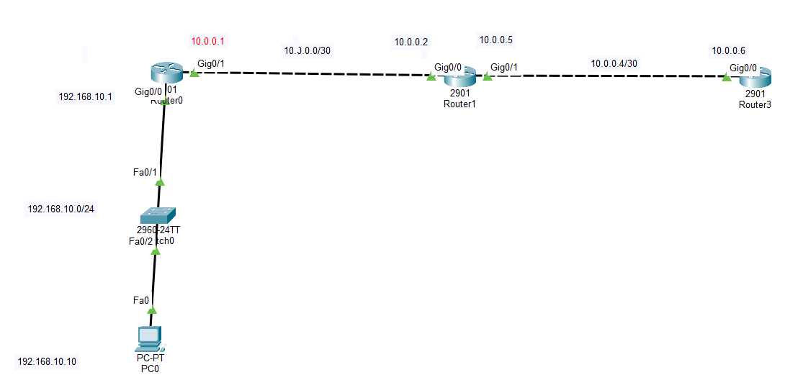
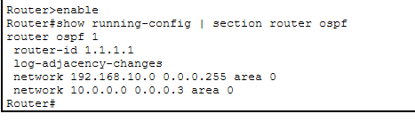
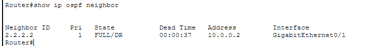
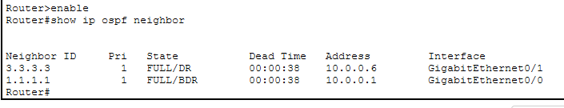
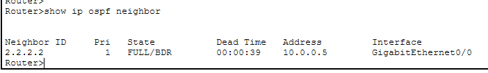
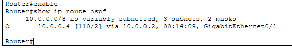
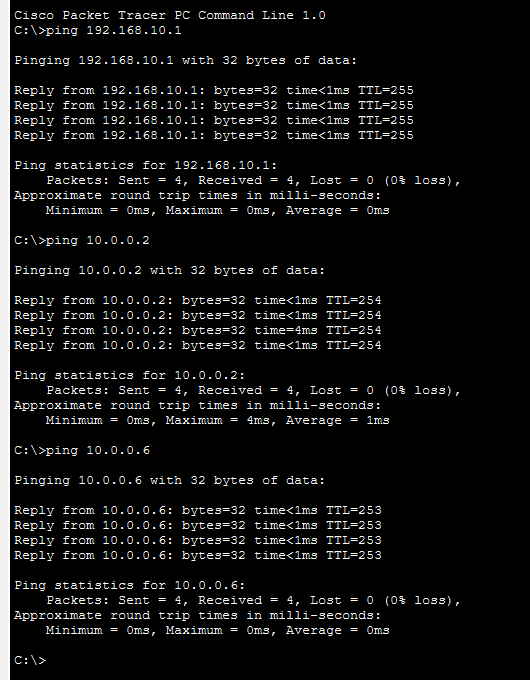

# LAB 09 — Dynamic Routing Using Single-Area OSPFv2

## 📌 Overview

This lab demonstrates how to configure **Open Shortest Path First Version 2 (OSPFv2)** inside a single operational area (**Area 0 / Backbone Area**) across a multi-hop cascading linear infrastructure using Cisco Packet Tracer.

Unlike distance-vector protocols (such as RIPv2), OSPFv2 is an advanced link-state dynamic routing protocol that uses the **Dijkstra Shortest Path First (SPF)** algorithm to build a loop-free network map based on bandwidth cost metrics. OSPFv2 triggers instantaneous incremental updates using Link-State Advertisements (LSAs) sent to multicast addresses `224.0.0.5` and `224.0.0.6` upon topology changes. This configuration delivers fast convergence times, efficient CPU scaling, and complete protocol reliability for modern enterprise backbones.

The lab focuses on initializing global OSPF process components, explicitly mapping wildcard masks, forming dynamic neighbor adjacencies, and verifying Link-State Database (LSDB) convergence.

---

## 🎯 Objective

The objectives of this lab are to:

* Configure a multi-router linear infrastructure backbone using Cisco Packet Tracer.
* Configure static IPv4 interface mappings for LAN hosts and sequential point-to-point WAN links.
* Understand the core concepts of link-state routing, wildcard masking, and area assignment.
* Configure global OSPFv2 routing processes with unique process IDs and manual Router IDs.
* Advertise directly connected networks accurately into OSPF Area 0 using wildcard masks.
* Verify active link-state neighbor adjacencies across all adjacent peers.
* Validate dynamic path convergence marked with the **`O` (OSPF)** designator flag in routing tables.
* Test end-to-end bidirectional data plane reachability across multi-hop domains using ICMP Echo routines.

---

## 🧪 Lab Environment

| Component       | Details             |
| --------------- | ------------------- |
| Simulation Tool | Cisco Packet Tracer |
| Routers         | Router0, Router1, Router3 |
| Switches        | Cisco 2960-24TT     |
| End Devices     | PC0                 |
| Network Type    | Single-Area OSPF Dynamic Infrastructure |
| LAN Subnet      | 192.168.10.0/24     |
| WAN Link 1      | 10.0.0.0/30         |
| WAN Link 2      | 10.0.0.4/30         |

---

# 🌐 Network Topology

The network design maps a Local Area Network (LAN) edge environment terminating into two cascading Wide Area Network (WAN) transport layers converged dynamically inside OSPF Backbone Area 0:



*   **LAN Subnet:** `192.168.10.0/24` (PC0 Host: `192.168.10.10`, Router0 Gateway: `192.168.10.1` on `Gig0/0`)
*   **WAN Transit Link 1:** `10.0.0.0/30` (Router0 IP: `10.0.0.1` on `Gig0/1`, Router1 IP: `10.0.0.2` on `Gig0/0`)
*   **WAN Transit Link 2:** `10.0.0.4/30` (Router1 IP: `10.0.0.5` on `Gig0/1`, Router3 IP: `10.0.0.6` on `Gig0/0`)

---

# 🗂️ IP Addressing Blueprint

| Device  | Interface | IP Address      | Assignment | Default Gateway |
| ------- | --------- | --------------- | ---------- | --------------- |
| Router0 | G0/0 (LAN)| 192.168.10.1/24 | Static     | N/A             |
| Router0 | G0/1 (WAN)| 10.0.0.1/30     | Static     | N/A             |
| Router1 | G0/0 (WAN)| 10.0.0.2/30     | Static     | N/A             |
| Router1 | G0/1 (WAN)| 10.0.0.5/30     | Static     | N/A             |
| Router3 | G0/0 (WAN)| 10.0.0.6/30     | Static     | N/A             |
| PC0     | NIC       | 192.168.10.10   | Static     | 192.168.10.1    |

---

# ⚙️ OSPFv2 Global Protocol Configuration

To instantiate global link-state routing properties, an explicit process ID (PID = 1) is created, unique 32-bit Router IDs are set for easy management plane tracking, and interfaces are matched using structural inverse wildcard masks mapping straight into **Area 0**.

### 1. Router0 OSPFv2 Configuration
```cisco
router ospf 1
 router-id 1.1.1.1
 network 192.168.10.0 0.0.0.255 area 0
 network 10.0.0.0 0.0.0.3 area 0
```

### 2. Router1 OSPFv2 Configuration
```cisco
router ospf 1
 router-id 2.2.2.2
 network 10.0.0.0 0.0.0.3 area 0
 network 10.0.0.4 0.0.0.3 area 0
```

### 3. Router3 OSPFv2 Configuration
```cisco
router ospf 1
 router-id 3.3.3.3
 network 10.0.0.4 0.0.0.3 area 0
```

---

# 🔹 Router Interface Configuration Script

Baseline IP configurations deployed to hardware nodes:

### Router0 Interface Setup
```cisco
interface GigabitEthernet0/0
 ip address 192.168.10.1 255.255.255.0
 no shutdown
exit

interface GigabitEthernet0/1
 ip address 10.0.0.1 255.255.255.252
 no shutdown
exit
```

### Router1 Interface Setup
```cisco
interface GigabitEthernet0/0
 ip address 10.0.0.2 255.255.255.252
 no shutdown
exit

interface GigabitEthernet0/1
 ip address 10.0.0.5 255.255.255.252
 no shutdown
exit
```

### Router3 Interface Setup
```cisco
interface GigabitEthernet0/0
 ip address 10.0.0.6 255.255.255.252
 no shutdown
exit
```

---

# 💻 Complete Configuration

The final deployment script applied to individual IOS terminal prompts:

### Router0 Global Command Block
```cisco
enable
configure terminal
hostname Router0

interface GigabitEthernet0/0
 ip address 192.168.10.1 255.255.255.0
 no shutdown
exit

interface GigabitEthernet0/1
 ip address 10.0.0.1 255.255.255.252
 no shutdown
exit

router ospf 1
 router-id 1.1.1.1
 network 192.168.10.0 0.0.0.255 area 0
 network 10.0.0.0 0.0.0.3 area 0
end
write memory
```

### Router1 Global Command Block
```cisco
enable
configure terminal
hostname Router1

interface GigabitEthernet0/0
 ip address 10.0.0.2 255.255.255.252
 no shutdown
exit

interface GigabitEthernet0/1
 ip address 10.0.0.5 255.255.255.252
 no shutdown
exit

router ospf 1
 router-id 2.2.2.2
 network 10.0.0.0 0.0.0.3 area 0
 network 10.0.0.4 0.0.0.3 area 0
end
write memory
```

### Router3 Global Command Block
```cisco
enable
configure terminal
hostname Router3

interface GigabitEthernet0/0
 ip address 10.0.0.6 255.255.255.252
 no shutdown
exit

router ospf 1
 router-id 3.3.3.3
 network 10.0.0.4 0.0.0.3 area 0
end
write memory
```

---

# ⚙️ OSPF Configuration Verification

Active process verification commands running on local terminal profiles:

### Global OSPF Process Parameter Check


---

# 🔎 Verification & Screenshots

## 1. Verify Active OSPFv2 Neighbor Adjacencies

To confirm loop-free neighbor status, state machines, and proper neighbor sync (`FULL` states), the `show ip ospf neighbor` command was verified across all routers.

### Router0 OSPF Neighbor Adjacency Log


### Router1 OSPF Neighbor Adjacency Log


### Router3 OSPF Neighbor Adjacency Log


---

## 2. Verify IP Routing Table Convergence

The link-state routing engine maps were verified using the `show ip route` verification script to capture converged OSPF paths.

### Dynamic OSPF Routes Convergence Map


The strategic presence of the routing code prefix **`O` (OSPF)** validates that remote networks are dynamically learned and installed into the active IP routing tables with respective OSPF Administrative Distance (AD = 110) metrics.

---

# 🌐 Connectivity & Path Testing

## 1. ICMP Cross-WAN Reachability Verification

End-to-end transport layer testing was executed from **PC0** using **ICMP Echo Request** routines targeting the remote endpoints interface across the transit grids.

```cmd
C:\> ping 10.0.0.6
```


**ICMP Connectivity Status: SUCCESSFUL ✅ (0% packet loss, stable propagation times)**

---

# 🔎 Verification Commands Summary

| Command | Purpose |
| :--- | :--- |
| `show ip interface brief` | Verify active interface hardware status and IP tracking maps |
| `show ip ospf neighbor` | Verify OSPF neighbor states, router IDs, and adjacencies |
| `show ip ospf database` | View Link-State Database (LSDB) metrics and shared LSAs |
| `show ip route` | Print the live converging routing table database engine |
| `show ip route ospf` | Filter routing table entries to show OSPF-learned routes only |
| `show running-config` | Verify running operational configurations lines script |
| `ping <Destination-IP>` | Test end-to-end bidirectional transport access over the WAN |

---

# ✅ Expected Result

After completing the lab:
* OSPFv2 establishes stable adjacencies (`FULL` state) between directly connected interfaces.
* Cost metrics are correctly calculated by the Dijkstra algorithm based on interface bandwidth.
* PC0 dynamically learns paths toward the end transit layers across the single backbone Area 0.
* Packets heading to any destination subnet forward instantly through link-state paths.
* End-to-end bidirectional connectivity maps pass successfully with zero loss parameters.

---

