# LAB 10 — OSPF Cost and Path Selection

## 📌 Overview

This lab demonstrates how Open Shortest Path First Version 2 (**OSPFv2**) performs dynamic route selection based on interface metric values (**Cost**) inside a Cisco Packet Tracer infrastructure sandbox environment.

OSPF evaluates path preferences using a cumulative cost metric calculated via the reference bandwidth formula: 
$$\text{Cost} = \frac{\text{Reference Bandwidth (Default = } 100 \text{ Mbps)}}{\text{Interface Bandwidth}}$$

When multiple alternative routing vectors (redundant paths) exist to target remote network subnets, the Dijkstra Shortest Path First (SPF) algorithm automatically selects the loop-free path carrying the absolute lowest total cost value. This lab maps out an upper direct point-to-point link and a lower alternative backup multi-hop transit line. Furthermore, it demonstrates manual manipulation of the interface cost to dynamically steer traffic over the backup path, verifying immediate routing convergence and path selection changes.

---

## 🎯 Objective

The objectives of this lab are to:

* Deploy a redundant loop-free multi-router network matrix using Cisco Packet Tracer.
* Assign classless fixed static IPv4 configuration maps for distinct host networks and WAN point-to-point paths.
* Understand the Cisco OSPFv2 cumulative link cost metric calculation formula.
* Initialize global Area 0 dynamic parameters to activate dynamic lookup adjacencies.
* Verify preferred structural path selection properties inside converged IP routing tables.
* Manually alter interface OSPF cost settings (`ip ospf cost <value>`) to influence path selection.
* Validate immediate routing table updates and path failover triggers after metric modification.
* Execute an end-to-end data-plane path check to confirm transport reachability using ICMP Echo metrics.
* Diagnose and capture the active forwarding path steps using Traceroute boundary analysis.

---

## 🧪 Lab Environment

| Component | Details |
| :--- | :--- |
| Simulation Tool | Cisco Packet Tracer |
| Hardware Routers | Router1 (R1), Router2 (R2), Router3 (R3) |
| Core Switches | Switch1, Switch2 (Cisco 2960-24TT) |
| Host Workspaces | PC1, PC2 |
| Routing Protocol | Single-Area OSPFv2 (Backbone Area 0) |
| Metrics Basis | Interface Cost / Reference Bandwidth |

---

# 🌐 Network Topology

The architecture maps redundant dynamic transit lines separating two endpoints cross-connected through a multi-node transport ring:

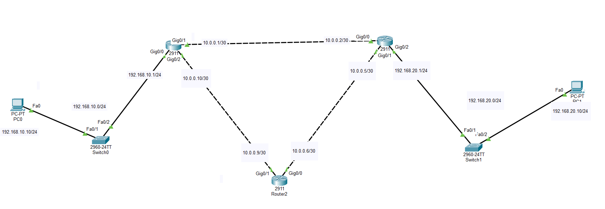

### 📊 Structural Subnet Allocation Map
* **LAN Subnet 1 (Left):** `192.168.10.0/24` (PC1 Host: `192.168.10.10`, Router1 Gateway: `192.168.10.1` on `Gig0/0`)
* **WAN Link A (Upper Direct):** `10.0.0.0/30` (Router1: `10.0.0.1` on `Gig0/1`, Router2: `10.0.0.2` on `Gig0/0`)
* **WAN Link B (Lower Left):** `10.0.0.8/30` (Router1: `10.0.0.10` on `Gig0/2`, Router3: `10.0.0.9` on `Gig0/1`)
* **WAN Link C (Lower Right):** `10.0.0.4/30` (Router3: `10.0.0.6` on `Gig0/0`, Router2: `10.0.0.5` on `Gig0/1`)
* **LAN Subnet 2 (Right):** `192.168.20.0/24` (PC2 Host: `192.168.20.10`, Router2 Gateway: `192.168.20.1` on `Gig0/2`)

---

# ⚙️ OSPFv2 Global Dynamic Configuration

Global OSPF process instances are configured using a matching Process ID (PID = 1). Directly connected subnets are matched via inverse classless wildcard statement blocks explicitly assigned to **Area 0**.

### 1. Router1 (R1) Configuration Script
```cisco
router ospf 1
 log-adjacency-changes
 network 192.168.10.0 0.0.0.255 area 0
 network 10.0.0.0 0.0.0.3 area 0
 network 10.0.0.8 0.0.0.3 area 0
```

### 2. Router2 (R2) Configuration Script
```cisco
router ospf 1
 log-adjacency-changes
 network 192.168.20.0 0.0.0.255 area 0
 network 10.0.0.0 0.0.0.3 area 0
 network 10.0.0.4 0.0.0.3 area 0
```

### 3. Router3 (R3) Configuration Script
```cisco
router ospf 1
 log-adjacency-changes
 network 10.0.0.4 0.0.0.3 area 0
 network 10.0.0.8 0.0.0.3 area 0
```

---

# 💻 Complete System Script Blocks

The full configuration command blocks deployed to the respective infrastructure nodes:

### Router1 (R1) Setup Commands
```cisco
enable
configure terminal
hostname R1

interface GigabitEthernet0/0
 ip address 192.168.10.1 255.255.255.0
 no shutdown
exit

interface GigabitEthernet0/1
 ip address 10.0.0.1 255.255.255.252
 no shutdown
exit

interface GigabitEthernet0/2
 ip address 10.0.0.10 255.255.255.252
 no shutdown
exit

router ospf 1
 network 192.168.10.0 0.0.0.255 area 0
 network 10.0.0.0 0.0.0.3 area 0
 network 10.0.0.8 0.0.0.3 area 0
end
write memory
```

### Router2 (R2) Setup Commands
```cisco
enable
configure terminal
hostname R2

interface GigabitEthernet0/0
 ip address 10.0.0.2 255.255.255.252
 no shutdown
exit

interface GigabitEthernet0/1
 ip address 10.0.0.5 255.255.255.252
 no shutdown
exit

interface GigabitEthernet0/2
 ip address 192.168.20.1 255.255.255.0
 no shutdown
exit

router ospf 1
 network 192.168.20.0 0.0.0.255 area 0
 network 10.0.0.0 0.0.0.3 area 0
 network 10.0.0.4 0.0.0.3 area 0
end
write memory
```

### Router3 (R3) Setup Commands
```cisco
enable
configure terminal
hostname R3

interface GigabitEthernet0/0
 ip address 10.0.0.6 255.255.255.252
 no shutdown
exit

interface GigabitEthernet0/1
 ip address 10.0.0.9 255.255.255.252
 no shutdown
exit

router ospf 1
 network 10.0.0.4 0.0.0.3 area 0
 network 10.0.0.8 0.0.0.3 area 0
end
write memory
```

---

# 🖥️ Static Endpoint Properties Validation

Manual interface metrics applied permanently to host system software layers:

### PC1 Local IP Profile Properties
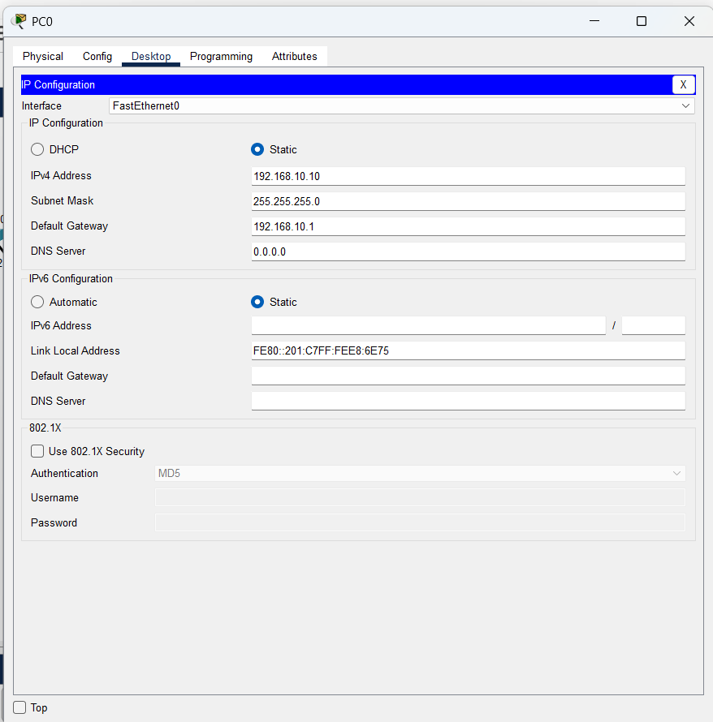

### PC2 Local IP Profile Properties
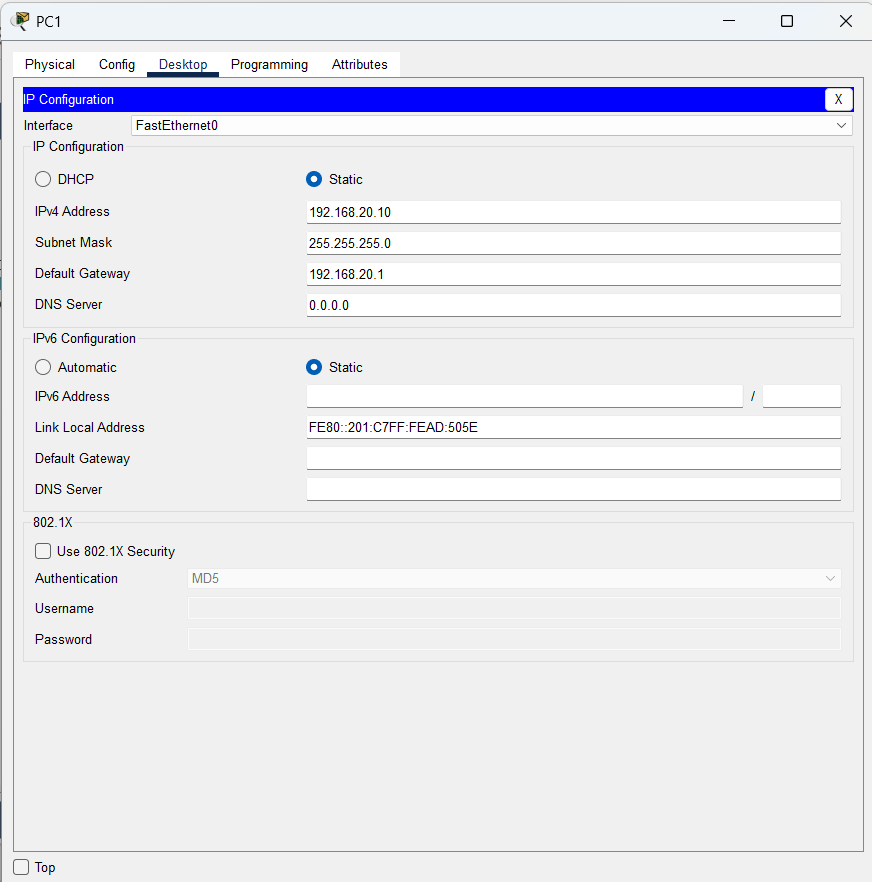

---

# 🔎 Operational Verification & Screenshots

## 1. Verify Router Interface Status
Confirm active interface link hardware addressing and baseline interface parameters.

### Router1 Interface summary
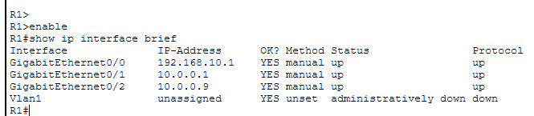

### Router2 Interface summary
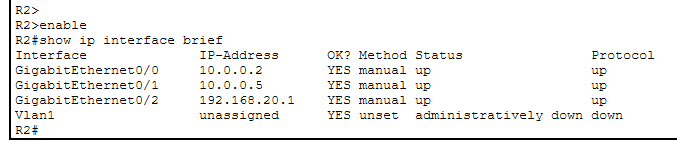

### Router3 Interface summary
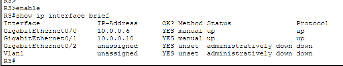

---

## 2. Verify Configured Routing Commands & Adjacencies
The parameters verified inside the global status memory profiles indicate correct configuration injection and neighbor tracking status.

### OSPF Active Configuration Properties
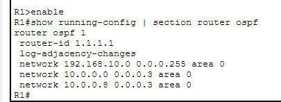

### OSPF Neighbor Adjacency Verification
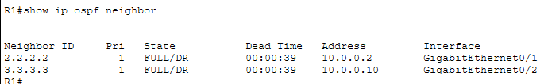

---

## 3. Extract Granular Link Cost Profiles
To trace individual cost metric attributes applied globally on target interface paths:

### Router1 Per-Link Dynamic Cost Parameters
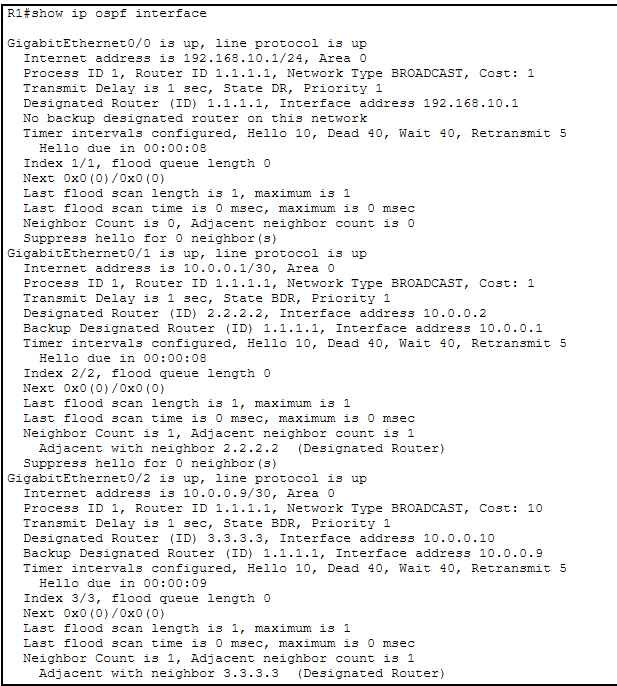

### Router2 Per-Link Dynamic Cost Parameters
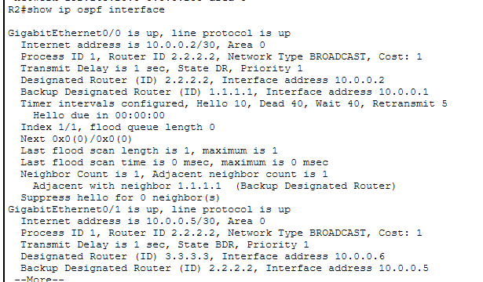

---

## 🛠️ Traffic Engineering: OSPF Metric Manipulation
To influence path preference toward the multi-hop backup link, the default cost configuration on Router1's direct link interface (`Gig0/1`) was increased manually. 

```cisco
R1(config)# interface GigabitEthernet0/1
R1(config-if)# ip ospf cost 50
```

### Verified Routing Table Post Cost Manipulation
The dynamic route convergence results inside the hardware memory layer show path alteration verification:

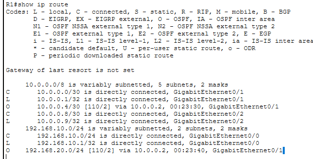

As verified, the routing table updates to choose the longer alternative backup path vector due to a lower cumulative cost string comparison.

### Converged Path Routing Maps Check
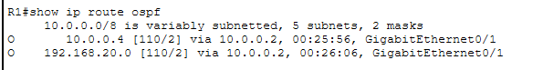

---

# 🌐 Data Plane Connectivity and Failover Diagnostics

## 1. End-to-End ICMP Reachability Check
Bidirectional message delivery verification originating across distinct host nodes:

```cmd
C:\> ping 192.168.20.10
```
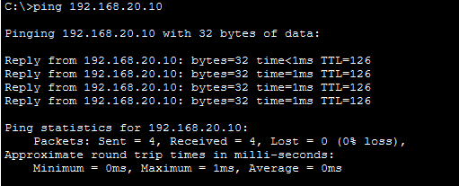

**ICMP Ping Status: SUCCESSFUL ✅ (0% packet drop statistics, uniform round-trip patterns)**

---

## 2. Traceroute Hop Vector Path Diagnostics
To analyze the exact tracking loop and record the explicit path vector utilized across active WAN backbones, a trace check is performed from the client terminal workspace:

```cmd
C:\> tracert 192.168.20.10
```
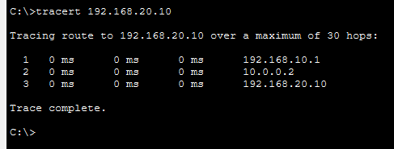

---

# 🔎 OSPF Diagnostics Reference Guide

| Verification Command | Technical Operational Target Purpose |
| :--- | :--- |
| `show ip interface brief` | Check basic interface link hardware tracking address settings status |
| `show ip ospf interface <int>` | Extract granular per-link Dijkstra cost dynamic output calculations |
| `show ip ospf neighbor` | Map live sync protocol adjacencies status properties states |
| `show ip route ospf` | Extract OSPF dynamically converged best-cost forwarding vector routes |
| `ping <Destination-IP>` | Audit continuous bidirectional path connectivity accessibility maps |
| `tracert <Destination-IP>` | Audit dynamic hop selection sequence across routing boundaries |

---

# ✅ Expected Lab Outcome

After successful deployment:
* OSPF dynamic adjacencies reach stable converged `FULL` status across all intersecting rings.
* The Dijkstra SPF engine calculates and matches proper cost weights to active hardware properties.
* Traffic defaults to the direct point-to-point upper path due to its lower total routing metric under default states.
