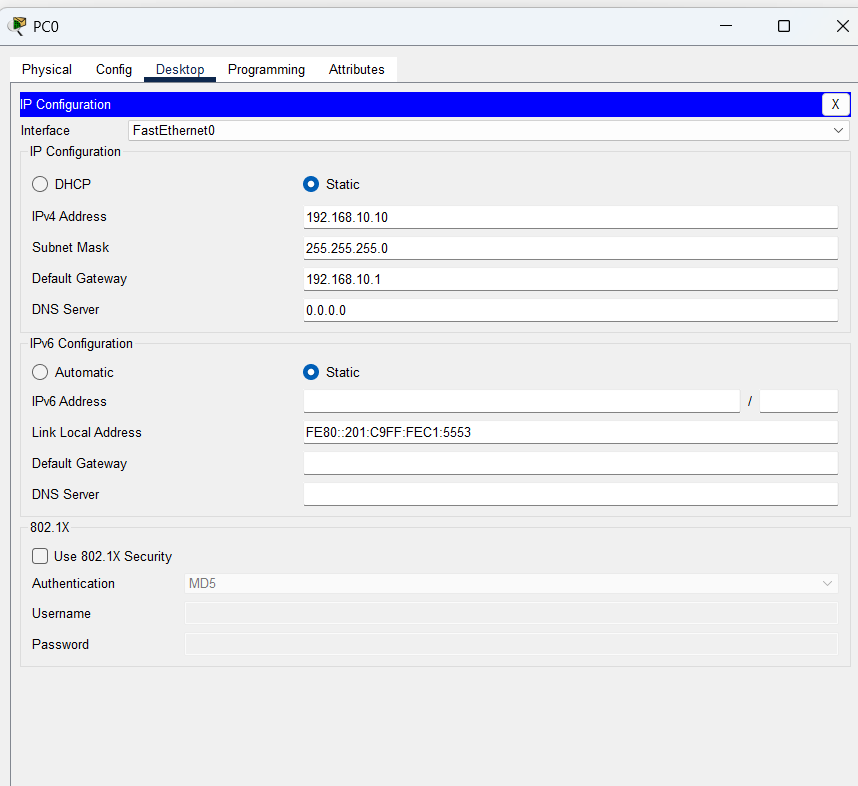

# LAB 12 — OSPF Inter-Area Route Summarization

## 📌 Overview

This lab demonstrates how to configure **OSPF Inter-Area Route Summarization** across an enterprise multi-area topology using Cisco Packet Tracer.

In large-scale Multi-Area OSPF deployments, thousands of specific subnets are advertised across logical domains, expanding individual routing tables, consuming massive router memory, and triggering frequent Shortest Path First (SPF) flooding loop recalculations globally. 

**OSPF Route Summarization** solves this resource scaling constraint by grouping multiple contiguous specific network routes into a single aggregate prefix before advertising them across borders. This optimization must be configured explicitly on Area Border Routers (**ABRs**) using the `area range` command strategy. This process hides local link flaps from adjacent logical domains, reduces overall table size, minimizes routing protocol overhead, and ensures stable operations.

---

## 🎯 Objective

The objectives of this lab are to:

* Deploy a multi-router segmented backbone architecture using Cisco Packet Tracer.
* Assign classless static IPv4 configuration parameters for local host subnets and point-to-point transit paths.
* Master the absolute engineering necessity of route summarization at logical ABR boundaries.
* Configure global OSPFv2 processes and consolidate multiple subnets under optimized prefix ranges.
* Implement the `area range` configuration block inside Area Border Routers (`Router0` and `Router2`).
* Compare the backbone router's (`Router1`) IP routing tables **before and after summary injection**.
* Verify cross-area dynamically aggregated neighbor adjacencies across boundary layers.
* Test end-to-end transport reachability across condensed topological maps using ICMP Echo metrics.
* Track step-by-step cross-area path crossings using Traceroute boundary diagnostics.

---

## 🧪 Lab Environment

| Component | Details |
| :--- | :--- |
| Simulation Tool | Cisco Packet Tracer |
| Core Routers | Router0 (Left ABR), Router1 (Backbone), Router2 (Right ABR) |
| Layer 2 Switches | Switch1, Switch0 (Cisco 2960-24TT) |
| End Devices | PC0, PC1 |
| Routing Protocol | Classless Multi-Area OSPFv2 with Explicit Aggregation |
| Configured Domains | Area 0 (Backbone), Area 1 (Left Segment Area), Area 2 (Right Segment Area) |

---

# 🌐 Network Topology

The architecture maps distinct edge areas terminating into a shared central backbone pipeline layer:


### 📊 Segmented IP and Area Mapping Scheme
*   **Area 1 (Left Segment Domain):**
    *   LAN Subnet: `192.168.10.0/24` (PC0: `192.168.10.10/24`, Router0 Gateway: `192.168.10.1` on `Gig0/0`)
    *   WAN Transit Link: `10.0.12.0/30` interface boundary on Router0 (`10.0.12.1` on `Gig0/1`)
*   **Area 0 (Core Backbone Domain):**
    *   WAN Link 1: `10.0.12.0/30` interface boundary on Router1 (`10.0.12.2` on `Gig0/0`)
    *   WAN Link 2: `10.0.23.0/30` interface boundary on Router1 (`10.0.23.1` on `Gig0/2`)
*   **Area 2 (Right Segment Domain):**
    *   WAN Transit Link: `10.0.23.0/30` interface boundary on Router2 (`10.0.23.2` on `Gig0/0`)
    *   LAN Subnet: `192.168.30.0/24` (PC1: `192.168.30.10/24`, Router2 Gateway: `192.168.30.1` on `Gig0/1`)

---

# ⚙️ OSPFv2 Inter-Area Summarization Configuration

Dynamic configurations utilize Process ID (PID = 1). To summarize local subnets heading toward Backbone Area 0, the `area <area-id> range <summary-network> <subnet-mask>` command syntax is deployed strictly on the boundary ABR nodes.

### 1. Router0 (Left ABR) Summarization Script
```cisco
router ospf 1
 router-id 1.1.1.1
 network 192.168.10.0 0.0.0.255 area 1
 network 10.0.12.0 0.0.0.3 area 0
 ! Summarize Area 1 subnets into a clean aggregate block
 area 1 range 192.168.10.0 255.255.255.0
```

### 2. Router1 (Core Backbone Router) Script
```cisco
router ospf 1
 router-id 2.2.2.2
 network 10.0.12.0 0.0.0.3 area 0
 network 10.0.23.0 0.0.0.3 area 0
```

### 3. Router2 (Right ABR) Summarization Script
```cisco
router ospf 1
 router-id 3.3.3.3
 network 10.0.23.0 0.0.0.3 area 0
 network 192.168.30.0 0.0.0.255 area 2
 ! Summarize Area 2 subnets into a clean aggregate block
 area 2 range 192.168.30.0 255.255.255.0
```

---

# 💻 Complete System Configuration Script

The exact production-grade command strings applied to local system environments:

### Router0 Setup Script
```cisco
enable
configure terminal
hostname Router0

interface GigabitEthernet0/0
 ip address 192.168.10.1 255.255.255.0
 no shutdown
exit

interface GigabitEthernet0/1
 ip address 10.0.12.1 255.255.255.252
 no shutdown
exit

router ospf 1
 router-id 1.1.1.1
 log-adjacency-changes
 network 192.168.10.0 0.0.0.255 area 1
 network 10.0.12.0 0.0.0.3 area 0
 area 1 range 192.168.10.0 255.255.255.0
end
write memory
```

### Router1 Setup Script
```cisco
enable
configure terminal
hostname Router1

interface GigabitEthernet0/0
 ip address 10.0.12.2 255.255.255.252
 no shutdown
exit

interface GigabitEthernet0/2
 ip address 10.0.23.1 255.255.255.252
 no shutdown
exit

router ospf 1
 router-id 2.2.2.2
 log-adjacency-changes
 network 10.0.12.0 0.0.0.3 area 0
 network 10.0.23.0 0.0.0.3 area 0
end
write memory
```

### Router2 Setup Script
```cisco
enable
configure terminal
hostname Router2

interface GigabitEthernet0/0
 ip address 10.0.23.2 255.255.255.252
 no shutdown
exit

interface GigabitEthernet0/1
 ip address 192.168.30.1 255.255.255.0
 no shutdown
exit

router ospf 1
 router-id 3.3.3.3
 log-adjacency-changes
 network 10.0.23.0 0.0.0.3 area 0
 network 192.168.30.0 0.0.0.255 area 2
 area 2 range 192.168.30.0 255.255.255.0
end
write memory
```

---

# 🖥️ Static Endpoint Properties Validation

Manual interface attributes applied permanently to local operating platforms:

### PC0 Endpoint IP Properties


### PC1 Endpoint IP Properties


---

# 🔎 Operational Verification & Screenshots

## 1. Verify Basic Interface Status Mappings
Audit active line state protocols and hardware tracking parameter sets.

### Router0 Link Status Summary


### Router1 Link Status Summary


### Router2 Link Status Summary


---

## 2. Verify Dynamic Aggregation Injection
Review the global configuration parameters applied across boundary layers to confirm that summarization parameters are running.

### Active OSPF Inter-Area Range Statements Check


### Synchronized Neighbor Adjacency Check


---

## 3. Compare Routing Tables: Before vs After Summarization
The core technical proof of OSPF aggregation optimization is demonstrated by comparing the backbone router's table structures.

### Router1 IP Routing Table BEFORE Summarization
*(Note: Shows bloated entries with all raw, individual subnets advertised explicitly across domains)*


### Router1 IP Routing Table AFTER Summarization
*(Note: Shows an optimized database where raw records are cleanly summarized into single, consolidated `O IA` entries)*


---

# 🌐 Data Plane Connectivity and Routing Diagnostics

## 1. End-to-End Inter-Area Reachability Check
Verification of error-free packet flow crossing aggregated dynamic area borders from PC0 to PC1:

```cmd
C:\> ping 192.168.30.10
```


**ICMP Ping Status: SUCCESSFUL ✅ (0% packet drop statistics, stable propagation times)**

---

## 2. Traceroute Multi-Area Gateway Trajectory Check
To ensure packet frames transit smoothly across optimized routing environments without getting trapped by summary loops, a path trace is executed from PC0 terminal prompt:

```cmd
C:\> tracert 192.168.30.10
```


---

# 🔎 OSPF Diagnostics Reference Guide

| Verification Command | Technical Operational Target Purpose |
| :--- | :--- |
| `show ip interface brief` | Audit active hardware interface states and IP tracking address maps |
| `show ip ospf neighbor` | Map live sync protocol adjacencies status properties states (`FULL`) |
| `show ip route` | Extract dynamically converged optimal forwarding paths database map |
| `show ip route ospf` | Filter routing table entries to show OSPF Inter-Area summary routes only |
| `ping <Destination-IP>` | Validate complete bidirectional packet flow accessibility grids |
| `tracert <Destination-IP>`| Map upstream boundary gateway path transitions behavior layout |

---

# ✅ Expected Lab Outcome

After successful deployment:
* The `area range` statement smoothly summarizes individual peripheral routes inside the ABRs.
* The Backbone core router (`Router1`) routing table drops in size, decreasing RAM utilization.
* Interface drops or flaps inside peripheral Area 1 or 2 are concealed locally and do not cause global LSA packet storms.
* Complete cross-area bidirectional data transport operates seamlessly with 100% stable reachability.

---

## 📂 Lab Files Inventory Checklist

| **File** | **Technical Description** |
| :--- | :--- |
| `README.md` | Comprehensive Lab Technical Documentation (This Document File) |
