# LAB 11 — Dynamic Routing Using Multi-Area OSPFv2

## 📌 Overview

This lab demonstrates how to configure **Multi-Area Open Shortest Path First Version 2 (OSPFv2)** across a cascading multi-router topology using Cisco Packet Tracer.

As network environments scale, a Single-Area OSPF design can introduce high CPU overhead due to frequent Shortest Path First (SPF) recalculations and large Link-State Databases (LSDB). Multi-Area OSPF solves this structural scaling limitation by logically segmenting the autonomous system into distinct areas. All peripheral areas (**Area 1** and **Area 2**) must physically connect to the central **Area 0 (Backbone Area)**. 

Segmenting networks into areas confines topology changes within local boundaries, limits SPF recalculations, and allows Area Border Routers (**ABRs**) to inject concise summary routes (**`O IA` - OSPF Inter-Area**) into opposing domains. This approach ensures excellent database optimization and fast network convergence.

---

## 🎯 Objective

The objectives of this lab are to:

* Deploy a multi-router segmented network backbone architecture using Cisco Packet Tracer.
* Assign classless static IPv4 configuration parameters for local host subnets and point-to-point transit paths.
* Master the design concepts of OSPF structural segmentation: Backbone Area, Peripheral Areas, and Area Border Routers (ABRs).
* Configure global OSPFv2 processes on core nodes and explicitly advertise networks using structural inverse wildcard masks.
* Verify dynamic cross-area link-state neighbor adjacencies across boundary layers.
* Validate inter-area path convergence marked with the **`O IA` (OSPF Inter-Area)** designator prefix flag in routing tables.
* Test end-to-end bidirectional data plane reachability over distinct logical area drops using ICMP Echo routines.
* Track step-by-step multi-area gateway traversals using Traceroute path diagnostics.

---

## 🧪 Lab Environment

| Component | Details |
| :--- | :--- |
| Simulation Tool | Cisco Packet Tracer |
| Core Routers | Router0 (Left ABR), Router1 (Backbone), Router2 (Right ABR) |
| Layer 2 Switches | Switch1, Switch0 (Cisco 2960-24TT) |
| End Devices | PC0, PC1 |
| Routing Architecture | Classless Multi-Area OSPFv2 |
| Configured Logical Domains | Area 0 (Backbone), Area 1 (Left Wing), Area 2 (Right Wing) |

---

# 🌐 Network Topology

The network design features a segmented infrastructure layout divided into three distinct logical dynamic domains:

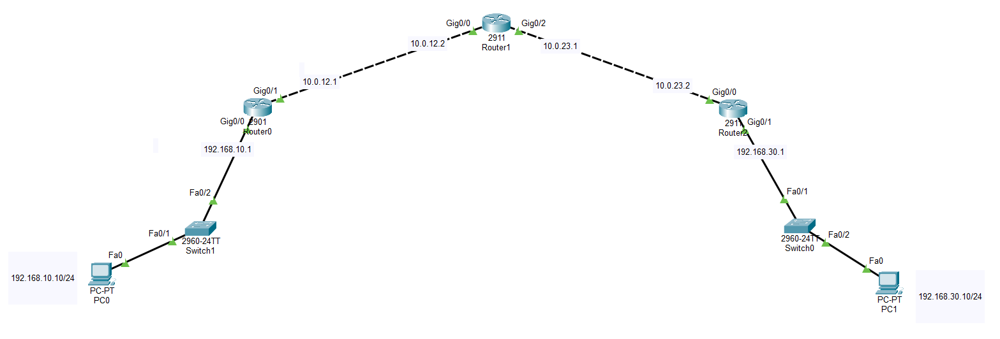

### 📊 Segmented IP and Area Mapping Scheme
*   **Area 1 (Left Segment Domain):**
    *   LAN Subnet: `192.168.10.0/24` (PC0: `192.168.10.10/24`, Router0 Gateway: `192.168.10.1` on `Gig0/0`)
    *   WAN Transit Link: `10.0.12.0/30` interface boundary on Router0 (`10.0.12.1` on `Gig0/1`)
*   **Area 0 (Core Backbone Domain):**
    *   WAN Link 1: `10.0.12.0/30` interface boundary on Router1 (`10.0.12.2` on `Gig0/0`)
    *   WAN Link 2: `10.0.23.0/30` interface boundary on Router1 (`10.0.23.1` on `Gig0/2`)
*   **Area 2 (Right Segment Domain):**
    *   WAN Transit Link: `10.0.23.0/30` interface boundary on Router2 (`10.0.23.2` on `Gig0/0`)
    *   LAN Subnet: `192.168.30.0/24` (PC1: `192.168.30.10/24`, Router2 Gateway: `192.168.30.1` on `Gig0/1`)

---

# ⚙️ OSPFv2 Multi-Area Dynamic Configuration

Global configuration scripts run under a shared Process ID (PID = 1). The ABR nodes (**Router0** and **Router2**) explicitly map different connected links into their respective logical target areas.

### 1. Router0 (Left Area Border Router) Config
```cisco
router ospf 1
 router-id 1.1.1.1
 network 192.168.10.0 0.0.0.255 area 1
 network 10.0.12.0 0.0.0.3 area 0
```

### 2. Router1 (Backbone Core Router) Config
```cisco
router ospf 1
 router-id 2.2.2.2
 network 10.0.12.0 0.0.0.3 area 0
 network 10.0.23.0 0.0.0.3 area 0
```

### 3. Router2 (Right Area Border Router) Config
```cisco
router ospf 1
 router-id 3.3.3.3
 network 10.0.23.0 0.0.0.3 area 0
 network 192.168.30.0 0.0.0.255 area 2
```

---

# 💻 Complete System Script Blocks

The full configuration command scripts deployed within the respective network elements:

### Router0 Configuration Commands
```cisco
enable
configure terminal
hostname Router0

interface GigabitEthernet0/0
 ip address 192.168.10.1 255.255.255.0
 no shutdown
exit

interface GigabitEthernet0/1
 ip address 10.0.12.1 255.255.255.252
 no shutdown
exit

router ospf 1
 router-id 1.1.1.1
 log-adjacency-changes
 network 192.168.10.0 0.0.0.255 area 1
 network 10.0.12.0 0.0.0.3 area 0
end
write memory
```

### Router1 Configuration Commands
```cisco
enable
configure terminal
hostname Router1

interface GigabitEthernet0/0
 ip address 10.0.12.2 255.255.255.252
 no shutdown
exit

interface GigabitEthernet0/2
 ip address 10.0.23.1 255.255.255.252
 no shutdown
exit

router ospf 1
 router-id 2.2.2.2
 log-adjacency-changes
 network 10.0.12.0 0.0.0.3 area 0
 network 10.0.23.0 0.0.0.3 area 0
end
write memory
```

### Router2 Configuration Commands
```cisco
enable
configure terminal
hostname Router2

interface GigabitEthernet0/0
 ip address 10.0.23.2 255.255.255.252
 no shutdown
exit

interface GigabitEthernet0/1
 ip address 192.168.30.1 255.255.255.0
 no shutdown
exit

router ospf 1
 router-id 3.3.3.3
 log-adjacency-changes
 network 10.0.23.0 0.0.0.3 area 0
 network 192.168.30.0 0.0.0.255 area 2
end
write memory
```

---

# 🖥️ Static Endpoint Properties Validation

Static host parameters permanently provisioned inside endpoint network properties:

### PC0 Network Settings Blueprint


### PC1 Network Settings Blueprint
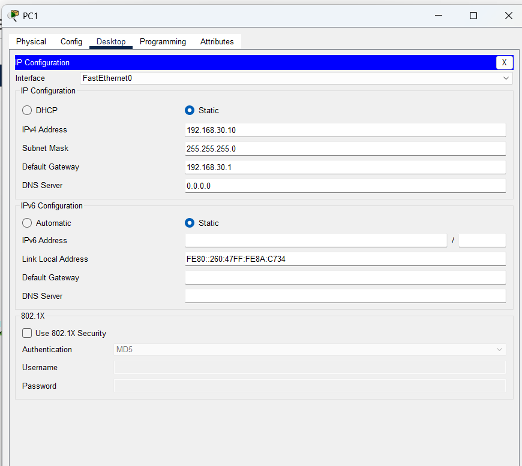

---

# 🔎 Operational Verification & Screenshots

## 1. Verify Interface Line Protocol Status
Audit operational up/up hardware connectivity parameters across individual platforms.

### Router0 Interface Summary
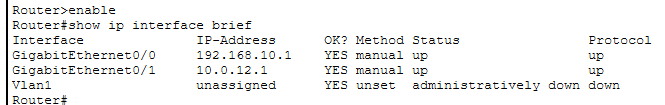

### Router1 Interface Summary
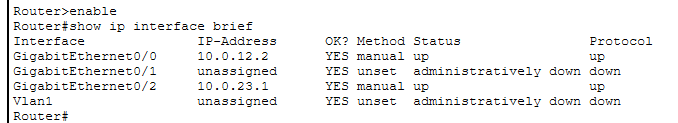

### Router2 Interface Summary
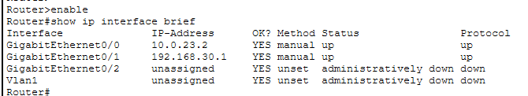

---

## 2. Verify Cross-Area Configuration Parameters & Neighbors
Confirm explicit multiprotocol configurations and synchronized neighbor engine parameters.

### Global Multi-Area Network Configuration Injections
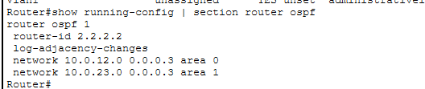

### Synchronized Neighbor Adjacency Verifications
```cisco
Router0# show ip ospf neighbor
```
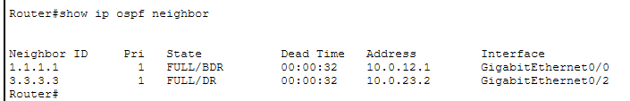

---

## 3. Verify Inter-Area Routing Tables Convergence
The convergence profiles verified inside active lookup engine databases capture the successful introduction of inter-area network blocks.

### Router0 Converged Routing Table Engine
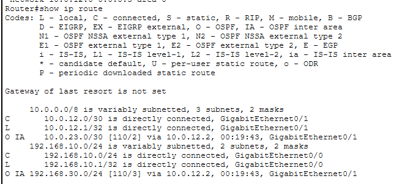

### Router1 Converged Routing Table Engine
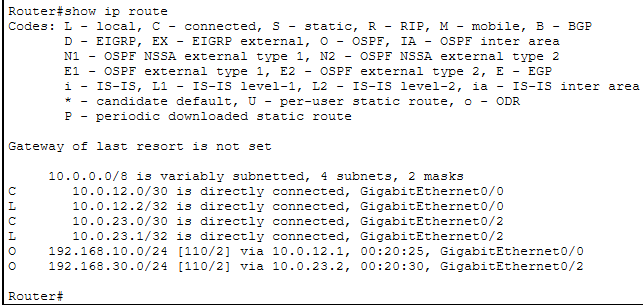

### Router2 Converged Routing Table Engine
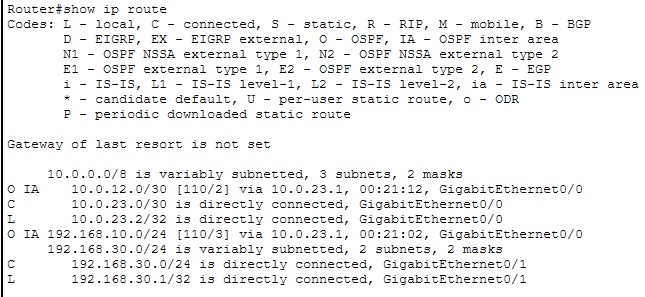

The tactical presence of the prefix indicator **`O IA`** (OSPF Inter-Area) on edge nodes confirms that the ABR routers are successfully calculating, summarizing, and propagating routing metrics across boundaries.

---

# 🌐 Data Plane Connectivity and Diagnostics

## 1. End-to-End Cross-Area Reachability Check
Verification of end-to-end network data transport originating across distinct area domains from PC0 toward PC1:

```cmd
C:\> ping 192.168.30.10
```
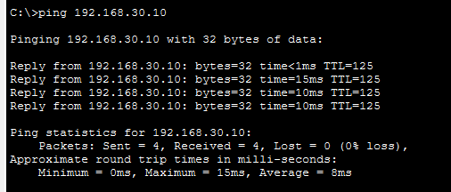

**ICMP Ping Status: SUCCESSFUL ✅ (0% packet drop statistics, stable round-trip propagation times)**

---

## 2. Traceroute Cross-Area Gateway Path Tracking
To inspect the operational line path vector taken by data frames crossing different logical area domains, a path trace is executed from PC0 terminal workspace:

```cmd
C:\> tracert 192.168.30.10
```
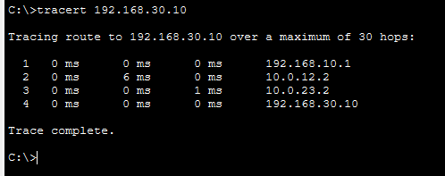

The trace path log maps the exact data plane transitions across distinct logical area drops:
1. `192.168.10.1` (Area 1 Gateway Termination Drop - Router0)
2. `10.0.12.2` (OSPF Area 0 Backbone Ingress Node - Router1)
3. `10.0.23.2` (Area 2 Boundary Entry Interface - Router2)
4. `192.168.30.10` (Remote Target End Workspace Destination - PC1)

---

# 🔎 OSPF Diagnostics Reference Guide

| Verification Command | Technical Operational Target Purpose |
| :--- | :--- |
| `show ip interface brief` | Audit active hardware interface states and IP tracking address maps |
| `show ip ospf neighbor` | Map live sync protocol adjacencies status properties states (`FULL`) |
| `show ip ospf database` | View Link-State Database (LSDB) metrics, including summary LSAs |
| `show ip route` | Extract dynamically converged optimal forwarding paths database map |
| `ping <Destination-IP>` | Validate complete bidirectional packet flow accessibility grids |
| `tracert <Destination-IP>`| Map upstream boundary gateway path transitions behavior layout |

---

# ✅ Expected Lab Outcome

After successful deployment:
* Global OSPF dynamic parameters successfully form solid adjacencies across distinct area borders.
* Inter-area network routes converge seamlessly, creating concise table entries without bloated routing loops.
* Boundary changes inside Area 1 (e.g., interface flaps) remain isolated locally, preventing SPF recalculations in Area 2.
