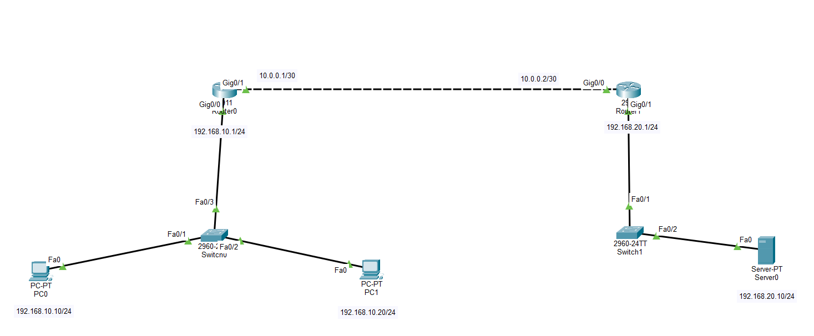
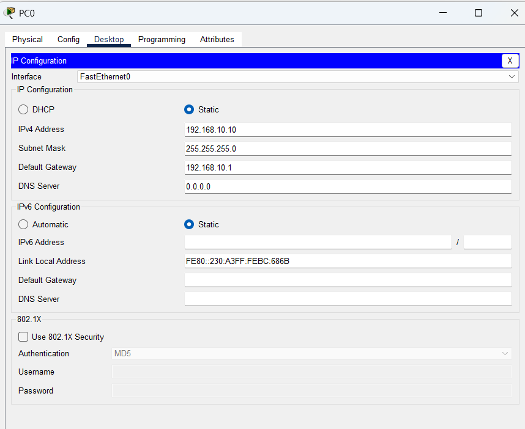
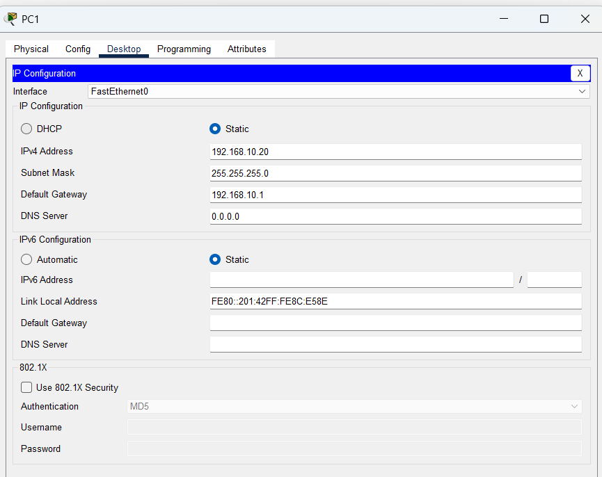
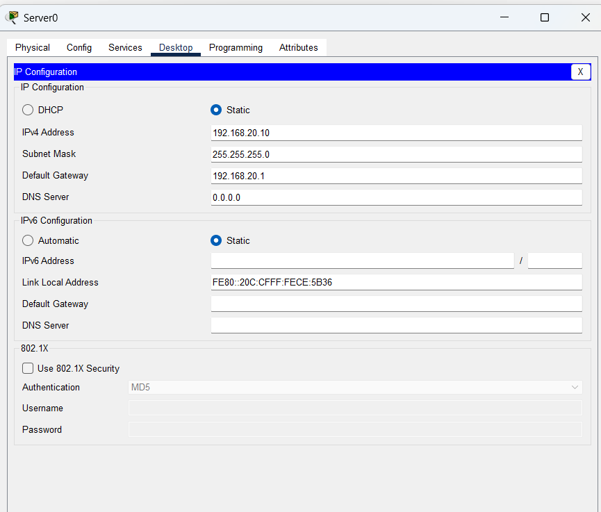
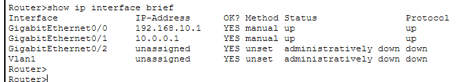
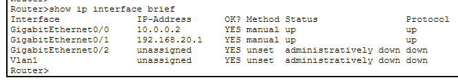
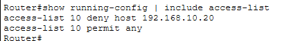
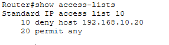
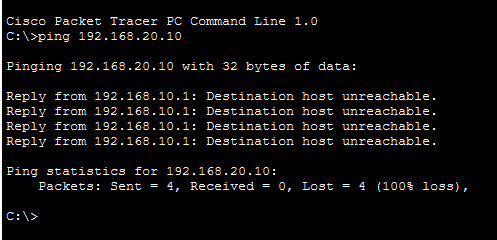
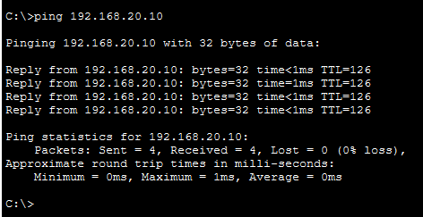

# LAB 12 — Network Security Using Standard Access Control Lists (ACL)

## 📌 Overview

This lab demonstrates how to configure and deploy a **Numbered Standard Access Control List (ACL)** to implement basic traffic filtering and network security management plane policies using Cisco Packet Tracer.

Standard Access Control Lists filter network traffic based solely on the **Source IP Address** packet headers. Because standard ACLs lack destination or port layer awareness, Cisco design best practices dictate that they must be applied **as close to the destination network as possible** to prevent unintended blocking of transit paths to other network segments. Standard ACLs use inverse wildcard masks to match single hosts or entire subnet blocks, and they conclude with an implicit `deny any` statement, meaning any traffic not explicitly permitted is automatically dropped.

The lab focuses on creating a security policy that permits specific client host traffic (`PC0`) while explicitly denying a blocked host (`PC1`) from accessing a secure destination server network (`Server0`).

---

## 🎯 Objective

The objectives of this lab are to:

* Configure a multi-router network layout incorporating edge host subnets and a secured server zone using Cisco Packet Tracer.
* Configure precise interface IPv4 addressing and stable routing profiles across transit nodes.
* Master the design and placement rules of standard access control lists within sequential network topologies.
* Configure a Numbered Standard ACL to explicitly block a single target host IP while permitting adjacent nodes.
* Apply the ACL filter inbound or outbound under appropriate destination-facing hardware interfaces (`ip access-group`).
* Verify active access-list statement lines and real-time hit counts using Cisco IOS verification tools.
* Test packet filtering behavior to validate traffic blocks (ICMP Unreachable) vs successful allowed communication paths.

---

## 🧪 Lab Environment

| Component       | Details             |
| --------------- | ------------------- |
| Simulation Tool | Cisco Packet Tracer |
| Core Routers    | Router0 (nuuter0), Router1 |
| Layer 2 Switches| Switch0 (Switchnu), Switch1 |
| End Devices     | PC0, PC1            |
| Target Servers  | Server0 (Secured Server Sector) |
| Filtering Type  | Numbered Standard Access Control List (ACL 10) |
| Routing Logic   | Static / Dynamic Converged Path Mapping |

---

# 🌐 Network Topology

The architecture maps distinct local user segments connected across point-to-point WAN lines toward a remote secure server infrastructure layer:



### 📊 Structural Subnet Allocation Blueprint
*   **LAN Subnet 1 (Left Segment):** `192.168.10.0/24`
    *   PC0 Endpoint Host: `192.168.10.10/24` (Permitted Transit Host)
    *   PC1 Endpoint Host: `192.168.10.20/24` (Blocked Target Host)
    *   Router0 LAN Gateway: `192.168.10.1/24` on interface `Gig0/0`
*   **WAN Transit Link (Core Backbone):** `10.0.0.0/30`
    *   Router0 WAN Interface: `10.0.0.1/30` on interface `Gig0/1`
    *   Router1 WAN Interface: `10.0.0.2/30` on interface `Gig0/0`
*   **LAN Subnet 2 (Right Secured Segment):** `192.168.20.0/24`
    *   Server0 Target Workspace: `192.168.20.10/24`
    *   Router1 LAN Gateway: `192.168.20.1/24` on interface `Gig0/1`

---

# ⚙️ Standard Access Control List Security Policy

The administrative security objective is to prevent **PC1** (`192.168.10.20`) from reaching the **Server0** domain (`192.168.20.10`) while allowing **PC0** (`192.168.10.10`) and all other adjacent host environments to maintain error-free connectivity.

Following placement design principles, this standard ACL is applied directly on **Router1** (the router closest to the destination network) on interface `Gig0/1` in the **outbound** direction.

### 📝 ACL Filtering Statement Logic (Configured on Router1)
```cisco
access-list 10 deny host 192.168.10.20
access-list 10 permit any
```

### 🔀 Interface Application Mapping
```cisco
interface GigabitEthernet0/1
 ip access-group 10 out
```

---

# 💻 Complete System Configuration Script

The comprehensive configuration command blocks deployed to individual infrastructure hardware elements:

### Router0 ( nuuter0 ) Setup Script
```cisco
enable
configure terminal
hostname Router0

interface GigabitEthernet0/0
 ip address 192.168.10.1 255.255.255.0
 no shutdown
exit

interface GigabitEthernet0/1
 ip address 10.0.0.1 255.255.255.252
 no shutdown
exit

! Configure a path route to reach the remote Server Subnet (Using Static Route for baseline simplicity)
ip route 192.168.20.0 255.255.255.0 10.0.0.2
end
write memory
```

### Router1 Configuration Script (ACL Deployment Point)
```cisco
enable
configure terminal
hostname Router1

interface GigabitEthernet0/0
 ip address 10.0.0.2 255.255.255.252
 no shutdown
exit

interface GigabitEthernet0/1
 ip address 192.168.20.1 255.255.255.0
 no shutdown
exit

! Configure a return path route back to user networks
ip route 192.168.10.0 255.255.255.0 10.0.0.1
exit

! Define Numbered Standard Access Control List
access-list 10 deny host 192.168.10.20
access-list 10 permit any

! Apply Access List Outbound on Destination LAN Interface
interface GigabitEthernet0/1
 ip access-group 10 out
end
write memory
```

---

# 🖥️ Endpoint Properties Verification

Manual static network attributes provisioned locally across host computing layers:

### PC0 Local IP Configuration Profile


### PC1 Local IP Configuration Profile


### Server0 Secure Zone IP Configuration Profile


---

# 🔎 Operational Verification & Security Testing

## 1. Verify Active Interfaces Status
Ensure hardware line protocol metrics show steady operational states.

### Router0 Core Interfaces Brief Table


### Router1 Core Interfaces Brief Table


---

## 2. Audit Configured Access-List Profiles
To review the active statement sequences and track real-time filtering statistics (packet hits), the access-list verification syntax is evaluated:

```cisco
Router1# show access-lists
```


### Active Rule Verification Snapshot


---

## 🔒 Security Policy Enforcement Validation (Connectivity Testing)

### Case A: Blocked Host Verification Check (PC1 -> Server0)
An end-to-end data plane transport test is initiated from **PC1** toward **Server0**. Router1 intercepts the source packet, matches it against the deny statement, drops the frame, and responds with an ICMP protocol unreachable message.

```cmd
C:\> ping 192.168.20.10
```


**ICMP Ping Status: BLOCKED / DENIED ❌ (Reply from 10.0.0.2: Destination host unreachable - 100% loss)**

---

### Case B: Permitted Host Verification Check (PC0 -> Server0)
A simultaneous parallel packet trace routine is executed from the adjacent permitted node **PC0** toward **Server0**. Since its source IP does not match the deny rule, it falls through to the permit statement and passes cleanly.

```cmd
C:\> ping 192.168.20.10
```


**ICMP Ping Status: ALLOWED / SUCCESSFUL ✅ (0% packet loss, verified active flow connectivity)**

---

# 🔎 Firewall and Access Control Diagnostics Reference Guide

| Verification Command      | Technical Operational Target Purpose |
| :------------------------ | :------------------------------------------------------------- |
| `show ip interface brief` | Audit active hardware interface states and IP tracking address maps |
| `show access-lists`       | Print configured access-list rules and match criteria counter hits |
| `show ip interface <int>` | Verify which specific ACL index is applied to an interface and direction |
| `show running-config`     | Parse system startup config properties configuration lines script |
| `ping <Destination-IP>`   | Validate traffic restriction drop parameters vs reachability allowance |

---

# ✅ Expected Lab Outcome

After successful deployment:
* Numbered Standard ACL 10 accurately registers the filtering parameters inside Router1's memory engine.
* Packets originating from source IP `192.168.10.20` are dropped outbound at interface `Gig0/1`, generating packet drop hits.
* Traffic originating from source IP `192.168.10.10` transits the filtering checkpoint seamlessly.
* Server0 zone architecture remains protected against unauthorized host traffic while remaining accessible to allowed segments.

---

## 📂 Lab Files Inventory Checklist

| **File** | **Technical Description** |
| :--- | :--- |
| `README.md` | Comprehensive Lab Technical Documentation (This Document File) |
| `Lab 12 — Standard ACL.pkt` | Authentic Cisco Packet Tracer network firewall security lab file |
| `01-Topology.png` | Network topology environment design backbone path layout |
| `02-PC0-IP-Configuration.png` | PC0 host network assignment parameters screenshot |
| `03-PC1-IP-Configuration.png` | PC1 host network assignment parameters screenshot |
| `04-Server-IP-Configuration.png` | Server0 secure zone network assignment properties snapshot |
| `05-R0-Interface-Configuration.png` | Router0 operational interface summary configuration clip |
| `06-R1-Interface-Configuration.png` | Router1 operational interface summary configuration clip |
