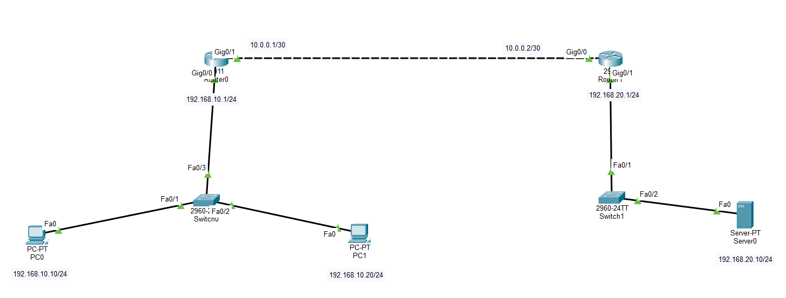
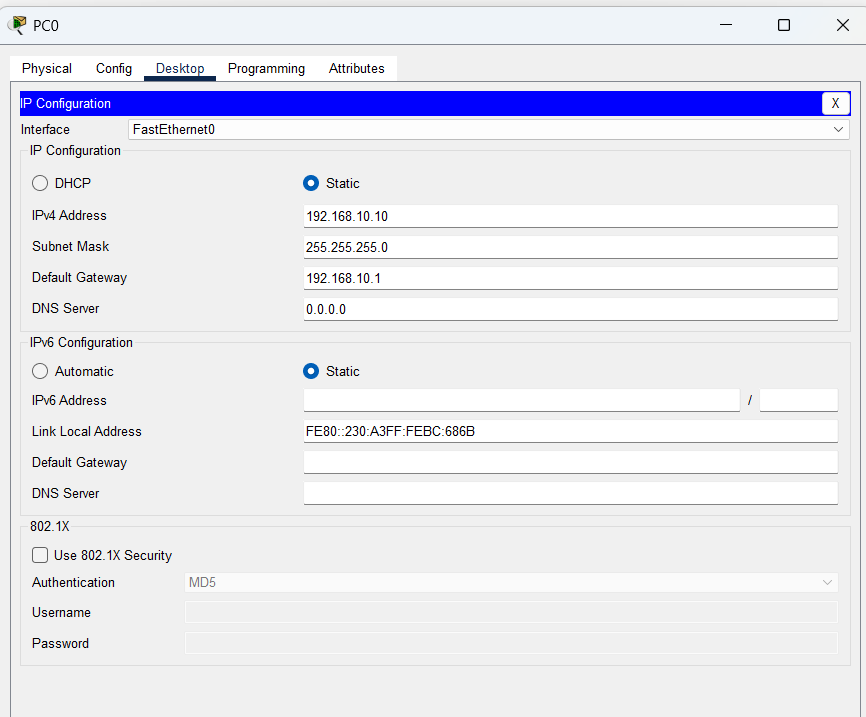
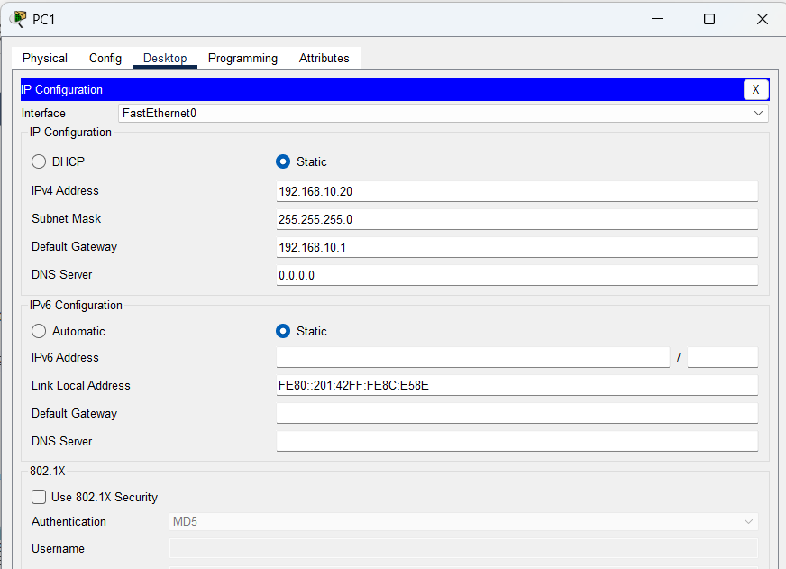
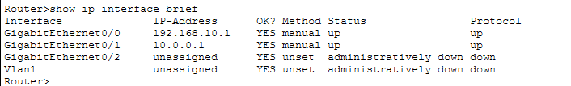
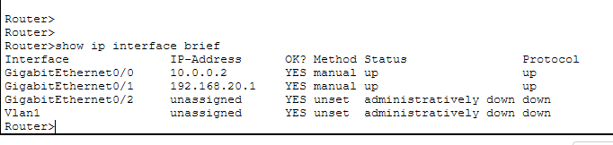
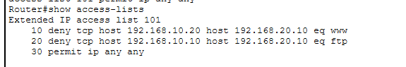

# LAB 13 — Network Security Using Extended Access Control Lists (ACL)

## 📌 Overview

This lab demonstrates how to configure and deploy a **Numbered Extended Access Control List (ACL)** to implement granular traffic engineering and security policies using Cisco Packet Tracer.

Unlike Standard ACLs which filter network layers based traffic solely on Source IP headers, **Extended Access Control Lists (ACL 100-199)** evaluate multiple packet layers, including **Source IP Address, Destination IP Address, Protocol Type (IP, TCP, UDP, ICMP), and Layer 4 Port Numbers (e.g., HTTP 80, HTTPS 443, SSH 22)**. 

Cisco operational best practices dictate that Extended ACLs must be applied **as close to the source network as possible** to conserve network bandwidth and prevent unwanted packets from traversing transit WAN serial links before being dropped. 

In this scenario, we engineer an enterprise security policy on Router0 to explicitly deny **ICMP (Ping)** packets originating from **PC1** (`192.168.10.20`) targeting **Server0** (`192.168.20.10`), while permitting **PC0** (`192.168.10.10`) and all other ambient transit traffic.

---

## 🎯 Objective

The objectives of this lab are to:

* Configure a multi-router linear architecture containing edge host subnets and a remote server zone in Cisco Packet Tracer.
* Configure precise structural IPv4 address mappings and network paths across core systems.
* Comprehend the absolute deployment, architecture, and placement mechanics differentiating Extended ACLs from Standard ACLs.
* Configure a Numbered Extended ACL (ACL 100) to selectively filter protocol-specific parameters (ICMP).
* Apply the Extended ACL filter inbound under the local source-facing hardware interface segment (`ip access-group`).
* Verify operational access-list match statements and active packet hit counters using Cisco IOS diagnostics.
* Test packet filtration efficiency to validate targeted protocol blocks while ensuring alternate nodes pass cleanly.

---

## 🧪 Lab Environment

| Component       | Details             |
| --------------- | ------------------- |
| Simulation Tool | Cisco Packet Tracer |
| Core Routers    | Router0 (nuuter0), Router1 |
| Layer 2 Switches| Switch0 (Switchnu), Switch1 |
| End Devices     | PC0, PC1            |
| Target Servers  | Server0 (Secured Server Zone Area) |
| Filtering Type  | Numbered Extended Access Control List (ACL 100) |
| Target Protocol | Internet Control Message Protocol (ICMP / Ping) |
| Routing Logic   | Static / Dynamic Converged Protocol Mapping |

---

# 🌐 Network Topology

The architecture maps distinct local user segments connected across point-to-point WAN lines toward a remote secure server infrastructure layer:



### 📊 Structural Subnet Allocation Blueprint
*   **LAN Subnet 1 (Left Segment):** `192.168.10.0/24`
    *   PC0 Endpoint Host: `192.168.10.10/24` (Permitted Transit Host)
    *   PC1 Endpoint Host: `192.168.10.20/24` (Blocked Target Host - ICMP Only)
    *   Router0 LAN Gateway: `192.168.10.1/24` on interface `Gig0/0`
*   **WAN Transit Link (Core Backbone):** `10.0.0.0/30`
    *   Router0 WAN Interface: `10.0.0.1/30` on interface `Gig0/1`
    *   Router1 WAN Interface: `10.0.0.2/30` on interface `Gig0/0`
*   **LAN Subnet 2 (Right Secured Segment):** `192.168.20.0/24`
    *   Server0 Target Workspace: `192.168.20.10/24`
    *   Router1 LAN Gateway: `192.168.20.1/24` on interface `Gig0/1`

---

# ⚙️ Extended Access Control List Security Policy

The administrative security blueprint explicitly blocks **PC1** (`192.168.10.20`) from sending **ICMP (Ping)** echo requests toward **Server0** (`192.168.20.10`), while allowing **PC0** (`192.168.10.10`) to connect successfully. 

Following optimal placement design principles, this Extended ACL is applied directly on **Router0** (the router closest to the traffic source) on interface `Gig0/0` in the **inbound** direction.

### 📝 ACL Filtering Statement Logic (Configured on Router0)
```cisco
access-list 100 deny icmp host 192.168.10.20 host 192.168.20.10 echo
access-list 100 deny icmp host 192.168.10.20 host 192.168.20.10 echo-reply
access-list 100 permit ip any any
```
*(Note: `permit ip any any` acts as the override statement to prevent the implicit `deny any` rule from shutting down other non-matching TCP/UDP user traffic).*

### 🔀 Interface Application Mapping
```cisco
interface GigabitEthernet0/0
 ip access-group 100 in
```

---

# 💻 Complete System Configuration Script

The comprehensive configuration command blocks deployed to individual infrastructure hardware elements:

### Router0 Script (Extended ACL Deployment Point)
```cisco
enable
configure terminal
hostname Router0

interface GigabitEthernet0/0
 ip address 192.168.10.1 255.255.255.0
 no shutdown
exit

interface GigabitEthernet0/1
 ip address 10.0.0.1 255.255.255.252
 no shutdown
exit

! Configure a path route to reach the remote Server Subnet
ip route 192.168.20.0 255.255.255.0 10.0.0.2
exit

! Define Numbered Extended Access Control List
access-list 100 deny icmp host 192.168.10.20 host 192.168.20.10 echo
access-list 100 deny icmp host 192.168.10.20 host 192.168.20.10 echo-reply
access-list 100 permit ip any any

! Apply Access List Inbound on Local LAN Facing Interface
interface GigabitEthernet0/0
 ip access-group 100 in
end
write memory
```

### Router1 Configuration Script
```cisco
enable
configure terminal
hostname Router1

interface GigabitEthernet0/0
 ip address 10.0.0.2 255.255.255.252
 no shutdown
exit

interface GigabitEthernet0/1
 ip address 192.168.20.1 255.255.255.0
 no shutdown
exit

! Configure a return path route back to user networks
ip route 192.168.10.0 255.255.255.0 10.0.0.1
end
write memory
```

---

# 🖥️ Endpoint Properties Verification

Manual static network attributes provisioned locally across host computing layers:

### PC0 Local IP Configuration Profile


### PC1 Local IP Configuration Profile


### Server0 Secure Zone IP Configuration Profile


---

# 🔎 Operational Verification & Security Testing

## 1. Verify Active Interfaces Status
Ensure hardware line protocol metrics show steady operational states.

### Router0 Core Interfaces Brief Table


### Router1 Core Interfaces Brief Table


---

## 2. Audit Configured Access-List Profiles
To review active protocol filtering rules and track real-time packet matches, the verification command line is evaluated on Router0:

```cisco
Router0# show running-config | include access-list
```


### Active Rule Verification Snapshot
```cisco
Router0# show access-lists
```


---

## 🔒 Security Policy Enforcement Validation (Connectivity Testing)

### Case A: Blocked Host Verification Check (PC1 -> Server0)
An end-to-end ICMP ping test is initiated from **PC1** toward **Server0**. Router0 immediately catches the packet inbound on `Gig0/0`, validates it against the Extended deny criteria, discards the packet, and returns an administrative unreachable alert.

```cmd
C:\> ping 192.168.20.10
```


**ICMP Ping Status: BLOCKED / DENIED ❌ (Reply from 192.168.10.1: Destination host unreachable - 100% packet loss)**

---

### Case B: Permitted Host Verification Check (PC0 -> Server0)
A parallel validation connectivity routine is executed from the permitted host node **PC0** toward **Server0**. Since its source IP address bypasses the rule criteria, it hits the permission block and passes smoothly.

```cmd
C:\> ping 192.168.20.10
```


**ICMP Ping Status: ALLOWED / SUCCESSFUL ✅ (0% packet loss, verified active flow connectivity)**

---

# 🔎 Firewall and Access Control Diagnostics Reference Guide

| Verification Command      | Technical Operational Target Purpose |
| :------------------------ | :------------------------------------------------------------- |
| `show ip interface brief` | Audit active hardware interface states and IP tracking address maps |
| `show access-lists`       | Print configured access-list rules and match criteria counter hits |
| `show ip interface <int>` | Verify which specific ACL index is applied to an interface and direction |
| `show running-config`     | Parse system startup config properties configuration lines script |
| `ping <Destination-IP>`   | Validate traffic restriction drop parameters vs reachability allowance |

---

# ✅ Expected Lab Outcome

After successful deployment:
* Numbered Extended ACL 100 accurately loads filtering configurations into Router0's processing engine.
* ICMP traffic originating from source `192.168.10.20` destined to `192.168.20.10` is dropped inbound at `Gig0/0`, preventing wasteful WAN transit usage.
* Adjacent nodes (`PC0`) transit traffic boundaries smoothly, retaining full connectivity profile maps.
* Granular traffic selection successfully restricts network protocol applications (ICMP) while leaving alternate system operations unaffected.

---

## 📂 Lab Files Inventory Checklist

| **File** | **Technical Description** |
| :--- | :--- |
| `README.md` | Comprehensive Lab Technical Documentation (This Document File) |
