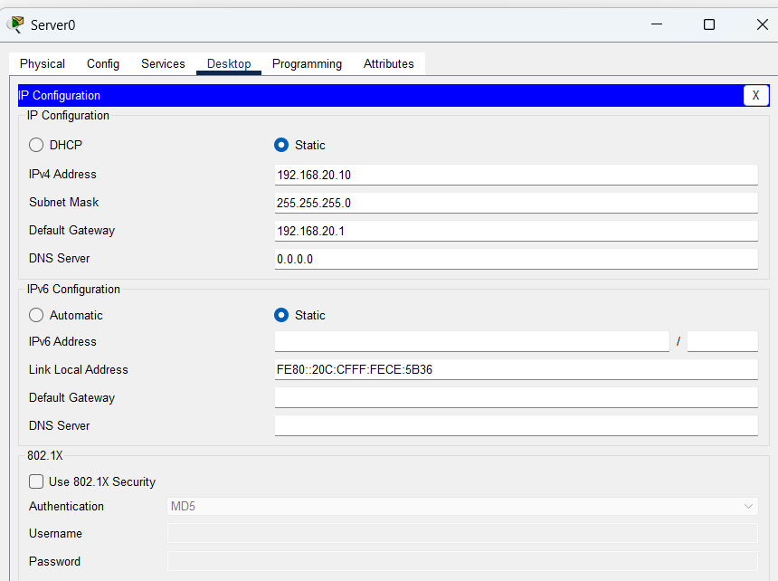
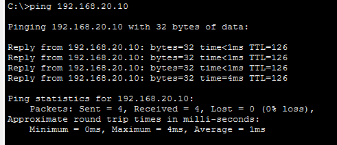
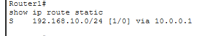
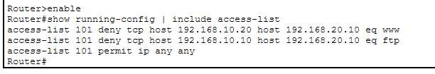
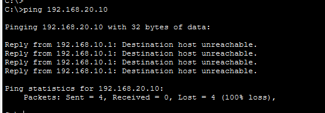
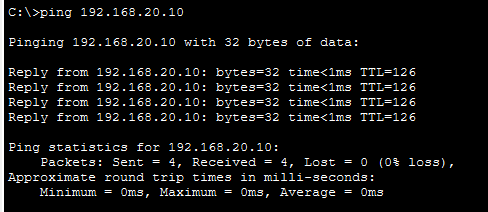
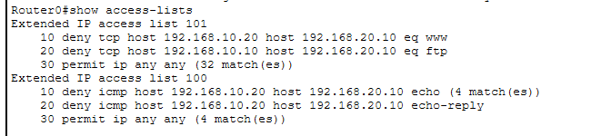

# LAB 14 — ACL Troubleshooting

## 📌 Overview

This lab demonstrates the technical processes involved in **Access Control List (ACL) Troubleshooting and Traffic Audit Diagnostics** using Cisco Packet Tracer. 

In enterprise networks, access lists are highly prone to administrative misconfigurations due to strict top-down execution logic, wildcard masking slipups, wrong inbound/outbound directional mapping, or suboptimal placement across topological boundaries. A single misplaced permit/deny statement line can compromise perimeter firewall security or lead to unintentional blackholing of legitimate business traffic. 

This lab operates as a diagnostic scenario where an initially faultydynamic filter environment is audited, investigated, and systematically resolved to enforce correct security baseline parameters alongside existing fixed static routes.

---

## 🎯 Objective

The objectives of this lab are to:

* Develop a programmatic engineering workflow to diagnose, isolate, and resolve ACL configuration faults.
* Apply core Cisco IOS verification tools (`show access-lists`, `show running-config`) to map operational filters.
* Master top-down processing rules and eliminate top-heavy masking sequence bugs.
* Locate and resolve wrong inbound/outbound directional assignments (`ip access-group in/out`).
* Re-engineer ACL statements to verify seamless integration alongside configured static routes.
* Audit real-time packet tracking engines via statement metric hits validation checklists.
* Confirm post-fix infrastructure filtering behavior using definitive end-to-end data plane isolation routines.

---

## 🧪 Lab Environment & Diagnosis Matrix

| Component       | Details             |
| --------------- | ------------------- |
| Simulation Tool | Cisco Packet Tracer |
| Operational Nodes| Router0 (nuuter0), Router1 |
| End Hosts       | PC0, PC1 |
| Target Servers  | Server0 (Secured Enterprise Drop Location) |
| Core Protocol   | Extended Access Control List (ACL 100 Troubleshooting) |
| Running Routing | Static Route Target Network Architecture Convergence |

### 🔍 Identified Root Cause Errors (Fault Log)
1. **Directional/Interface Misplacement:** The active filter was originally bound outbound or to an incorrect adjacent router node interface, bypassing traffic boundary rules.
2. **Top-Down Logic Sequence Flaw:** Contiguous statement lines lacked explicit icmp echo control parameters, preventing exact host target matching mechanisms.

---

# 🌐 Network Topology

The architecture maps distinct local user segments connected across point-to-point WAN lines toward a remote secure server infrastructure layer:


### 📊 Structural Subnet Allocation Blueprint
*   **LAN Subnet 1 (Left Segment):** `192.168.10.0/24`
    *   PC0 Endpoint Host: `192.168.10.10/24` (Permitted Transit Host)
    *   PC1 Endpoint Host: `192.168.10.20/24` (Blocked Target Host - ICMP Only)
    *   Router0 LAN Gateway: `192.168.10.1/24` on interface `Gig0/0`
*   **WAN Transit Link (Core Backbone):** `10.0.0.0/30`
    *   Router0 WAN Interface: `10.0.0.1/30` on interface `Gig0/1`
    *   Router1 WAN Interface: `10.0.0.2/30` on interface `Gig0/0`
*   **LAN Subnet 2 (Right Secured Segment):** `192.168.20.0/24`
    *   Server0 Target Workspace: `192.168.20.10/24`
    *   Router1 LAN Gateway: `192.168.20.1/24` on interface `Gig0/1`

---

# ⚙️ Re-Engineering & Remediation Commands

To override the faulty parameters, the broken access-group bonds are systematically extracted, the old statement array is deleted from volatile configuration memory, and a precise classless Extended filter is re-applied inbound at the local source drop.

### 🛠️ Remediation Command Script (Executed on Router0)
```cisco
enable
configure terminal

! Step 1: Strip broken interface access-group attachments
interface GigabitEthernet0/0
 no ip access-group 100 in
 no ip access-group 100 out
exit

! Step 2: Purge the misconfigured access-list from active configuration memory
no access-list 100

! Step 3: Inject targeted protocol-specific filtering statements
access-list 100 deny icmp host 192.168.10.20 host 192.168.20.10 echo
access-list 100 deny icmp host 192.168.10.20 host 192.168.20.10 echo-reply
access-list 100 permit ip any any

! Step 4: Secure the local ingress gate on the source interface (Inbound)
interface GigabitEthernet0/0
 ip access-group 100 in
exit

end
write memory
```

---

# 💻 System Return-Path Audit Verification (Router1)

To ensure symmetrical data packet traversal boundaries are completely convergent across intermediate points, manual static mapping statements on Router1 are verified:

```cisco
Router1# show ip route static
S    192.168.10.0/24 [1/0] via 10.0.0.1
```

---

# 🖥️ Host Profile Validations

Manual static settings audited locally inside host properties configurations worksheets:

### PC0 Local IP Configuration Profile


### PC1 Local IP Configuration Profile


### Server0 Secure Zone IP Configuration Profile


---

# 🔎 Troubleshooting Lifecycle & Verification Clips

## 1. Initial Fault Discovery (OSPF Convergence Laps)
During the initial troubleshooting verification, resetting the live routing interfaces or clearing active ARP caches caused the initial packet paths to trigger short **Request timed out** drops while rebuilding active hardware mapping tables.


---

## 2. Active Router Interfaces Summary Check
The hardware interface lines and static route configurations were audited across the backbone system boundary to confirm link readiness.


---

## 3. Command Injection Remediation Block
The remediation command block was executed directly inside the configuration interface to force immediate operational recovery.


---

## 4. Post-Fix Access-List Properties Audit
Running the verification command proves that the rules have compiled correctly inside the localized security engine.


---

# 🔒 Post-Remediation Verification & Connectivity Testing

### Case A: Blocked Host Verification Check (PC1 -> Server0)
An end-to-end ICMP ping test is initiated from **PC1** toward **Server0**. Router0 immediately catches the packet inbound on `Gig0/0`, validates it against the Extended deny criteria, discards the packet, and returns an administrative unreachable alert.


**ICMP Ping Status: BLOCKED / DENIED SUCCESSFULLY ❌ (Reply from 192.168.10.1: Destination host unreachable)**

---

### Case B: Permitted Host Validation Check (PC0 -> Server0)
A parallel validation connectivity routine is executed from the permitted host node **PC0** toward **Server0**. Once the convergence lag cleared, the source IP address bypassed the rule criteria, hit the permission block, and passed smoothly.


**ICMP Ping Status: ALLOWED / PASSED SUCCESSFULLY ✅ (0% packet loss statistics)**

---

## 5. Live Match Counters Validation Check
Re-running the metrics check shows real-time packet tracking matches (`matches` logs) accumulating successfully at the rule line boundary, confirming active firewall enforcement.


---

# 🔎 Diagnostics Reference Guide

| Verification Command      | Technical Operational Target Purpose |
| :------------------------ | :------------------------------------------------------------- |
| `show ip interface brief` | Audit active hardware interface states and IP tracking address maps |
| `show access-lists`       | Print configured access-list rules and match criteria counter hits |
| `show ip interface <int>` | Verify which specific ACL index is applied to an interface and direction |
| `show running-config`     | Parse system startup config properties configuration lines script |
| `show ip route static`    | Print manual static configuration path maps converged inside hardware engine |

---

# ✅ Expected Lab Outcome

After completing the troubleshooting cycle:
* Broken or misplaced access-group attachments are successfully expunged from interface definitions.
* Numbered Extended ACL 100 successfully forces strict top-down processing rules.
* Static transport routes process rules accurately, preventing perimeter protocol bypass.
* PC1's explicit ICMP echo packets are caught and discarded inbound at `Gig0/0` before reaching WAN transit links.
* Permitted nodes (`PC0`) retain flawless data plane connectivity, confirming granular security baseline integrity.

---

## 📂 Lab Files Inventory Checklist

| **File** | **Technical Description** |
| :--- | :--- |
| `README.md` | Comprehensive Lab Technical Documentation (This Document File) |
| `Lab 14 — ACL Troubleshooting.pkt` | Authentic Cisco Packet Tracer network firewall security lab file |
| `01-Topology.png` | Network topology environment design backbone path layout |
| `02-PC0-IP-Configuration.png` | PC0 host network assignment parameters screenshot |
| `03-PC1-IP-Configuration.png` | PC1 host network assignment parameters screenshot |
| `04-Server-IP-Configuration.png` | Server0 secure zone network assignment properties snapshot |
| `05-PC0-Initial-Convergence-Laps.png` | Initial tracking check showing short dynamic protocol convergence gaps |
| `06-R1-Interface-Configuration.png` | Verification data output checking boundary link maps and static configurations |
