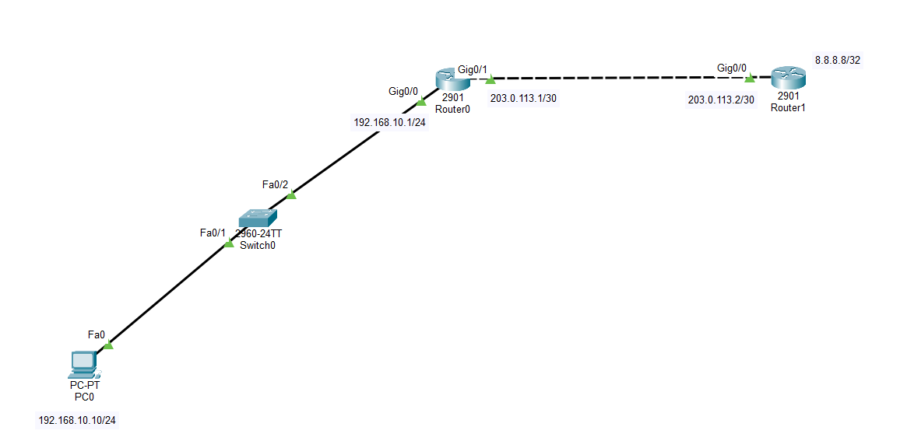
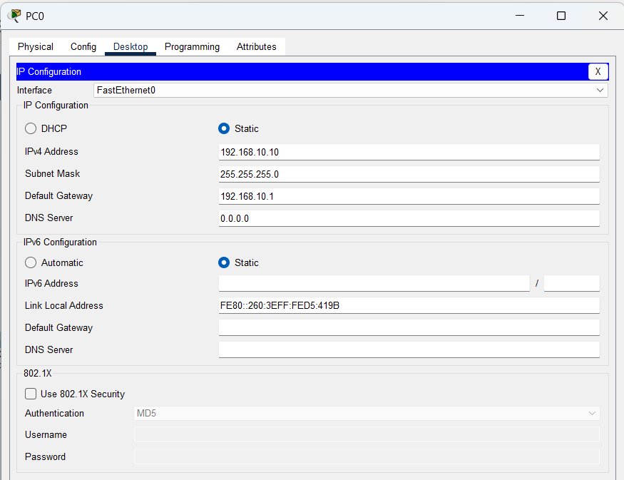
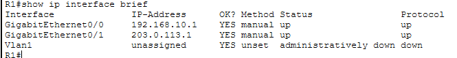
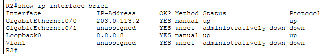
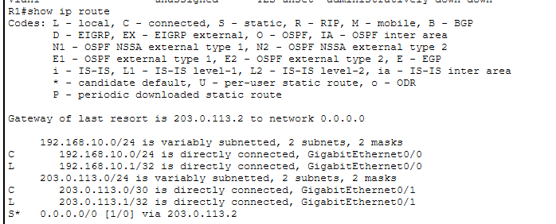
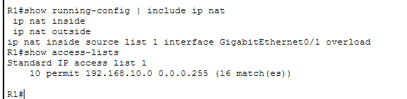
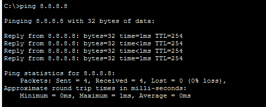
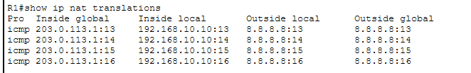
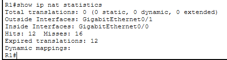
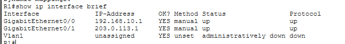

# LAB 15 — Network Core Services: NAT / PAT Configuration

## 📌 Overview

This lab demonstrates how to configure and deploy **Network Address Translation (NAT)** and **Port Address Translation (PAT / NAT Overload)** inside a dual-router transit environment using Cisco Packet Tracer.

As IPv4 address spaces faced rapid global exhaustion, NAT was engineered to conserve public address ranges by allowing networks to reuse private IP blocks internally (defined under RFC 1918). When internal packets traverse perimeter firewall boundaries toward the public Internet, the border gateway router dynamically maps private inside local addresses onto reusable inside global public addresses. 

This lab focuses specifically on **PAT (Port Address Translation / NAT Overload)**, which utilizes unique Layer 4 source port numbers to map multiple internal private hosts simultaneously to a singular shared public IP interface address, optimizing security boundaries and enterprise scaling properties.

---

## 🎯 Objectives

The objectives of this lab are to:

* Configure a multi-router border gateway layout integrating an inside private LAN segment and a simulated public ISP server zone in Cisco Packet Tracer.
* Configure interface boundary mappings to explicitly identify `ip nat inside` and `ip nat outside` zones.
* Configure a Standard Access Control List (ACL) to match legitimate internal host subnets eligible for translation.
* Configure PAT (NAT Overload) globally to tie internal hosts to the external public-facing interface.
* Verify dynamic translation entries within live operational environment mapping tables (`show ip nat translations`).
* Audit performance overhead metrics, total active dynamic hits, and translated boundaries using Cisco IOS statistics toolsets.
* Validate secure host outbound internetwork transit connectivity through successful ICMP Echo end-to-end data plane testing.

---

## 🧪 Lab Environment & Structural Parameters

| Component       | Details             |
| --------------- | ------------------- |
| Simulation Tool | Cisco Packet Tracer |
| Hardware Routers| R0 (Border Gateway), R1 (Simulated ISP Edge) |
| Core Switches   | SW1 (Cisco 2960-24TT) |
| End Devices     | PC0 |
| Inside Private  | 192.168.10.0/24 Subnet Block (LAN Segment) |
| Outside Public  | 203.0.113.0/30 WAN Transit Line |
| Target Internet | 8.8.8.8/32 Simulated Loopback Destination |
| Translation Mode| Port Address Translation (PAT / NAT Overload) |

---

# 🌐 Network Topology

The production architecture implements a localized private perimeter that dynamically overloads exiting payloads onto corporate WAN pipelines:



### 📊 Structural Subnet Allocation Blueprint
*   **Inside Private Segment (LAN Zone):** `192.168.10.0/24`
    *   PC0 Endpoint Host: `192.168.10.10/24`
    *   R0 Inside Local Gateway: `192.168.10.1/24` on interface `Gig0/0`
*   **Outside Public Segment (WAN Transit Link):** `203.0.113.0/30`
    *   R0 Inside Global WAN Interface: `203.0.113.1/30` on interface `Gig0/1`
    *   R1 Outside ISP Gateway Ingress: `203.0.113.2/30` on interface `Gig0/0`
*   **Remote Public Server Zone (Internet Sector):** `8.8.8.8/32`
    *   R1 Simulated Google Public DNS Core: `8.8.8.8/32` on interface `Loopback0`

---

# ⚙️ NAT / PAT Operational Configuration Scripts

To establish functional PAT boundaries, internal and external translation zones are defined under hardware interfaces, an access-list is written to match private hosts, and overloading mechanics are linked globally to the WAN link.

### 📝 Core Command Script (Executed on Border Router R0)
```cisco
enable
configure terminal
hostname R0

! Step 1: Assign Private LAN IP and map it as the NAT Inside zone
interface GigabitEthernet0/0
 ip address 192.168.10.1 255.255.255.0
 ip nat inside
 no shutdown
exit

! Step 2: Assign Public WAN IP and map it as the NAT Outside zone
interface GigabitEthernet0/1
 ip address 203.0.113.1 255.255.255.252
 ip nat outside
 no shutdown
exit

! Step 3: Define a Standard ACL matching the inside private subnet block
access-list 1 permit 192.168.10.0 0.0.0.255

! Step 4: Link ACL 1 dynamically to the WAN interface using dynamic Port Overloading
ip nat inside source list 1 interface GigabitEthernet0/1 overload

! Step 5: Configure default tracking route pointing outwards toward ISP R1
ip route 0.0.0.0 0.0.0.0 203.0.113.2
end
write memory
```

### 📝 Baseline ISP Routing Script (Executed on Router R1)
```cisco
enable
configure terminal
hostname R1

interface GigabitEthernet0/0
 ip address 203.0.113.2 255.255.255.252
 no shutdown
exit

interface loopback 0
 ip address 8.8.8.8 255.255.255.255
exit
end
write memory
```
*(Note: An industrial-grade simulated public ISP router carries **zero routing table definitions** for internal private networks like `192.168.10.0/24`. Connectivity is maintained purely because PAT translates private sources into public WAN addresses before forwarding packets).*

---

# 🖥️ Host Profile Validations

Manual static assignment properties configured locally inside operational host network worksheets:

### PC0 Local Inside Private Network Profile


---

# 🔎 Dynamic Core Diagnostics & Address Verification

## 1. Baseline Link Summary Properties Check
Confirm basic hardware line status metrics are up/up across core interfaces.


### Remote Backbone Properties


---

## 2. Dynamic Translation Engine Verification
The actual route convergence parameters applied across global profiles show successful lookup path mapping checks:


### Active PAT Overload Configuration Properties


---

# 🔒 Data Plane Connectivity & Live PAT Table Audit

## 1. Outbound Internet Connectivity Check
An end-to-end data packet transmission routine is initiated from **PC0** toward the public server **8.8.8.8**. The border gateway intercept checks local parameters, translates private boundaries successfully, and maps the traffic cleanly.
```cmd
C:\> ping 8.8.8.8
```


**ICMP Ping Status: ALLOWED & TRANSITED SUCCESSFULLY ✅ (0% packet drop statistics)**

---

## 2. Live Active Translation Table Trajectory Capture
While active ping tests run, executing the dynamic translation verification query captures real-time translation state metrics:
```cisco
R0# show ip nat translations
```


The live processing log parses the exact structural Layer 3 / Layer 4 multiplexing translations mapping the dynamic Inside Local network block to Inside Global addresses.

---

## 3. Dynamic Core NAT Performance Statistics Audit
To analyze dynamic translation parameters, total dynamic allocations, allocation misses, and hit metrics, the statistics summary tool is queried on the boundary node:
```cisco
R0# show ip nat statistics
```


### Final System Boundary Matrix Check
```cisco
R0# show ip interface brief
```


---

# 🔎 Core Network Services Diagnostics Reference Guide

| Verification Command      | Technical Operational Target Purpose |
| :------------------------ | :------------------------------------------------------------- |
| `show ip interface brief` | Audit active hardware interface states and IP tracking address maps |
| `show ip route`           | Print entire live convergent routing engine path data engine  |
| `show access-lists`       | Print configured access-list rules matching private traffic scopes |
| `show ip nat translations`| Print dynamic active NAT/PAT translation engine mappings database |
| `show ip nat statistics`  | Parse hardware hit counters, miss logs, and system deployment statistics |
| `ping <Destination-IP>`   | Validate outward traffic routing clearance crossing translation boundaries |

---

# ✅ Expected Lab Outcome

After successful deployment:
* Router R0 dynamically intercepts private source packets heading outbound.
* Core processes translate internal hosts (`192.168.10.10`) into the singular public IP interface `203.0.113.1` using distinct Layer 4 source ports.
* The public ISP router R1 successfully handles returning traffic frames without running explicit route mappings back to private scopes.
* End-to-end data plane accessibility checks complete successfully with stable 0% packet drop metrics.

---

## 📂 Lab Files Inventory Checklist

| **File** | **Technical Description** |
| :--- | :--- |
| `README.md` | Comprehensive Lab Technical Documentation (This Document File) |
| `Lab 15 - NAT - PAT.pkt` | Authentic Cisco Packet Tracer core address translation network blueprint |
| `01-Topology.png` | Network topology environment design backbone path layout |
| `02-PCO-IP-Configuration.png` | PC0 inside private network host assignment screenshot |
| `03-RO-Interface-Configuration.png` | R0 perimeter interface summary configuration clip |
| `04-R1-Interface-Configuration.png` | R1 ISP interface summary configuration clip |
| `05-Routing-Configuration.png` | R0 static default path lookup profile verification capture |
| `06-PAT-Configuration.png` | Global dynamic port overloading injection command configuration clip |
| `07-Ping-Success.png` | Outbound host transport plane connectivity validation crossing translation scopes |
