# LAB 16 — Network Core Services: Static NAT Configuration

## 📌 Overview

This lab demonstrates how to configure and deploy **Static Network Address Translation (Static NAT)** inside a dual-router corporate gateway topology using Cisco Packet Tracer.

Unlike Dynamic NAT or PAT (NAT Overload), Static NAT creates a permanent, **one-to-one mapping** between a private inside-local IP address and a public inside-global IP address. This static translation allows external internet hosts to initiate direct inbound sessions to internal servers (such as corporate web or mail servers) protected behind a perimeter gateway, while completely hiding the true private IP scheme from the public domain.

The lab focuses on initializing one-to-one mapping structures, defining interface NAT zones, engineering specific outside return paths, and validating bidirectional data plane reachability.

---

## 🎯 Objectives

The objectives of this lab are to:

* Configure a multi-router border gateway layout integrating an inside private LAN segment and a simulated public ISP zone in Cisco Packet Tracer.
* Configure interface boundary mappings to explicitly identify `ip nat inside` and `ip nat outside` zones.
* Implement a Numbered Static NAT mapping statement to bind a private host to a dedicated public IPv4 address.
* Configure precise static routing profiles to manage traffic boundary traversals symmetrically.
* Verify dynamic and static translation entries within live operational environment mapping tables (`show ip nat translations`).
* Test bidirectional end-to-end data plane connectivity via outbound client testing and inbound internet-to-inside server reachability.
* Audit performance metrics and configuration states using Cisco IOS statistics toolsets.

---

## 🧪 Lab Environment & Structural Parameters

| Component       | Details             |
| --------------- | ------------------- |
| Simulation Tool | Cisco Packet Tracer |
| Hardware Routers| R0 (Border NAT Gateway), R1 (Outside/ISP Router) |
| Core Switches   | SW0 (Cisco 2960-24TT) |
| End Devices     | PC0 (Inside Protected Host) |
| Inside Private  | 192.168.10.0/24 Subnet Block (LAN Segment) |
| Outside Public  | 203.0.113.0/30 WAN Transit Line |
| Target Internet | 8.8.8.8/32 Simulated Loopback Destination |
| Translation Mode| One-to-One Static Network Address Translation (Static NAT) |

---

# 🌐 Network Topology

The architecture maps private internal computing nodes transiting a secure edge checkout perimeter toward public external server spaces across an automated ISP network layer:

### Topology Schematic
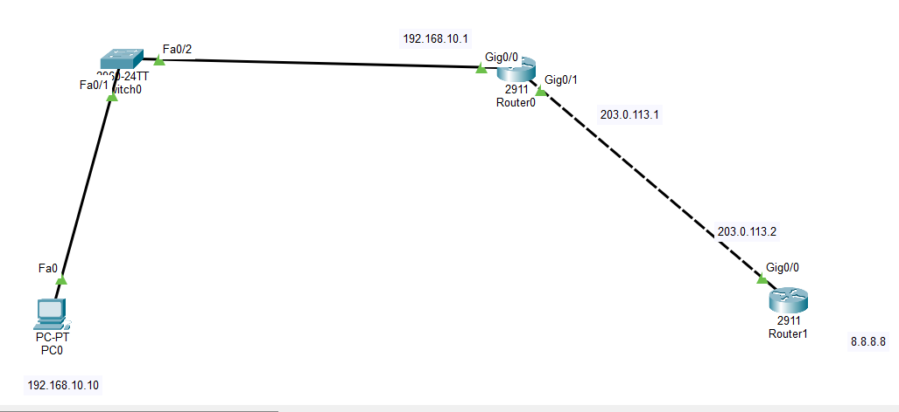

### 📊 Structural Subnet Allocation Blueprint
*   **Inside Private Segment (LAN Zone):** `192.168.10.0/24`
    *   PC0 Endpoint Host: `192.168.10.10/24`
    *   R0 Inside Local Gateway: `192.168.10.1/24` on interface `Gig0/0`
*   **Outside Public Segment (WAN Transit Link):** `203.0.113.0/30`
    *   R0 Inside Global WAN Interface: `203.0.113.1/30` on interface `Gig0/1`
    *   R1 Outside ISP Gateway Ingress: `203.0.113.2/30` on interface `Gig0/0`
*   **Remote Public Server Zone (Internet Sector):** `8.8.8.8/32`
    *   R1 Simulated Google Public DNS Core: `8.8.8.8/32` on interface `Loopback0`

### 🔄 Static NAT Mapping Matrix

| Mapping Type | IPv4 Address Asset | Functional Architectural Definition |
| :--- | :--- | :--- |
| **Inside Local** | `192.168.10.10` | Real Private Internal Client/Server IP Profile |
| **Inside Global** | `203.0.113.10` | Dedicated Public Facing External Aliased IP Profile |

---

# ⚙️ Static NAT Operational Configuration Scripts

To establish functional Static NAT boundaries, internal and external translation zones are defined under hardware interfaces, a one-to-one rule is written globally, and a default outbound path is linked to the WAN link.

### 📝 Core Command Script (Executed on Border Router R0)
```cisco
enable
configure terminal
hostname R0

! Step 1: Assign Private LAN IP and map it as the NAT Inside zone
interface GigabitEthernet0/0
 ip address 192.168.10.1 255.255.255.0
 ip nat inside
 no shutdown
exit

! Step 2: Assign Public WAN IP and map it as the NAT Outside zone
interface GigabitEthernet0/1
 ip address 203.0.113.1 255.255.255.252
 ip nat outside
 no shutdown
exit

! Step 3: Establish the explicit 1-to-1 Static NAT mapping block
ip nat inside source static 192.168.10.10 203.0.113.10

! Step 4: Configure default tracking route pointing outwards toward ISP R1
ip route 0.0.0.0 0.0.0.0 203.0.113.2
end
write memory
```

### 📝 Baseline ISP Routing Script (Executed on Router R1)
```cisco
enable
configure terminal
hostname R1

! Step 1: Initialize incoming public transit interfaces
interface GigabitEthernet0/0
 ip address 203.0.113.2 255.255.255.252
 no shutdown
exit

! Step 2: Initialize external public target engine loopback
interface loopback 0
 ip address 8.8.8.8 255.255.255.255
exit

! Step 3: Engineer specific static return route targeting the Inside Global public profile
ip route 203.0.113.10 255.255.255.255 203.0.113.1
end
write memory
```
*(Note: An industrial-grade simulated public ISP router carries **zero routing table definitions** for internal private networks like `192.168.10.0/24`. R1 routes return traffic targeting the translated Public Inside Global IP `203.0.113.10` via R1's gateway interface).*

---

# 🖥️ Host Profile Validations

Manual static assignment properties configured locally inside operational host network worksheets:

### PC0 Local Inside Private Network Profile
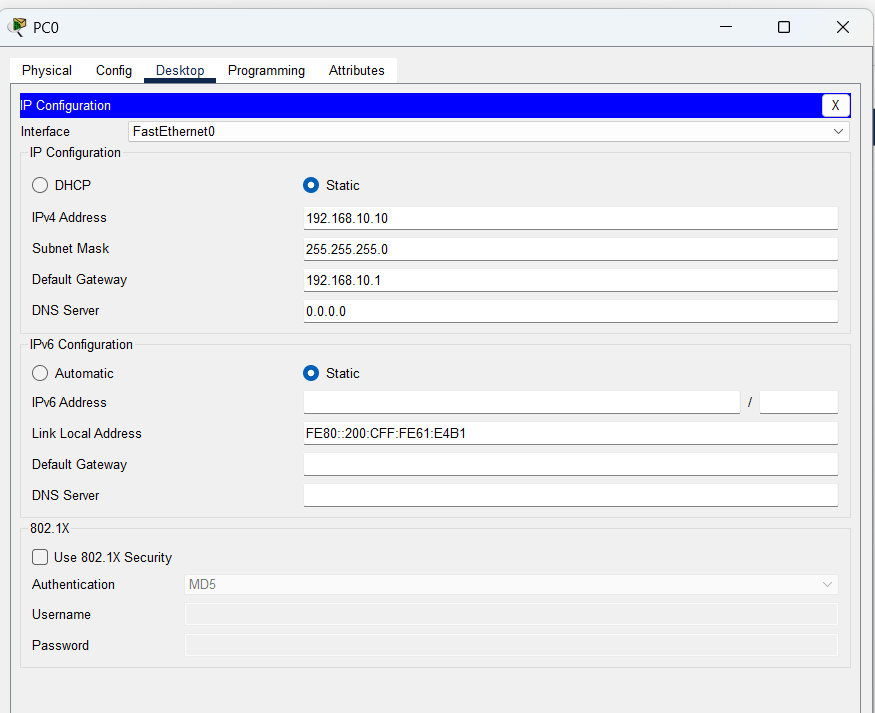

---

# 🔎 Dynamic Core Diagnostics & Address Verification

## 1. Baseline Link Summary Properties Check
Confirm basic hardware line status metrics are up/up across core interfaces.

### Router R0 Boundary Interface Table
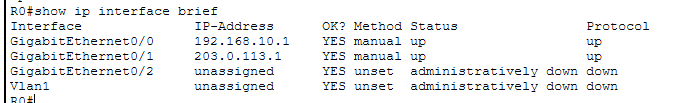

### Router R1 ISP Interface Table
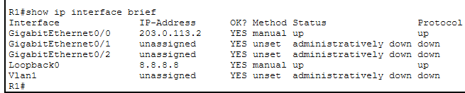

---

## 2. Dynamic Routing Convergence Validation
The actual route convergence parameters applied across global profiles show successful lookup path mapping checks:

### Router R0 Default Forwarding Matrix
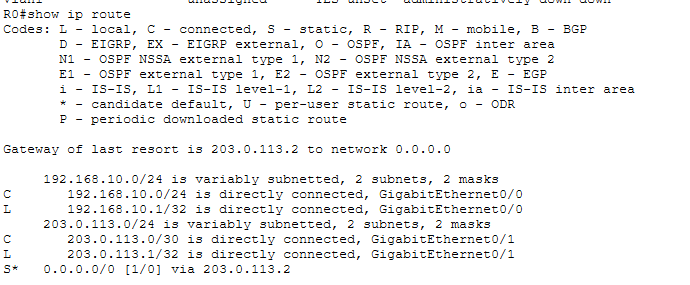

### Router R1 Internet Return Lane Mappings
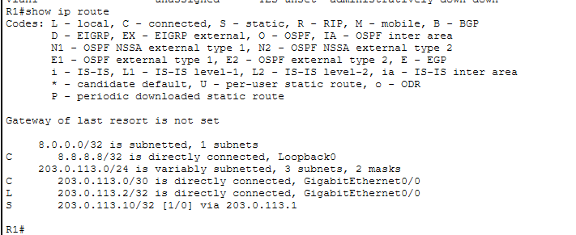

---

## 3. Static NAT Rule Verification
To audit active global translation parameters running inside the volatile system profiles:
```cisco
R0# show running-config | include ip nat
```
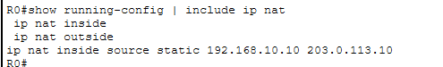

---

# 🔒 Data Plane Connectivity & Live NAT Table Audit

## 1. Bidirectional Connectivity Verification (Outbound & Inbound)
End-to-end data plane reachability testing is evaluated across distinct network segment layers.

### Test A: Outbound Client Test (PC0 -> 8.8.8.8)
An outbound message check is initiated from **PC0** targeting public internet space. Traffic transits the boundary safely as R0 swaps private parameters for public metrics.

### Test B: Inbound Internet Server Test (R1 -> 203.0.113.10)
An inbound connectivity verification check is initiated directly from the outside ISP platform **R1** targeting the **Inside Global public address**. R0 catches the incoming frames, processes the translation table, and safely tunnels the packets to PC0.
```text
R1# ping 203.0.113.10
```
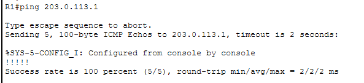

**ICMP Ping Status: ALLOWED & TRANSITED SUCCESSFULLY ✅ (100% success rate / 0% packet drop)**

---

## 2. Live Active Translation Table Trajectory Capture
Executing the translation lookup matrix command parses the active one-to-one static mapping convergence statistics:
```cisco
R0# show ip nat translations
```
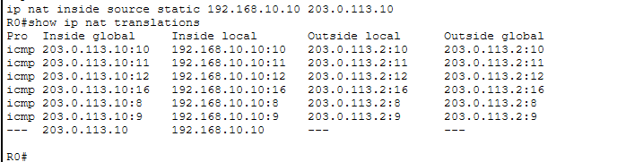

---

## 3. Dynamic Core NAT Performance Statistics Audit
To analyze dynamic translation parameters, total dynamic allocations, allocation misses, and hit metrics, the statistics summary tool is queried on the boundary node:
```cisco
R0# show ip nat statistics
```
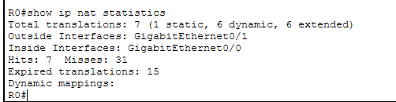

### Final System Boundary Matrix Check
```cisco
R0# show running-config
```
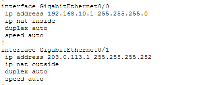

---

# 🔎 Core Network Services Diagnostics Reference Guide

| Verification Command      | Technical Operational Target Purpose |
| :------------------------ | :------------------------------------------------------------- |
| `show ip interface brief` | Audit active hardware interface states and IP tracking address maps |
| `show ip route`           | Print entire live convergent routing engine path data engine  |
| `show ip nat translations`| Print dynamic active NAT/PAT translation engine mappings database |
| `show ip nat statistics`  | Parse hardware hit counters, miss logs, and system deployment statistics |
| `show running-config`     | Parse system startup config properties configuration lines script |
| `ping <Destination-IP>`   | Validate outbound traffic routing clearance crossing translation boundaries |

---

