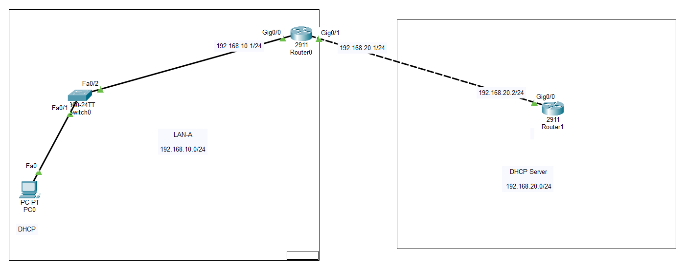
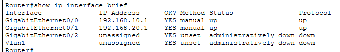
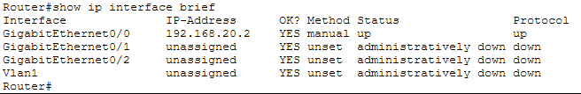
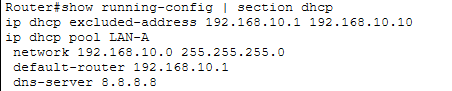
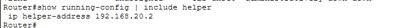
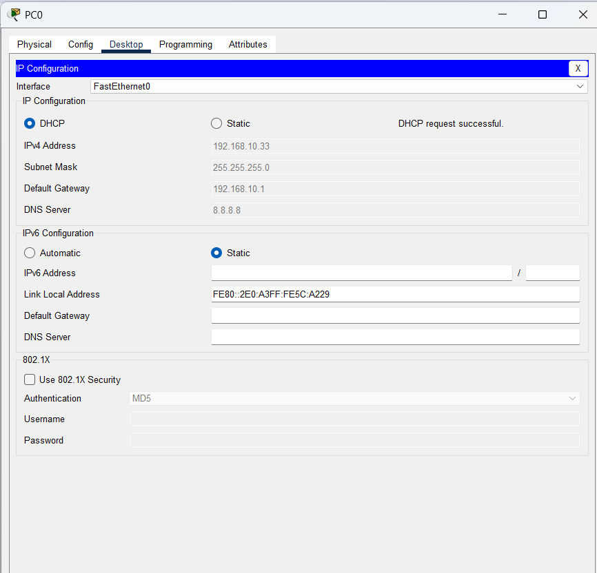
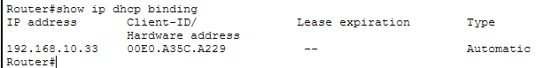
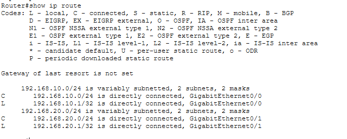
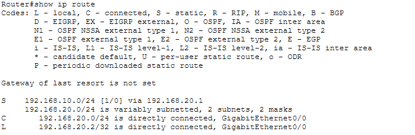
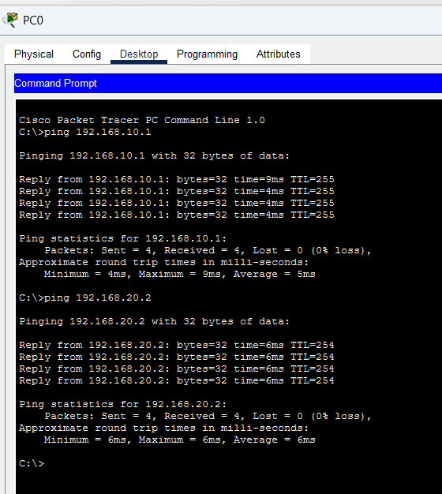

# LAB 17 — OSPF and ACL Troubleshooting

## 📌 Overview

This lab demonstrates how to configure and deploy a **DHCP Relay Agent** (Dynamic Host Configuration Protocol Relay) across separate Layer 3 network domains using Cisco Packet Tracer.

By default, DHCP clients locate servers using limited broadcast messages (destination MAC `FF:FF:FF:FF:FF:FF` and destination IP `255.255.255.255`). Because Cisco routers block broadcast packets at network segment boundaries to isolate broadcast storms, a client host (`PC0`) cannot directly acquire dynamic configurations if the Central DHCP Server (`R1`) is located inside a remote subnet zone. 

A **DHCP Relay Agent** solves this communication barrier. When configured on the client-facing gateway interface using the `ip helper-address` command, the router intercepts incoming local broadcast DHCP Discover messages, encapsulates them inside unicast IP packets, and forwards them directly to the remote server's IP address. This design enables a single centralized server to manage IP pools across multiple remote local area networks.

---

## 🎯 Objectives

The objectives of this lab are to:

* Configure precise classless fixed static IPv4 address profiles on core gateway routers.
* Build a centralized DHCP Server profile on R1 incorporating active excluded address ranges and pool allocations.
* Configure R0 as a functional DHCP Relay Agent using the interface `ip helper-address` mechanism.
* Validate dynamic host auto-configuration mapping parameters locally on end-user operating slots.
* Implement proper static infrastructure routing paths to maintain end-to-end return lane symmetry.
* Audit live leased hardware allocations inside the centralized network engine via dynamic IP binding tables.
* Validate end-to-end bidirectional transport plane reachability using standard ICMP metrics checking.

---

## 🧪 Lab Environment & Structural Parameters

| Component       | Details             |
| --------------- | ------------------- |
| Simulation Tool | Cisco Packet Tracer |
| Core Gateway    | R0 (DHCP Relay Agent Gateway) |
| Central Server  | R1 (Centralized IP Provisioning Engine / DHCP Server) |
| Client Switches | SW0 (Cisco 2960-24TT) |
| End Devices     | PC0 (Dynamic Host Auto-Configuration Client) |
| Client LAN Sub  | 192.168.10.0/24 Segment |
| Transit Link    | 192.168.20.0/24 Backbone Network |
| Relay Mechanism | Unicast Encapsulation via Interface Helper-Address Mapping |

---

# 🌐 Network Topology

The architecture maps private dynamic client nodes transiting local switches toward an intermediate boundary node that tunnels payloads across transit lines to a central core network assignment pool:



### 📊 Structural Subnet Allocation Blueprint
*   **Inside Protected LAN Segment (Client Area 1):** `192.168.10.0/24`
    *   PC0 Endpoint Host: DHCP Assigned Client Allocation Space
    *   R0 Local LAN Gateway Interface: `192.168.10.1/24` on interface `Gig0/0`
*   **Core Transit Backbone Segment (WAN Link Route):** `192.168.20.0/24`
    *   R0 Upstream WAN Ingress Interface: `192.168.20.1/24` on interface `Gig0/1`
    *   R1 Central Server Gateway Interface: `192.168.20.2/24` on interface `Gig0/0`

---

# ⚙️ DHCP Server & Relay Operational Configuration Scripts

To establish a centralized allocation block, address range exclusions are declared, pools are mapped to target wings, interface helpers are linked on client-facing edge gates, and symmetric return loops are injected manually.

### 📝 Relay Gateway Command Script (Executed on Router R0)
```cisco
enable
configure terminal
hostname R0

! Step 1: Assign Private LAN IP and register the explicit target Server Unicast Address
interface GigabitEthernet0/0
 ip address 192.168.10.1 255.255.255.0
 ip helper-address 192.168.20.2
 no shutdown
exit

! Step 2: Assign Transit WAN IP facing the remote server wing
interface GigabitEthernet0/1
 ip address 192.168.20.1 255.255.255.0
 no shutdown
exit
end
write memory
```

### 📝 Central Server & Allocation Command Script (Executed on Router R1)
```cisco
enable
configure terminal
hostname R1

! Step 1: Initialize server gateway communication interface
interface GigabitEthernet0/0
 ip address 203.0.113.2 255.255.255.0
 ip address 192.168.20.2 255.255.255.0
 no shutdown
exit

! Step 2: Declare explicit exclusions to preserve static device gateway lines
ip dhcp excluded-address 192.168.10.1 192.168.10.10

! Step 3: Instantiate the structural dynamic scope allocation pool
ip dhcp pool LAN-A
 network 192.168.10.0 255.255.255.0
 default-router 192.168.10.1
 dns-server 8.8.8.8
exit

! Step 4: Engineer specific static return path leading back to client LAN segments
ip route 192.168.10.0 255.255.255.0 192.168.20.1
end
write memory
```

---

# 🔎 Interface Status & Parameter Validation

Confirm active hardware line status metrics are up/up across core interfaces.

### Router R0 Boundary Interface Status Table


### Router R1 Server Interface Status Table


---

# ⚙️ Allocation Scope & Helper Mappings Check

## 1. Central Server Dynamic Scope Table Audit
Verifying the running dynamic parameters profile inside the server memory layer confirms that exclusions and lease metrics have compiled cleanly.
```cisco
R1# show running-config | section dhcp
```


---

## 2. Inbound Interface Helper Configuration Verification
Verifying active parameters on the client gateway node confirms that broadcast interception targets are correctly mapped.
```cisco
R0# show running-config | include helper
```


---

# 💻 Client Auto-Configuration & Active Binding Table Audit

## 1. Endpoint DHCP Host Initialization
Switching the client platform workstation metric from static to automated triggers an outbound broadcast. R0 intercepts the packet, encapsulates it as a unicast frame, and forwards it to R1. R1 assigns the first available lease (`192.168.10.11`) along with default gateway parameters.


---

## 2. Centralized Hardware Allocation Binding Check
To audit live dynamically leased hardware entries, MAC addresses, and lease status, the centralized binding database is queried on R1:
```cisco
R1# show ip dhcp binding
```


---

# 🛣️ Network Layer Routing Verification

Because traffic crosses multiple network domains, routing parameters must be convergent to maintain symmetric communication channels.

### Router R0 Local Connected Converged Routing Table


### Router R1 Symmetrical Return Lane Routing Table


---

# 🔒 Data Plane Connectivity Diagnostics

End-to-end transport plane reachability testing is evaluated across distinct network segment layers from the auto-configured terminal workspace:

```cmd
C:\> ping 192.168.20.2
```


**ICMP Ping Status: ALLOWED & TRANSITED SUCCESSFULLY ✅ (0% packet drop statistics)**

---

# 🔎 Core Network Services Diagnostics Reference Guide

| Verification Command      | Technical Operational Target Purpose |
| :------------------------ | :------------------------------------------------------------- |
| `show ip interface brief` | Audit active hardware interface states and IP tracking address maps |
| `show ip dhcp binding`    | Print centralized live convergent client MAC-to-IP address leases matrix |
| `show ip nat statistics`  | Parse hardware pool configurations, lease pools metrics, and scope lines |
| `show ip route`           | Extract dynamically converged optimal forwarding paths database map |
| `show running-config`     | Parse system startup config properties configuration lines script |
| `ping <Destination-IP>`   | Validate outward traffic routing clearance crossing network boundaries |

---

# ✅ Expected Lab Outcome

After successful deployment:
* Local client host broadcast signals are intercepted outbound at interface `Gig0/0` on R0.
* Packets are wrapped inside standard unicast structures and successfully routed across the `192.168.20.0/24` network to R1.
* The centralized allocation pool accurately leases configuration fields, passing correct gateway options to the client host.
* Symmetrical static return entries allow remote server responses to reach client nodes securely.
* Multi-segment data plane connectivity passes successfully with zero loss parameters.

---

## 📂 Lab Files Inventory Checklist

| File | Technical Description |
| :--- | :--- |
| `README.md` | Comprehensive Lab Technical Documentation (This Document File) |
| `Lab 17 – DHCP Relay.pkt` | Authentic Cisco Packet Tracer core network auto-provisioning sandbox file |
| `01-Topology.png` | Network topology environment design backbone path layout |
| `02-R0-Interface-Configuration.png` | Router R0 perimeter interface summary configuration clip |
| `03-R1-Interface-Configuration.png` | Router R1 server interface summary configuration clip |
| `04-R1-DHCP-Pool-Configuration.png` | Central server dynamic pool scope setup validation capture |
| `05-R0-DHCP-Relay-Configuration.png` | Inbound interface helper address statement verification snapshot |
| `06-PC0-DHCP-Configuration.png` | Dynamic client auto-configuration metric extraction screenshot |
