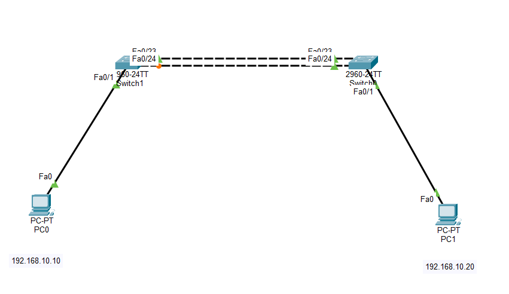
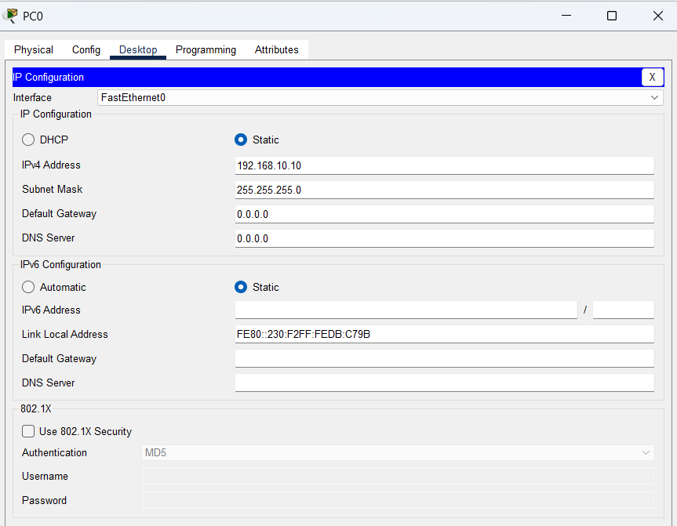
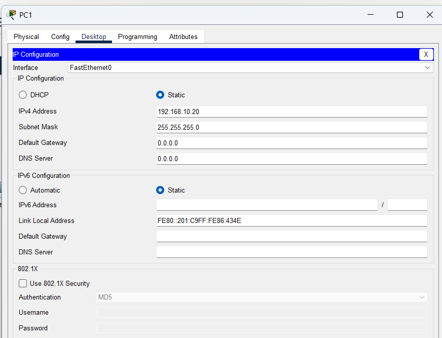
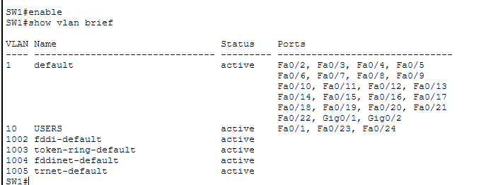
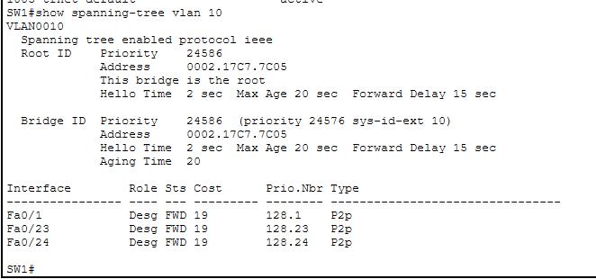
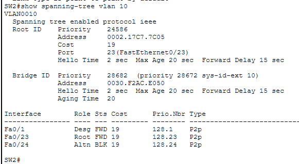
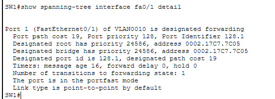
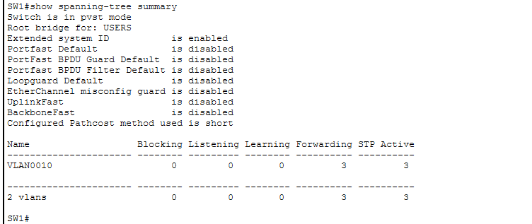
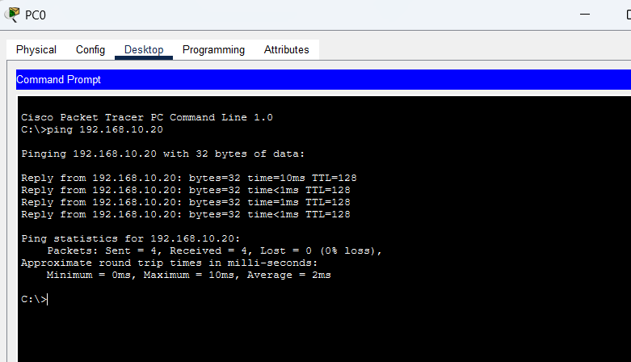

# LAB 18 — Layer 2 Optimization: STP, PortFast, and BPDU Guard

## 📌 Overview

This lab demonstrates how to configure and optimize the **Spanning Tree Protocol (STP)**, alongside corporate edge security features **PortFast** and **BPDU Guard**, across a redundant network environment using Cisco Packet Tracer.

In Layer 2 network environments, redundant connections are engineered between switches to ensure high availability. However, without a control loop protocol, these redundant paths trigger disastrous broadcast storms, MAC address table instability, and multiple frame copy replications. STP (defined under IEEE 802.1D) solves this structural constraint by logically blocking redundant interfaces to maintain a single, loop-free data plane forwarding path.

Furthermore, this lab introduces edge access modifications: **PortFast** is applied to client-facing ports to bypass traditional listening/learning convergence delays, while **BPDU Guard** is layered on top to shut down ports instantly if malicious or accidental external bridge loops are introduced.

---

## 🎯 Objectives

The objectives of this lab are to:

* Configure a redundant multi-switch infrastructure backbone to analyze active spanning-tree topologies.
* Manipulate priority values to explicitly elect a primary **Root Bridge** and backplane traffic pathways.
* Analyze dynamic port states, confirming correct convergence of Root Ports, Designated Ports, and Alternative/Blocking interfaces.
* Configure **PortFast** on access ports to accelerate host convergence times from 30 seconds to immediate forwarding.
* Implement **BPDU Guard** security constraints to protect access edges against unauthorized switch injections.
* Test network loop prevention and bidirectional transport plane connectivity using ICMP echo routines.

---

## 🧪 Lab Environment & Hardware Matrix

| Component | Details |
| :--- | :--- |
| Simulation Tool | Cisco Packet Tracer |
| Core Switches | SW1 (Primary Root), SW2 (Secondary/Backup Root) |
| Hardware Platform| Cisco Catalyst 2960-24TT Series FastEthernet Switches |
| Client End Devices| PC0, PC1 |
| Configured VLAN | VLAN 10 (Name: USERS) |
| Optimization Modes| PortFast Edge Acceleration & BPDU Guard Erdisable Security |

---

# 🌐 Network Topology

The architecture implements a dual-link core backbone link tying edge access switches that deliver data access plane services to user networks:



### 📊 Structural VLAN and Subnet Blueprint
*   **VLAN Configuration:** VLAN 10 registered as `USERS` globally across the fabric segment.
*   **User IP Addressing Profile:**
    *   PC0 Workspace Host: `192.168.10.10/24` mapped into interface `Fa0/1` on SW1.
    *   PC1 Workspace Host: `192.168.10.20/24` mapped into interface `Fa0/1` on SW2.
*   **Redundant Switching Trunk Links:** Cascading trunk pipelines established across `Fa0/23` and `Fa0/24` boundary rings connecting SW1 to SW2.

---

# ⚙️ Layer 2 Switching Configuration Scripts

To establish a loop-free architecture, database containers are created, port security attributes are bound to access gates, and bridge IDs are manipulated manually.

### 📝 Switch 1 Core Configuration (Executed on SW1)
```cisco
enable
configure terminal
hostname SW1

vlan 10
 name USERS
exit

! Configure client-facing interface with edge acceleration and security guard
interface FastEthernet0/1
 switchport mode access
 switchport access vlan 10
 spanning-tree portfast
 spanning-tree bpduguard enable
exit

! Configure redundant backbone trunk links
interface range FastEthernet0/23 - 24
 switchport mode access
 switchport access vlan 10
exit

! Force manual election of SW1 as the Spanning Tree Root Bridge
spanning-tree vlan 10 root primary
end
copy running-config startup-config
```

### 📝 Switch 2 Core Configuration (Executed on SW2)
```cisco
enable
configure terminal
hostname SW2

vlan 10
 name USERS
exit

! Configure client-facing interface with edge acceleration and security guard
interface FastEthernet0/1
 switchport mode access
 switchport access vlan 10
 spanning-tree portfast
 spanning-tree bpduguard enable
exit

! Configure redundant backbone trunk links
interface range FastEthernet0/23 - 24
 switchport mode access
 switchport access vlan 10
exit

! Configure SW2 as the secondary/backup root path
spanning-tree vlan 10 root secondary
end
copy running-config startup-config
```

---

# 🖥️ Host Profile Validations

Manual static assignment properties configured locally inside operational host network worksheets:

### PC0 Local VLAN 10 User Settings


### PC1 Local VLAN 10 User Settings


---

# 🔎 Spanning Tree Database Audit & Port States Analysis

## 1. Primary Root Bridge Verification
Verifying the running layer 2 operational properties on **SW1** confirms that it has successfully won the root election based on engineered priority metrics.
```cisco
SW1# show spanning-tree vlan 10
```


### Root Election Mechanics
```text
Root Bridge Matrix Status → SW1 is elected as the central Root Reference Node.
```

---

## 2. Dynamic Port Adjacency Convergence Check
To inspect how the non-root switch evaluates path vectors, the status query is run on **SW2**:
```cisco
SW2# show spanning-tree vlan 10
```


### Symmetrical Path Blocking Snapshot
```cisco
SW2# show spanning-tree vlan 10
```


The link database verification parses the explicit loop-prevention state properties:
*   **Root Port (Root Link Path):** `Fa0/23` transitions cleanly to **`FWD` (Forwarding)**.
*   **Alternate Port (Redundant Link Path):** `Fa0/24` is safely forced into **`BLK` (Blocking/Altn)** state, breaking the broadcast feedback loop.

---

# ⚡ Edge Acceleration and Access Security Verification

## 1. PortFast and BPDU Guard Interface Parameters
To verify that edge configuration injections are active on local host-facing access interfaces:
```cisco
SW1# show running-config interface FastEthernet 0/1
```


---

## 2. Converged Spanning Tree Global Summary Check
To check the overall operational modes, active port instances, and tracking flags across the switch fabric, the status summary engine is queried:
```cisco
SW1# show spanning-tree summary
```


---

# 🔒 Data Plane Connectivity Diagnostics

End-to-end user data plane transport reachability is evaluated across the loop-free converged switches from **PC0** toward **PC1**:

```cmd
C:\> ping 192.168.10.20
```


**ICMP Ping Status: ALLOWED & TRANSITED SUCCESSFULLY ✅ (0% packet drop statistics / 100% stable reachability)**

---

# 🔎 Layer 2 Diagnostics Reference Guide

| Verification Command | Technical Operational Target Purpose |
| :--- | :--- |
| `show spanning-tree vlan <id>` | Print granular STP parameters, root details, and local port states |
| `show spanning-tree summary` | Extract overall switch active mode summaries and global tracking matrices |
| `show spanning-tree interface <id> detail` | Extract detailed per-link edge configurations and BPDU packet counters |
| `show running-config interface <id>` | Verify running operational access configuration lines applied to interface |
| `ping <Destination-IP>` | Validate outward traffic routing clearance crossing network boundaries |

---

# ✅ Expected Lab Outcome

After successful deployment:
* SW1 successfully operates as the root bridge central authority node for VLAN 10.
* SW2 dynamically selects its single root port while placing the second redundant interface into a blocking state to isolate switching loops.
* Client workstations (`PC0`, `PC1`) achieve immediate network port forwarding states due to active PortFast settings.
* Any unauthorized BPDU incoming frames hit the BPDU Guard protection layer, instantly triggering an `err-disable` structural port shutdown to preserve network perimeter stability.

---

## 📂 Lab Files Inventory Checklist

| **File** | **Technical Description** |
| :--- | :--- |
| `README.md` | Comprehensive Lab Technical Documentation (This Document File) |
| `Lab 18 — STP - PortFast - BPDU Guard.pkt` | Authentic Cisco Packet Tracer layer 2 loop-prevention network layout file |
| `01-Topology.png` | Network topology environment design backbone path layout |
| `02-PC0-IP-Configuration.png` | PC0 host network assignment parameters screenshot |
| `03-PC1-IP-Configuration.png` | PC1 host network assignment parameters screenshot |
| `04-SW1-VLAN10.png` | SW1 primary root election properties verification capture |
| `05-SW1-STP-Root.png` | SW2 dynamic path selection root port status capture |
| `06-SW2-STP-Blocking-Port.png` | SW2 redundant alternate path blocking loop-prevention snapshot |
| `07-PortFast-BPDU-Guard.png` | Interface running configuration attributes verification clip |
| `08-STP-Summary.png` | Switch spanning-tree summary metrics database checkpoint |
| `09-Ping-Success.png` | User access data plane bidirectional connectivity confirmation capture |

---

## 📚 CCNA 200-301 Curriculum Series
This lab profile tracks a primary component block of the **CCNA Practical Switching Optimization and Infrastructure Security Series**.

## 🏁 Lab Status
**COMPLETED ✅**
