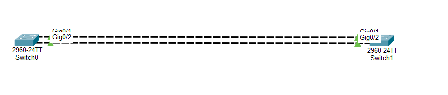
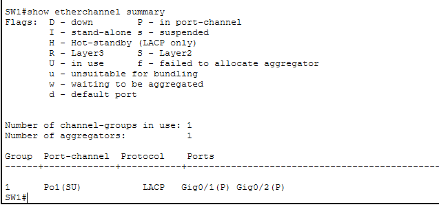
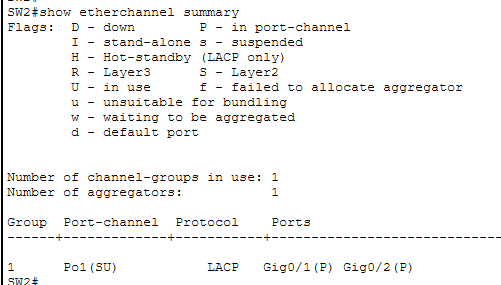
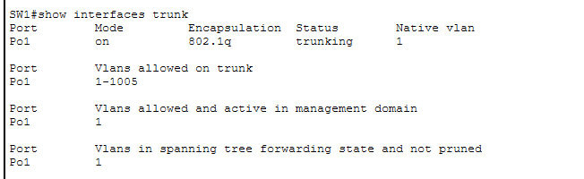

# LAB 19 — Layer 2 Scalability: EtherChannel (LACP) Configuration

## 📌 Overview

This lab demonstrates how to configure and verify **IEEE 802.3ad Link Aggregation Control Protocol (LACP) EtherChannel** between two Cisco Catalyst switches using Cisco Packet Tracer.

In redundant switching topologies, connecting multiple active physical interfaces between identical switches triggers Spanning Tree Protocol (STP) loop prevention mechanisms, placing redundant ports into a blocking/non-forwarding state. Consequently, bandwidth is limited to a single link, while other lines sit idle as dormant standby networks. 

**EtherChannel** solves this architectural throughput limitation by grouping up to eight physical parallel Ethernet links into a single logical interface called a **Port-Channel**. This configuration increases overall bandwidth, provides seamless link-level hardware redundancy, and ensures fast convergence without triggering STP loop recalculations when individual physical lines fail.

---

## 🎯 Objectives

The objectives of this lab are to:

* Configure a multi-link parallel switch backbone infrastructure to analyze high-throughput link aggregation.
* Implement open-standard **LACP (Link Aggregation Control Protocol)** dynamically using Active negotiation modes.
* Bundle individual physical GigabitEthernet interfaces cleanly into a single logical Port-Channel block.
* Configure the logical Port-Channel interface as an 802.1Q encapsulation Trunk pipeline.
* Verify EtherChannel convergence flags, port bundle state assignments, and LACP operational tracking tables.

---

## 🧪 Lab Environment & Hardware Matrix

| Component | Details |
| :--- | :--- |
| Simulation Tool | Cisco Packet Tracer |
| Core Switches | SW1 (Switch0), SW2 (Switch1) |
| Hardware Platform| Cisco Catalyst 2960-24TT Series FastEthernet/Gigabit Switches |
| Aggregation Protocol| IEEE 802.3ad Link Aggregation Control Protocol (LACP) |
| Bundle Interfaces | GigabitEthernet 0/1 & GigabitEthernet 0/2 |
| Logical Construct | Port-Channel 1 (Po1) |
| Interface Mode | Layer 2 Dot1Q Trunk Pipeline |

---

# 🌐 Network Topology

The architecture implements a dual-link high-speed parallel Gigabit trunk backbone tying edge distribution nodes to maximize bandwidth capacity:



### 📊 Structural Interface and Protocol Mapping Scheme
*   **Physical Bundle Ranges:** GigabitEthernet interfaces `Gig0/1` and `Gig0/2` cross-connected symmetrically between both nodes.
*   **Negotiation Parameters:** LACP mode set to **Active** on both switch boundaries to dynamically establish structural convergence.
*   **Logical Gateway Assignment:** Port-Channel 1 (`Po1`) created automatically to act as a unified trunk lane.

---

# ⚙️ EtherChannel Layer 2 Configuration Scripts

To establish a functional Port-Channel bundle, target interface ranges are isolated, linked to a specific channel-group, and the logical block is engineered globally as a trunk profile.

### 📝 Switch 1 Core Configuration (Executed on SW1 / Switch0)
```cisco
enable
configure terminal
hostname SW1

! Select physical interface ranges to bundle
interface range gigabitEthernet 0/1 - 2
 channel-group 1 mode active
exit

! Configure logical interface parameters as a Trunk lane
interface port-channel 1
 switchport mode trunk
exit

end
write memory
```

### 📝 Switch 2 Core Configuration (Executed on SW2 / Switch1)
```cisco
enable
configure terminal
hostname SW2

! Select physical interface ranges to bundle
interface range gigabitEthernet 0/1 - 2
 channel-group 1 mode active
exit

! Configure logical interface parameters as a Trunk lane
interface port-channel 1
 switchport mode trunk
exit

end
write memory
```

---

# 🔎 Operational Verification & Database Diagnostics

## 1. Local Configuration Parameter Injections Check
Confirm active interface properties and channel-group configuration status on both switching boundaries.

### SW1 Interface Scope Configurations


### SW2 Interface Scope Configurations


---

## 2. EtherChannel Summary Database Validation
The ultimate technical validation of link aggregation convergence is analyzed using the summary engine command line:
```cisco
SW1# show etherchannel summary
```


### Expected Architectural Designator Flags Parse
The active operational output verifies successful bundle execution based on state parameters:
*   **`Po1(SU)`**: A Layer 2 Port-Channel interface that is currently **`S` (In Use)** and operating **`U` (Up)**.
*   **`Gi0/1(P)` & `Gi0/2(P)`**: Physical interfaces successfully bundled and operating in a **`P` (Port-Channel)** state machine.

---

# 🔎 Core EtherChannel Reference Diagnostic Matrix

| Verification Command | Technical Operational Target Purpose |
| :--- | :--- |
| `show etherchannel summary` | Print a concise single-line database of the bundle status, protocols, and port states |
| `show lacp neighbor` | View LACP system IDs, port priorities, and active neighboring peer information |
| `show interfaces trunk` | Verify that the logical Port-Channel interface is actively trunking 802.1Q traffic |
| `show running-config interface port-channel 1` | Parse active properties applied directly onto the logical interface wrapper |

---

# ✅ Expected Lab Outcome

After successful deployment:
* SW1 and SW2 successfully run LACP dynamic message state checks via multicast every 30 seconds.
* Physical links `Gig0/1` and `Gig0/2` are bundled into a single logical link called **Port-Channel 1**.
* STP perceives the dual gigabit parallel pipes as a single combined path, preventing interface blocking states.
* Traffic load-balancing metrics operate across both boundaries automatically, doubling core backbone throughput capacity.

---

## 📂 Lab Files Inventory Checklist

| **File** | **Technical Description** |
| :--- | :--- |
| `README.md` | Comprehensive Lab Technical Documentation (This Document File) |
| `Lab 19 - EtherChannel (LACP).pkt` | Authentic Cisco Packet Tracer active link aggregation bundle blueprint file |
| `01-Topology.png` | Network topology environment design parallel backbone path layout |
| `02-SW1-Configuration.png` | SW1 (Switch0) interface group command injection verification clip |
| `03-SW2-Configuration.png` | SW2 (Switch1) interface group command injection verification clip |
| `04-Port-Channel-Trunk.png` | Converged EtherChannel summary and interface trunk status checkpoint |

---

## 📚 CCNA 200-301 Curriculum Series
This lab profile tracks a primary component block of the **CCNA Practical Switching Optimization and Layer 2 Scalability Series**.

## 🏁 Lab Status
**COMPLETED ✅**
