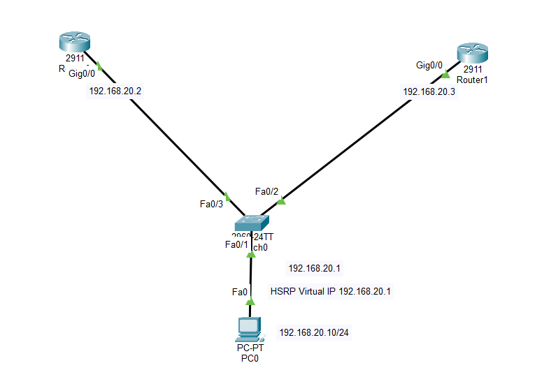
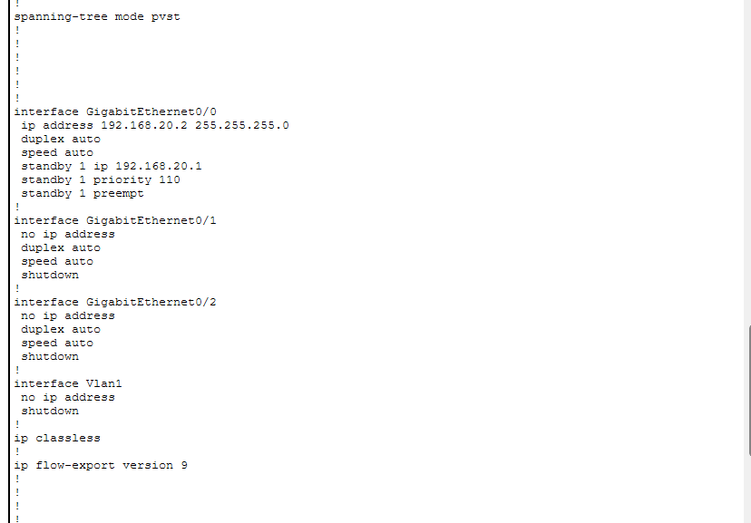
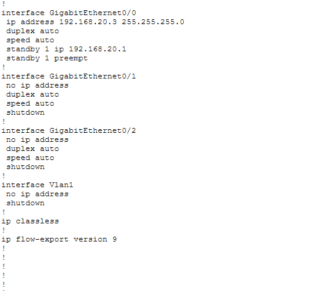
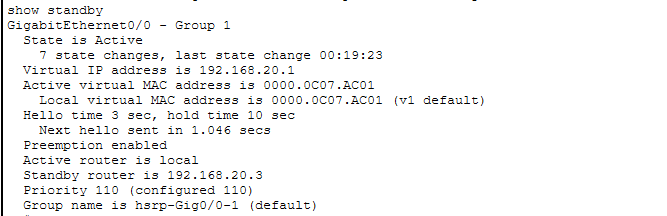
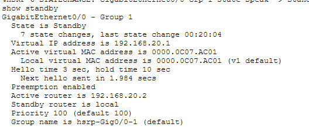
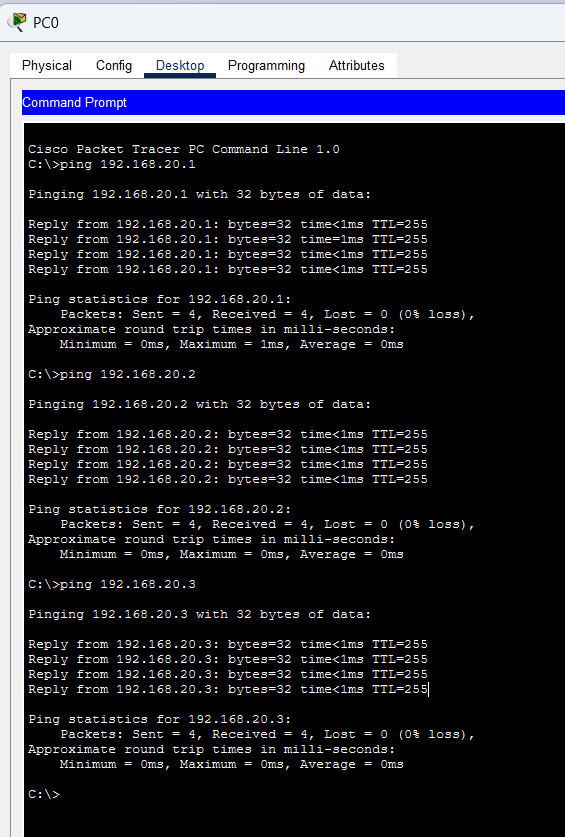
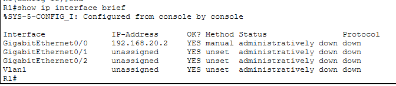
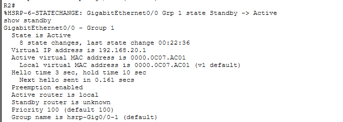
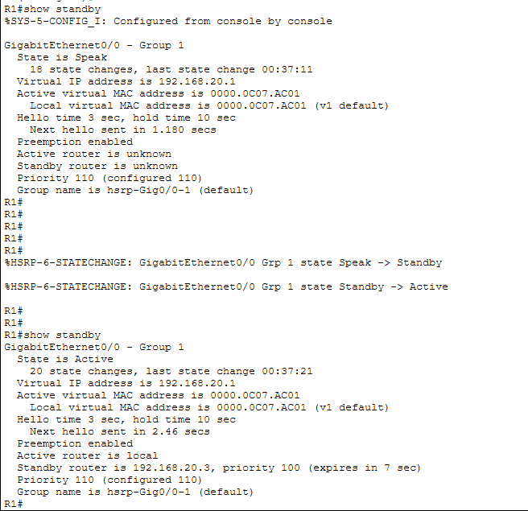

# LAB 20 — Network Infrastructure High Availability: HSRP Configuration

## 📌 Overview

This lab demonstrates how to configure and verify **Hot Standby Router Protocol (HSRP)**, a Cisco proprietary First Hop Redundancy Protocol (FHRP), inside a redundant gateway environment using Cisco Packet Tracer.

In default enterprise networks, host devices are statically provisioned with a single Default Gateway IP pointing to a physical router interface. If that edge router suffers a hardware or link failure, local area network hosts instantly lose all outbound internetwork transit access, creating a single point of failure (SPOF). 

**HSRP** solves this reliability constraint by grouping multiple physical infrastructure routers into a single virtual gateway layer sharing a unified **Virtual IP Address** and Virtual MAC address. Local hosts use this Virtual IP as their persistent gateway. Globally, the HSRP engine elects a single **Active Router** to actively process and forward host payloads, while alternate gateways sit as **Standby Routers**, continuously tracking keepalive hello parameters to execute automated subnet-level failovers within seconds if the primary line goes down.

---

## 🎯 Objectives

The objectives of this lab are to:

* Configure a redundant multi-router border infrastructure to deploy high-availability network perimeters.
* Initialize matching HSRP group standby numbers and configure a shared virtual gateway IP profile.
* Manipulate HSRP priority metrics to explicitly designate the primary active and standby backup roles.
* Implement HSRP **Preemption** mechanisms to enable recovered high-priority hardware to safely reclaim active status.
* Simulate real-world link failure events to audit automated data plane gateway failovers.
* Verify dynamic protocol transitions (`Active`, `Standby`, `Speak`, `Listen`) using Cisco IOS standby diagnostic scripts.

---

## 🧪 Lab Environment & Hardware Matrix

| Component | Details |
| :--- | :--- |
| Simulation Tool | Cisco Packet Tracer |
| Hardware Routers| R1 (Primary Gateway / Active), R2 (Backup Gateway / Standby) |
| Core Switches | SW1 (Cisco 2960-24TT Edge Distribution Node) |
| Client End Devices| PC1 Workspace Terminal |
| Redundancy Protocol| First Hop Redundancy — Hot Standby Router Protocol (HSRP Group 1) |
| Resiliency Profile| Active Preemption Engineering with Dynamic Priority Weighting |

---

# 🌐 Network Topology

The production architecture implements a dual-router redundant gateway mesh tying edge distribution access lanes to secure consistent outbound path operations:



### 📊 Structural Subnet and Priority Assignment Scheme
*   **LAN Subnet Segment Layer:** `192.168.20.0/24`
    *   PC1 Workspace Host IP Address: `192.168.20.10/24`
    *   R1 Physical Interface Local IP: `192.168.20.2/24` on interface `Gig0/0`
    *   R2 Physical Interface Local IP: `192.168.20.3/24` on interface `Gig0/0`
*   **HSRP Virtual Boundary Parameters:**
    *   HSRP Group Identifier: Group `1`
    *   Shared Gateway Virtual IP Address: `192.168.20.1/24`
    *   R1 Priority Weight: **`110`** (Preemption Enabled → Primary Active Forwarding path)
    *   R2 Priority Weight: **`100`** (Preemption Enabled → Secondary Standby Backup path)

---

# ⚙️ HSRP First Hop Redundancy Configuration Scripts

To establish a high-availability perimeter, local interfaces are assigned specific subnet IPs, linked to a virtual gateway group address, priority metrics are shifted manually, and preemption parameters are activated globally.

### 📝 Router R1 Core Configuration (Primary Active Router Setup)
```cisco
enable
configure terminal
hostname R1

! Configure local interface parameters
interface GigabitEthernet0/0
 ip address 192.168.20.2 255.255.255.0
 
 ! Instantiate HSRP Group 1 Virtual IP
 standby 1 ip 192.168.20.1
 
 ! Elevate priority weight above default (100) to win Active election
 standby 1 priority 110
 
 ! Allow R1 to dynamically reclaim Active state post-recovery
 standby 1 preempt
 no shutdown
exit

end
write memory
```

### 📝 Router R2 Core Configuration (Secondary Standby Router Setup)
```cisco
enable
configure terminal
hostname R2

! Configure local interface parameters
interface GigabitEthernet0/0
 ip address 192.168.20.3 255.255.255.0
 
 ! Instantiate HSRP Group 1 Virtual IP matching peer parameters
 standby 1 ip 192.168.20.1
 
 ! Maintain default priority weight
 standby 1 priority 100
 
 ! Enable preemption properties for clean structural transition tracking
 standby 1 preempt
 no shutdown
exit

end
write memory
```

---

# 🖥️ Host Profile Validations

Manual static gateway parameters mapped onto end-user host terminal worksheets:

### PC1 Local Redundant IP Profile Configuration
*   **Configured IP Address:** `192.168.20.10`
*   **Subnet Mask Allocation:** `255.255.255.0`
*   **Assigned Default Gateway:** **`192.168.20.1`** *(Points directly to the HSRP Virtual IP profile, not physical ports)*

---

# 🔎 Dynamic Core Diagnostics & Address Verification

## 1. Initial Local Configuration Injections Check
Confirm active interface properties, HSRP group metrics, and baseline address mappings are operating smoothly.

### Router R1 Global Settings Summary


### Router R2 Global Settings Summary


---

## 2. HSRP Active/Standby Role Selection Verification
The core operational validations of FHRP convergence are evaluated across the switch fabric boundaries using the standby status command line:

```cisco
R1# show standby
```

### Router R1 Active Core Protocol Database


*   **R1 State Matrix Check:** Transition logs verify R1 won the election and sits stably as **`State is Active`** carrying an operational priority of `110`.

---

```cisco
R2# show standby
```

### Router R2 Standby Core Protocol Database


*   **R2 State Matrix Check:** Transition logs verify R2 tracks the active peer safely as **`State is Standby`** carrying a default priority of `100`.

---

# 🔒 Data Plane Connectivity & Live Failover Diagnostics

## 1. Outbound Gateway Connectivity Check
An end-to-end data plane accessibility validation test is initiated from **PC1** toward the virtual checkpoint and physical endpoints:
```cmd
C:\> ping 192.168.20.1
```


**ICMP Ping Status: ALLOWED & TRANSITED SUCCESSFULLY ✅ (0% packet drop statistics)**

---

## 2. Simulated Primary Router Failure Failover Audit
To stress-test automated gateway failover recovery, Router R1's primary interface is forced administratively down:
```cisco
R1(config)# interface GigabitEthernet0/0
R1(config-if)# shutdown
```


While R1 goes down, HSRP keepalive hello messages cease traversing the access switch segment. R2 tracks the holdtime expiration, instantly recalculates its state metrics, and executes an automated takeover:

```cisco
R2# show standby
```


*   **HSRP Failover Result:** R2 dynamically jumps from `Standby` straight into **`State is Active`**, preserving the virtual gateway IP `192.168.20.1` alive without data plane traffic interruption.

---

## 3. High Availability Preemption Recovery Verification
After confirming backup operations, the primary link interface is recovered to test preemption triggers:
```cisco
R1(config)# interface GigabitEthernet0/0
R1(config-if)# no shutdown
```


Because **Preemption** is active globally and R1 owns a higher priority weight (`110 > 100`), it successfully kicks R2 back down to backup status, reclaiming its role as the active forwarding master path.

---

# 🔎 Core First Hop Redundancy Reference Diagnostic Matrix

| Verification Command | Technical Operational Target Purpose |
| :--- | :--- |
| `show standby` | Print comprehensive data fields of active HSRP states, timers, virtual MACs, and group attributes |
| `show standby brief` | View a highly optimized single-line summary of operational active, standby, and virtual IPs |
| `show ip interface brief` | Audit active hardware interface states and IP tracking address maps across the chassis |
| `ping <Destination-IP>` | Validate outbound traffic routing clearance crossing virtual redundancy boundaries |

---

# ✅ Expected Lab Outcome

After successful deployment:
* R1 and R2 negotiate HSRP Group 1 parameters via multicast hello frames (`224.0.0.2`) on UDP port 1985.
* R1 correctly forwards user frames under normal operation due to higher priority metrics.
* Forcing a link down on the primary interface triggers R2 to seamlessly take over gateway forwarding within 10 seconds.
* Host workstation PC1 maintains stable cross-network packet transfers during failure cycles since its default gateway configuration never requires physical changes.
* Restoring the primary link triggers an instantaneous preemption handoff, returning the perimeter to its primary optimal routing pathway.

---

## 📂 Lab Files Inventory Checklist

| **File** | **Technical Description** |
| :--- | :--- |
| `README.md` | Comprehensive Lab Technical Documentation (This Document File) |
| `Lab 20 - HSRP (Hot Standby Router Protocol).pkt` | Authentic Cisco Packet Tracer high-availability first-hop redundancy sandbox net-file |
