# LAB 21 — Network Core Services: IPv6 Basic Configuration

## 📌 Overview

This lab demonstrates the fundamental concepts, deployment strategies, and verification processes involved in implementing **Next-Generation IPv4 Replacement Architecture (IPv6 addressing)** on a Cisco infrastructure topology using Cisco Packet Tracer.

As traditional classless IPv4 global address spaces reached total international depletion, IPv6 was engineered under RFC 2460/8200 to offer a massive 128-bit hexadecimal addressing capacity, eliminating the operational requirements of perimeter NAT overlays. 

Unlike IPv4, a Cisco router interface does not forward multi-node payloads dynamically upon IPv6 allocation until global unicast switching matrices are enabled manually. This lab focuses on activating the core processing architecture, configuring Global Unicast Addresses (GUA), mapping link-local traits, and auditing network convergence engine routing databases.

---

## 🎯 Objectives

The objectives of this lab are to:

* Configure 128-bit IPv6 Global Unicast Address (GUA) structures on edge client platforms and gateway router interfaces.
* Initialize the global IPv6 processing engine layer inside Cisco IOS configuration memory (`ipv6 unicast-routing`).
* Verify operational link-states and lines address structures using up-to-date dynamic packet verification tools (`show ipv6 interface brief`).
* Analyze next-generation internetwork routing database convergence fields using link-state routing maps tables (`show ipv6 route`).
* Test complete multi-hop cross-network data plane isolation and edge reachability using ICMPv6 Echo Request/Reply routines.

---

## 🧪 Lab Environment & Structural Parameters

| Component       | Details             |
| --------------- | ------------------- |
| Simulation Tool | Cisco Packet Tracer |
| Core Gateways   | R1 (Cisco 2911 ISR Core Edge Node Gateway Router) |
| Client Workspaces| PC0, PC1 |
| Addressing Protocol| 128-Bit Hexadecimal Global Unicast Address (IPv6 GUA) |
| Allocation Mask | Classless Strict /64 Continuous Interface Prefix Length Mappings |
| Transport Diagnostic| Internet Control Message Protocol Version 6 (ICMPv6) |

---

# 🌐 Network Topology

The production architecture maps isolated local dynamic user networks connected directly across distinct multi-hop physical gateway lines to verify secure layer 3 convergence parameters:

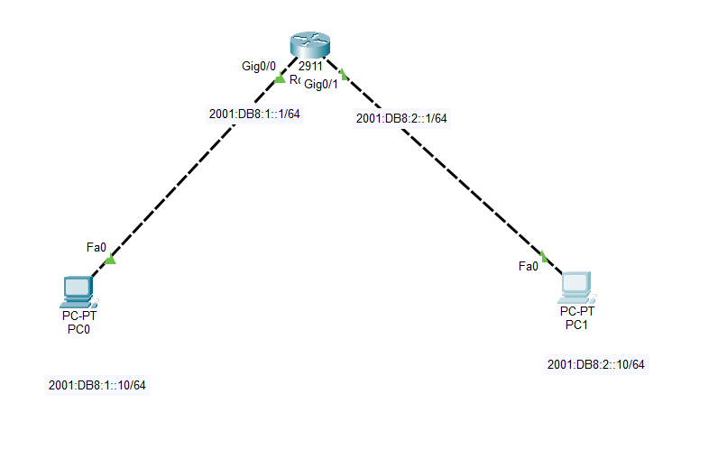

### 📊 Structural Subnet Mapping Scheme
*   **LAN Network 1 Segment (Left Wing):** `2001:DB8:1::/64`
    *   PC0 Client Host IPv6 Interface Profile: `2001:DB8:1::10/64`
    *   R1 Local LAN Ingress Interface: `2001:DB8:1::1/64` on port `Gig0/0`
*   **LAN Network 2 Segment (Right Wing):** `2001:DB8:2::/64`
    *   PC1 Client Host IPv6 Interface Profile: `2001:DB8:2::10/64`
    *   R1 Remote LAN Ingress Interface: `2001:DB8:2::1/64` on port `Gig0/1`

---

# ⚙️ IPv6 Global Interface Configuration Script

To initialize next-generation network layers, the core forwarding plane is triggered, local interfaces are assigned specific global prefixes, and link-state protocols are activated.

### 📝 Core Command Script (Executed on Gateway Router R1)
```cisco
enable
configure terminal
hostname R1

! Step 1: Initialize the core global IPv6 forwarding matrix engine
ipv6 unicast-routing

! Step 2: Configure Left LAN Interface and assign Global Unicast Address
interface GigabitEthernet0/0
 description Connection-to-PC0
 ipv6 address 2001:DB8:1::1/64
 no shutdown
exit

! Step 3: Configure Right LAN Interface and assign Global Unicast Address
interface GigabitEthernet0/1
 description Connection-to-PC1
 ipv6 address 2001:DB8:2::1/64
 no shutdown
exit

end
write memory
```

---

# 🖥️ Host Profile Validations

Manual static assignment properties configured locally inside operational host network worksheets:

### PC0 Left Wing Interface Configuration Profile
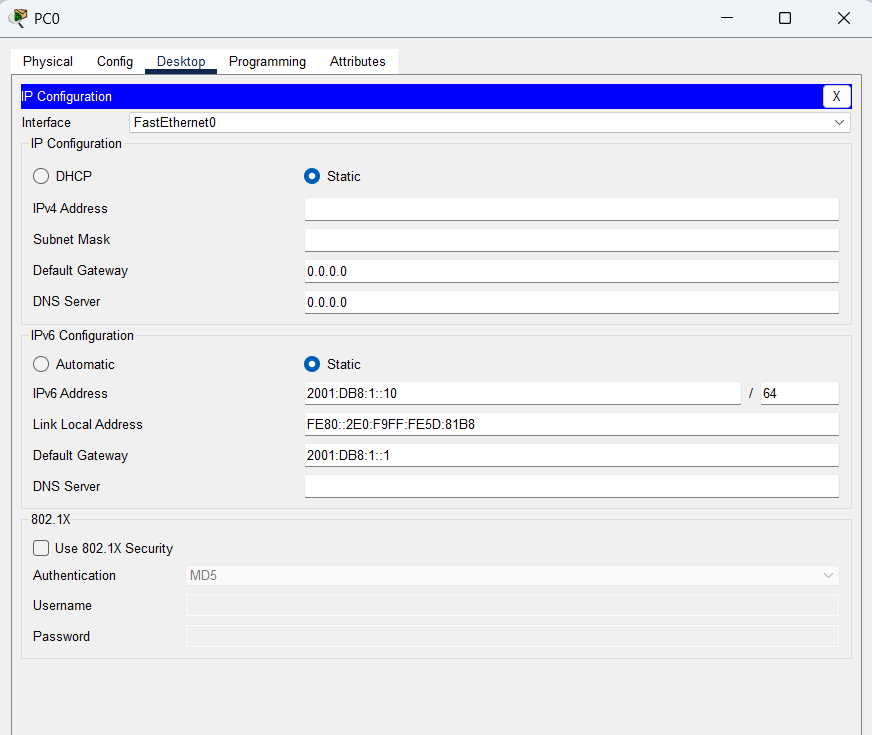

### PC1 Right Wing Interface Configuration Profile
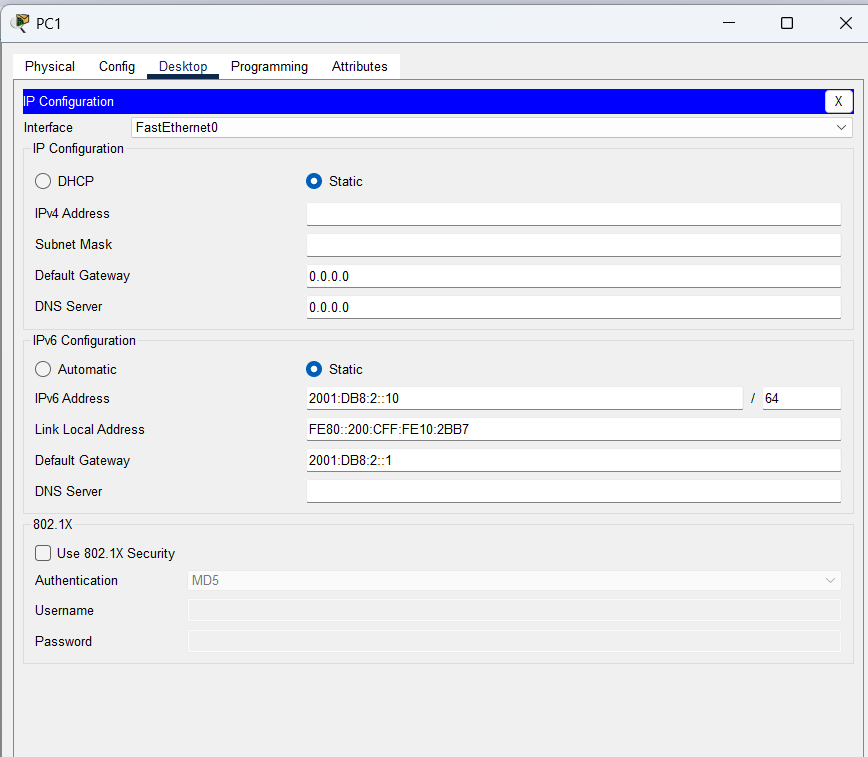

---

# 🔎 Dynamic Core Diagnostics & Address Verification

## 1. Initial Local Interface Deployment Check
Confirm active interface line command scripts applied across configuration profiles.
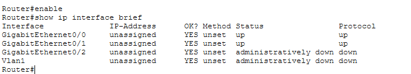

### Global Routing Processes Trigger Check
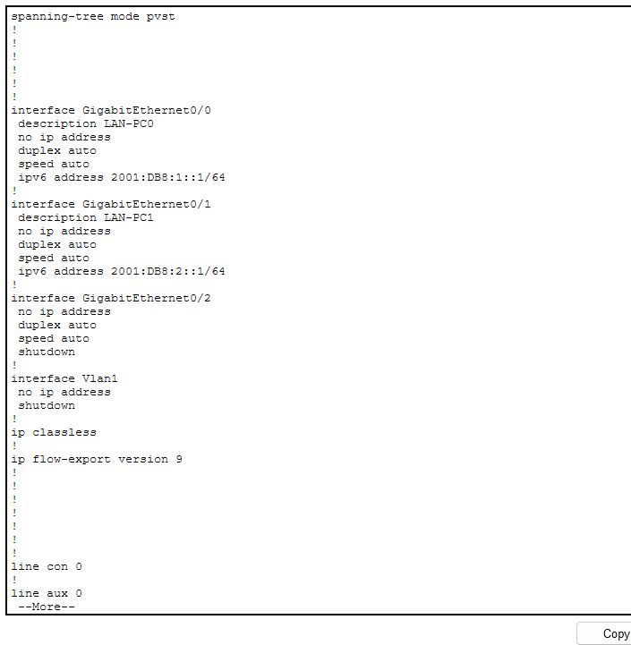

---

## 2. Dynamic Interface Status & Address Map Table Audit
To verify global addresses, automatic link-local mappings (`FE80::`), and operational up/up interface status properties across the chassis, the summary tool is queried:
```cisco
R1# show ipv6 interface brief
```
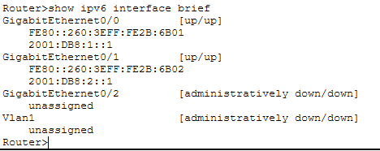

---

## 3. IPv6 Layer 3 Routing Table Convergence Audit
To verify that directly connected hexadecimal network blocks are cleanly updated inside the active hardware memory layer, the routing table engine is verified:
```cisco
R1# show ipv6 route
```
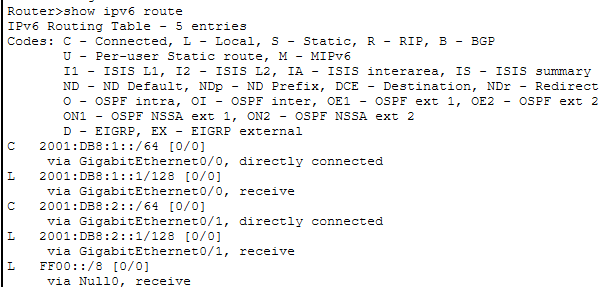

The strategic presence of designator codes **`C` (Connected)** and **`L` (Local)** confirms that both subnets have successfully converged.

---

# 🔒 Data Plane Connectivity & Live ICMPv6 Trace Diagnostics

End-to-end data plane isolation, transit times, and hop boundaries are audited via local workstation terminal command shells.

### Test A: Local Gateway Access Check (PC0 -> R1 LAN Ingress)
```cmd
C:\> ping 2001:DB8:1::1
```
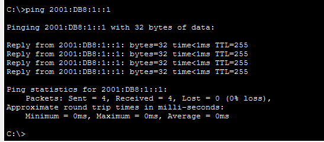

---

### Test B: Remote Gateway Access Check (PC1 -> R1 Remote Ingress)
```cmd
C:\> ping 2001:DB8:2::1
```
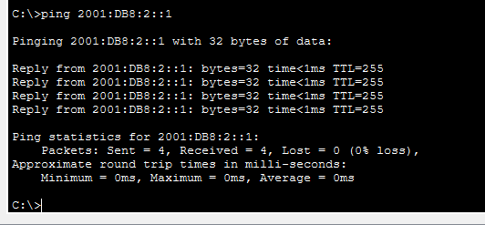

---

### Test C: End-to-End Multi-Hop Cross-Network Check (PC0 -> PC1)
An end-to-end multi-hop connectivity check is initiated crossing different physical segment lines. R1 dynamically intercepts the packets, verifies routing table definitions, and forwards them cleanly across wings.
```cmd
C:\> ping 2001:DB8:2::10
```
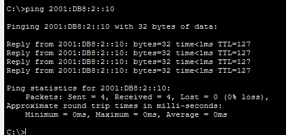

### Final Symmetrical Convergence Metric Verification Check
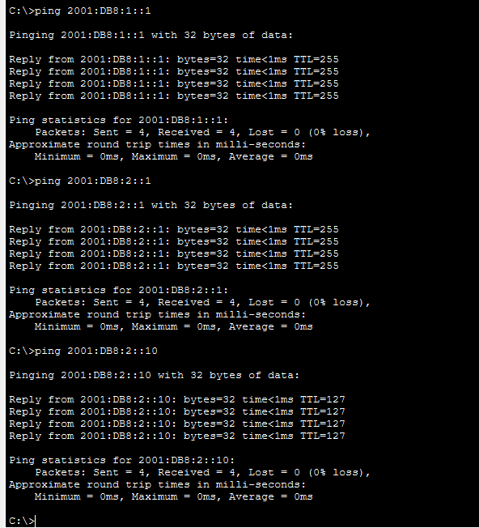

**ICMPv6 Diagnostic Status: SUCCESSFUL & COMPLETE ✅ (0% packet drop statistics / stable round-trip propagation metrics)**

---

# 🔎 Core Next-Generation Reference Diagnostic Matrix

| Verification Command | Technical Operational Target Purpose |
| :--- | :--- |
| `show ipv6 interface brief` | Print comprehensive database of IPv6 allocations, link-locals, and port line-states |
| `show ipv6 interface <id>` | View granular encapsulation metrics, duplicate address detection (DAD) status, and timers |
| `show ipv6 route` | Extract the live converged next-generation layer 3 routing table database engine |
| `ping <IPv6-Destination>` | Validate outbound traffic routing clearance crossing classless hexadecimal boundaries |

---

# ✅ Expected Lab Outcome

After successful deployment:
* The `ipv6 unicast-routing` command safely activates IPv6 packet switching inside R1.
* Router ports dynamically autoconfigure clean Link-Local (`FE80::`) scopes alongside target GUAs.
* End-user client machines auto-detect default gateways and parse standard 128-bit addresses accurately.
* Next-generation ICMPv6 echo signals transit multiple data loops with 100% stable reachability metrics.
* Complete bidirectional transport operations finish successfully with zero data drops or network layer failures.

---

## 📂 Lab Files Inventory Checklist

| **File** | **Technical Description** |
| :--- | :--- |
| `README.md` | Comprehensive Lab Technical Documentation (This Document File) |
| `Lab 21 - IPv6 Basic Configuration.pkt` | Authentic Cisco Packet Tracer core next-generation address deployment sandbox file |
| `01-Topology.png` | Network topology environment design parallel backbone path layout |
| `02-PCO-IPv6-Configuration.png` | PC0 local network address assignment worksheet snapshot (Asset matched profile) |
| `03-PC1-IPv6-Configuration.png` | PC1 local network address assignment worksheet snapshot |
| `04-R1-Interface-Configuration.png` | Router R1 individual port scope assignment confirmation clip |
| `05-R1-IPv6-Configuration.png` | Global dynamic unicast packet engine forwarding activation snapshot |
| `06-R1-IPv6-Interface-Brief.png` | Converged 128-bit link-local status database mapping checklist summary |
| `07-R1-IPv6-Route.png` | Next-generation converged routing infrastructure database map |
| `08-PCO-to-R1-IPv6-Ping.png` | PC0 to gateway ingress point host transport connectivity validation capture |
| `09-PC1-to-R1-IPv6-Ping.png` | PC1 to gateway ingress point host transport connectivity validation capture |
| `10-PCO-to-PC1-IPv6-Ping.png` | End-to-end multi-hop cross-network reachability verification checkpoint |
| `11-IPv6-Connectivity-Verification.png` | Final system transport layer diagnostic validation metrics log |

---

## 📚 CCNA 200-301 Curriculum Series
This lab profile tracks a primary component block of the **CCNA Practical Network Services and Next-Generation Address Management Deployment Series**.

## 🏁 Lab Status
**COMPLETED ✅**
