# LAB 22 — Network Core Services: IPv6 Static Routing Configuration

## 📌 Overview

This lab demonstrates how to configure and verify **IPv6 Static Routing** across a multi-hop linear backbone network using Cisco Packet Tracer.

While IPv6 connected links automatically populate the local routing engine database once global switching is enabled, routers lack historical context for non-contiguous networks sitting behind multiple hops. To bridge this communication gap without the dynamic protocol overhead of OSPFv3, administrators inject manual **IPv6 Static Routes**. 

This configuration establishes an exact next-hop IPv6 global unicast path to force explicit packet forwarding choices. This lab maps a three-router linear transit chain to evaluate IPv6 unicast routing enablement, static destination network statement mapping, routing table data plane convergence, and bidirectional path symmetry.

---

## 🎯 Objectives

The objectives of this lab are to:

* Configure 128-bit IPv6 Global Unicast Address (GUA) structures across distinct multi-hop segments.
* Initialize the global IPv6 processing engine layer inside Cisco IOS configuration memory (`ipv6 unicast-routing`).
* Configure explicit IPv6 Static Routes on edge and intermediate routers to target distant remote subnets.
* Verify dynamic and static hexadecimal route entry convergence within live operational network tables (`show ipv6 route`).
* Test bidirectional end-to-end data plane transport reachability using sequential ICMPv6 Echo Request/Reply path routines.

---

## 🧪 Lab Environment & Structural Parameters

| Component       | Details             |
| --------------- | ------------------- |
| Simulation Tool | Cisco Packet Tracer |
| Core Gateways   | R1 (Edge Router 1), R2 (Transit Router 2), R3 (Edge Router 3) |
| Client Switches | Layer 2 Access Switches |
| End Devices     | PC0, PC1 |
| Addressing Mode | 128-Bit Hexadecimal Global Unicast Address (IPv6 GUA) |
| Routing Protocol| Manual Classless IPv6 Static Routing Mappings |
| Diagnostic Core | Internet Control Message Protocol Version 6 (ICMPv6) |

---

# 🌐 Network Topology

The architecture maps private internal computing nodes transiting local switches toward an intermediate boundary node that tunnels payloads across transit lines to a remote core network layer:

```text
                  IPv6 Static Routing

 PC0                R1                R2                R3                PC1

  |                  |                 |                 |                 |
  |                  |                 |                 |                 |
  +---- G0/0 -------+---- G0/1 -------+---- G0/1 -------+---- G0/1 --------+
```

### Topology Schematic
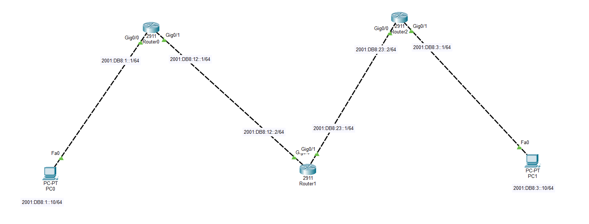

### 📊 Structural Subnet Allocation Blueprint
*   **LAN Network 1 Segment (Left Wing):** `2001:DB8:1::/64`
    *   PC0 Client Host IP Profile: `2001:DB8:1::10/64` (Gateway: `2001:DB8:1::1`)
    *   R1 Local LAN Ingress Interface: `2001:DB8:1::1/64` on port `Gig0/0`
*   **WAN Transit Link 1 (Core Backbone):** `2001:DB8:A::/64`
    *   R1 WAN Interface: `2001:DB8:A::1/64` on port `Gig0/1`
    *   R2 WAN Interface 1: `2001:DB8:A::2/64` on port `Gig0/0`
*   **WAN Transit Link 2 (Core Backbone):** `2001:DB8:B::/64`
    *   R2 WAN Interface 2: `2001:DB8:B::1/64` on port `Gig0/1`
    *   R3 WAN Interface: `2001:DB8:B::2/64` on port `Gig0/0`
*   **LAN Network 2 Segment (Right Wing):** `2001:DB8:2::/64`
    *   PC1 Client Host IP Profile: `2001:DB8:2::10/64` (Gateway: `2001:DB8:2::1`)
    *   R3 Remote LAN Ingress Interface: `2001:DB8:2::1/64` on port `Gig0/1`

---

# ⚙️ IPv6 Static Routing Operational Configuration Scripts

To establish a functional path matrix, the core forwarding plane is triggered, local interfaces are assigned specific global prefixes, and manual static destination next-hop records are injected.

### 1. Router R1 Core Configuration (Left Edge Gate)
```cisco
enable
configure terminal
hostname R1

ipv6 unicast-routing

interface GigabitEthernet0/0
 ipv6 address 2001:DB8:1::1/64
 no shutdown
exit

interface GigabitEthernet0/1
 ipv6 address 2001:DB8:A::1/64
 no shutdown
exit

! Configure static route to reach the remote Right LAN via R2 next-hop
ipv6 route 2001:DB8:2::/64 2001:DB8:A::2
! Configure static route to reach the intermediate transit link
ipv6 route 2001:DB8:B::/64 2001:DB8:A::2
end
write memory
```

### 2. Router R2 Core Configuration (Center Transit Node)
```cisco
enable
configure terminal
hostname R2

ipv6 unicast-routing

interface GigabitEthernet0/0
 ipv6 address 2001:DB8:A::2/64
 no shutdown
exit

interface GigabitEthernet0/1
 ipv6 address 2001:DB8:B::1/64
 no shutdown
exit

! R2 acts as intermediate bridge; maps routes to left and right LAN segments
ipv6 route 2001:DB8:1::/64 2001:DB8:A::1
ipv6 route 2001:DB8:2::/64 2001:DB8:B::2
end
write memory
```

### 3. Router R3 Core Configuration (Right Edge Gate)
```cisco
enable
configure terminal
hostname R3

ipv6 unicast-routing

interface GigabitEthernet0/0
 ipv6 address 2001:DB8:B::2/64
 no shutdown
exit

interface GigabitEthernet0/1
 ipv6 address 2001:DB8:2::1/64
 no shutdown
exit

! Configure static routes back toward the left LAN and transit segments
ipv6 route 2001:DB8:1::/64 2001:DB8:B::1
ipv6 route 2001:DB8:A::/64 2001:DB8:B::1
end
write memory
```

---

# 🖥️ Host Profile Validations

Manual static assignment properties configured locally inside operational host network worksheets:

### PC0 Left Wing Interface Configuration Profile
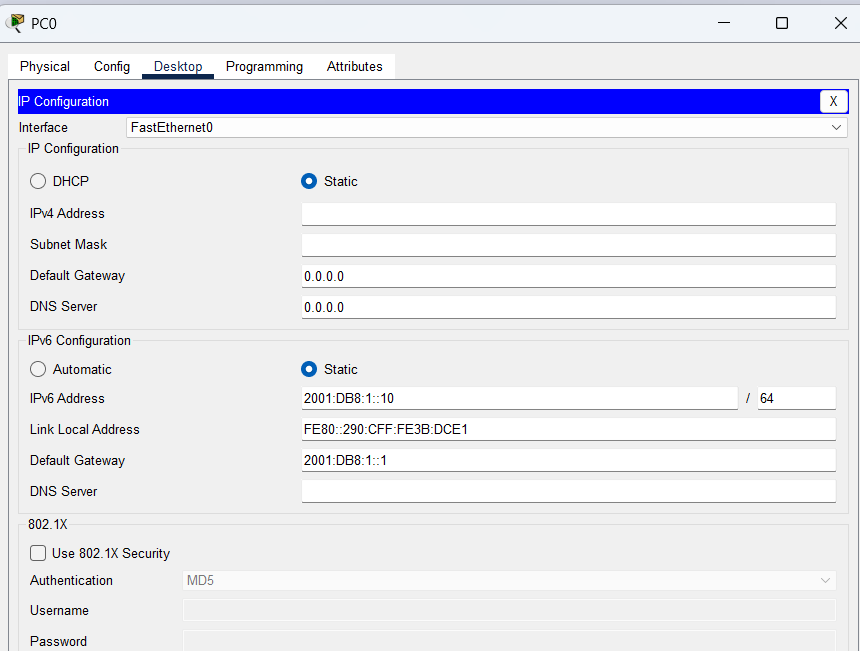

### PC1 Right Wing Interface Configuration Profile
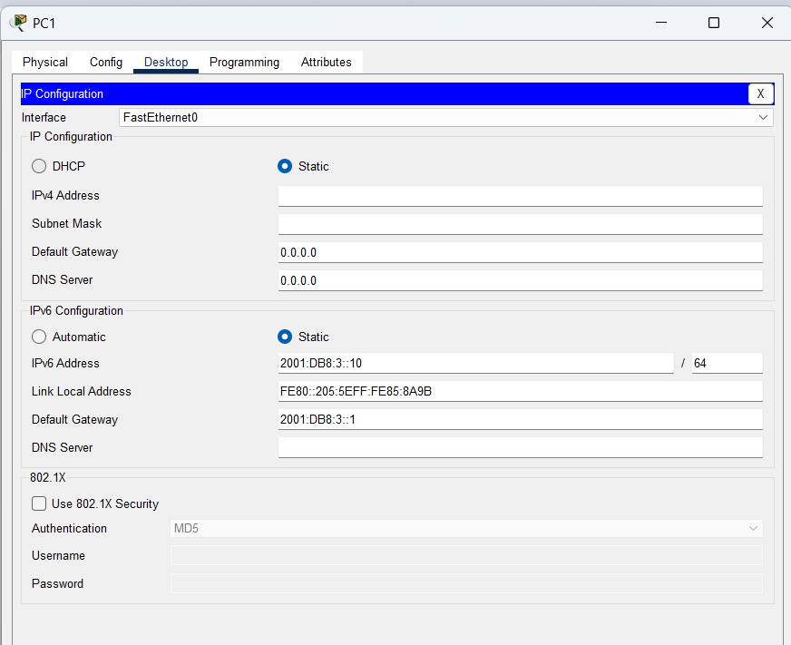

---

# 🔎 Dynamic Core Diagnostics & Address Verification

## 1. Local Interface Deployment Check
Confirm active interface line command scripts and baseline address configurations applied across chassis profiles.

### Router R1 Global Settings Summary
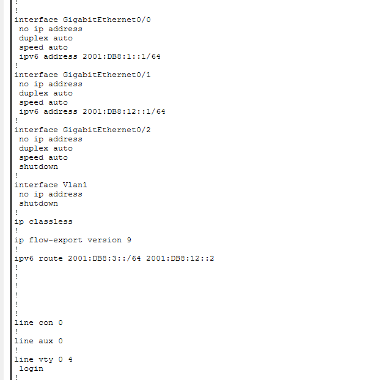

### Router R2 Global Settings Summary
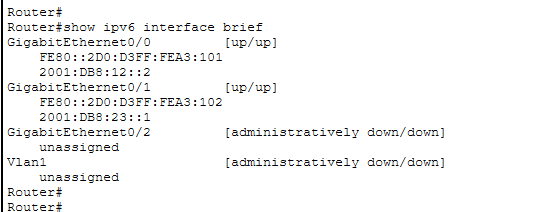

### Router R3 Global Settings Summary
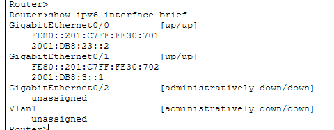

---

## 2. IPv6 Routing Table Convergence Audit
The convergent profiles verified inside active lookup engine databases capture the successful introduction of manual aggregate path blocks.

### Router R1 Converged Routing Table Engine
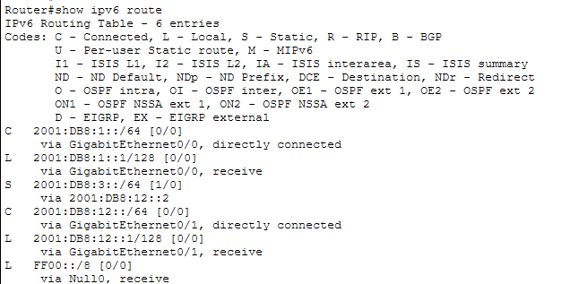

### Router R2 Converged Routing Table Engine
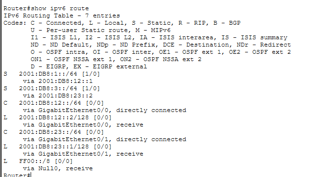

### Router R3 Converged Routing Table Engine
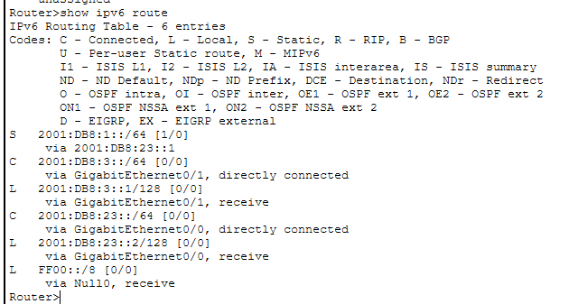

The strategic presence of the routing designator prefix code **`S` (Static)** validates that remote 128-bit network blocks are cleanly updated inside active memory tables.

---

# 🔒 Data Plane Connectivity & Live ICMPv6 Trace Diagnostics

End-to-end multi-hop connectivity checking is evaluated under symmetrical path loops using localized client workspace terminals.

### Test A: Outbound Verification Flow Check (PC0 -> PC1 Target)
An outbound hexadecimal packet trace is executed from **PC0** targeting remote LAN Net 2 space. Traffic transits the linear boundaries safely as intermediate hops process the next-hop statements smoothly.
```cmd
C:\> ping 2001:DB8:2::10
```
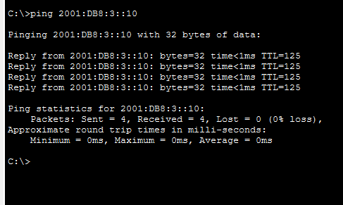

---

### Test B: Reverse Return Path Symmetry Check (PC1 -> PC0 Target)
To verify complete path symmetry and eliminate routing blackholes, a return lane check is initiated from host workspace **PC1** back toward **PC0**.
```cmd
C:\> ping 2001:DB8:1::10
```
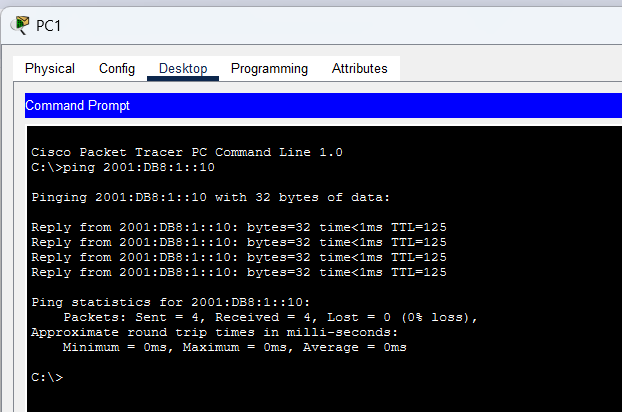

**ICMPv6 Diagnostics Status: ALLOWED & TRANSITED SUCCESSFULLY ✅ (0% packet drop statistics / stable round-trip propagation metrics)**

---

# 🔎 Core Next-Generation Reference Diagnostic Matrix

| Verification Command | Technical Operational Target Purpose |
| :--- | :--- |
| `show ipv6 interface brief` | Print comprehensive database of IPv6 allocations, link-locals, and port line-states |
| `show ipv6 route`           | Extract the live converged next-generation layer 3 routing table database engine |
| `show ipv6 route static`    | Filter routing table entries to isolate manual static destination records only |
| `ping <IPv6-Destination>`   | Validate outward traffic routing clearance crossing classless hexadecimal boundaries |

---

# ✅ Expected Lab Outcome

After successful deployment:
* The `ipv6 unicast-routing` command activates global IPv6 packet switching engines across all routers.
* Edge routers successfully compute manual path paths to jump across un-connected network perimeters.
* Returning traffic paths carry exact reverse symmetry definitions, eliminating routing loop boundaries or drop metrics.
* Next-generation ICMPv6 echo signals transit the entire multi-hop grid layout seamlessly with 100% stable reachability.

---

## 📂 Lab Files Inventory Checklist

| **File** | **Technical Description** |
| :--- | :--- |
| `README.md` | Comprehensive Lab Technical Documentation (This Document File) |
| `Lab 22 — IPv6 Static Routing.pkt` | Authentic Cisco Packet Tracer core next-generation static routing architecture sandbox file |
| `01-Topology.png` | Network topology environment design parallel backbone path layout |
| `02-PC0-IPv6-Configuration.png` | PC0 local network address assignment worksheet snapshot |
| `03-PC1-IPv6-Configuration.png` | PC1 local network address assignment worksheet snapshot |
| `04-R1-IPv6-Configuration.png` | Router R1 interface assignments and static routing parameters injection clip |
