# LAB 23 — Network Core Services: OSPFv3 Dynamic Routing Configuration

## 📌 Overview

This lab demonstrates how to configure and verify **Open Shortest Path First Version 3 (OSPFv3)** to implement dynamic next-generation IPv6 routing using Cisco Packet Tracer.

While traditional OSPFv2 was engineered strictly to process IPv4 network blocks embedded directly within its Link-State Advertisements (LSAs), **OSPFv3 (defined under RFC 5340)** was completely re-architected to support IPv6 classless environments. OSPFv3 runs on a per-link basis rather than a per-subnet basis, automatically advertising prefixes independently of protocol formats. 

A key technical requirement of OSPFv3 is that because it processes 128-bit hexadecimal strings, the routing engine **still mandates a manual 32-bit dotted-decimal Router ID (IPv4 format)** to initiate its core link-state state machines. This lab focuses on activating unicast parameters, setting process structures inside Area 0 (Backbone Area), establishing dynamic neighbor adjacencies, and auditing Link-State Database (LSDB) convergence fields.

---

## 🎯 Objectives

The objectives of this lab are to:

* Configure 128-bit IPv6 Global Unicast Address (GUA) structures on hosts and gateway router interfaces.
* Initialize the global IPv6 processing engine layer inside Cisco IOS configuration memory (`ipv6 unicast-routing`).
* Configure global OSPFv3 dynamic routing processes incorporating dedicated 32-bit standalone Router IDs.
* Enable OSPFv3 properties straight under hardware interface sub-menus mapping directly into Area 0.
* Verify dynamic cross-network link-state neighbor adjacencies across transit layers (`show ipv6 ospf neighbor`).
* Validate dynamically learned next-generation routing maps marked with the **`O` (OSPF)** prefix indicator.
* Test complete multi-hop end-to-end data plane transport reachability using standard ICMPv6 Echo protocols.

---

## 🧪 Lab Environment & Structural Parameters

| Component       | Details             |
| --------------- | ------------------- |
| Simulation Tool | Cisco Packet Tracer |
| Core Gateways   | R1 (Router0 Edge), R2 (Router1 Edge) |
| Client Switches | SW1, SW2 (Cisco 2960-24TT Switches) |
| End Devices     | PC0, PC1 |
| Core Protocol   | Open Shortest Path First Version 3 (OSPFv3 / IPv6 OSPF) |
| Logical Construct| Single Backbone Domain (Area 0 / Area 0.0.0.0) |
| Routing Metrics | Cost / Reference Bandwidth Basis |

---

# 🌐 Network Topology

The architecture maps distinct private next-generation client blocks cross-connected symmetrically across point-to-point transit paths converged dynamically inside OSPFv3 Area 0:

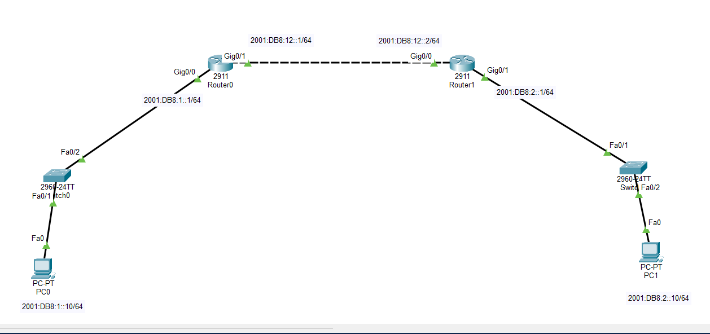

### 📊 Structural Subnet Allocation Blueprint
*   **LAN Network 1 Segment (Left Wing):** `2001:DB8:1::/64`
    *   PC0 Client Host IPv6 Profile: `2001:DB8:1::10/64` (Gateway: `2001:DB8:1::1`)
    *   R1 (Router0) Local LAN Ingress Interface: `2001:DB8:1::1/64` on port `Gig0/0`
*   **WAN Transit Link (Core Backbone Layer):** `2001:DB8:12::/64`
    *   R1 (Router0) WAN Ingress Interface: `2001:DB8:12::1/64` on port `Gig0/1`
    *   R2 (Router1) WAN Ingress Interface: `2001:DB8:12::2/64` on port `Gig0/0`
*   **LAN Network 2 Segment (Right Wing):** `2001:DB8:2::/64`
    *   PC1 Client Host IPv6 Profile: `2001:DB8:2::10/64` (Gateway: `2001:DB8:2::1`)
    *   R2 (Router1) Remote LAN Ingress Interface: `2001:DB8:2::1/64` on port `Gig0/1`

---

# ⚙️ OSPFv3 Global Dynamic Configuration Scripts

To establish functional link-state dynamics, unicast routing is activated, global OSPFv3 process containers are created with explicit Router IDs, and interfaces are mapped directly to Area 0 under physical port configuration modes.

### 📝 Router R1 Core Configuration (Left Gateway Node)
```cisco
enable
configure terminal
hostname R1

! Step 1: Initialize global IPv6 packet switching matrices
ipv6 unicast-routing

! Step 2: Initialize OSPFv3 process container and bind a manual 32-bit Router ID
ipv6 router ospf 1
 router-id 1.1.1.1
exit

! Step 3: Bind interface networks straight to OSPFv3 Area 0
interface GigabitEthernet0/0
 ipv6 address 2001:DB8:1::1/64
 ipv6 ospf 1 area 0
 no shutdown
exit

interface GigabitEthernet0/1
 ipv6 address 2001:DB8:12::1/64
 ipv6 ospf 1 area 0
 no shutdown
exit
end
write memory
```

### 📝 Router R2 Core Configuration (Right Gateway Node)
```cisco
enable
configure terminal
hostname R2

! Step 1: Initialize global IPv6 packet switching matrices
ipv6 unicast-routing

! Step 2: Initialize OSPFv3 process container and bind a manual 32-bit Router ID
ipv6 router ospf 1
 router-id 2.2.2.2
exit

! Step 3: Bind interface networks straight to OSPFv3 Area 0
interface GigabitEthernet0/0
 ipv6 address 2001:DB8:12::2/64
 ipv6 ospf 1 area 0
 no shutdown
exit

interface GigabitEthernet0/1
 ipv6 address 2001:DB8:2::1/64
 ipv6 ospf 1 area 0
 no shutdown
exit
end
write memory
```

---

# 🖥️ Host Profile Validations

Manual static assignment properties configured locally inside operational host network worksheets:

### PC0 Left Wing Interface Configuration Profile
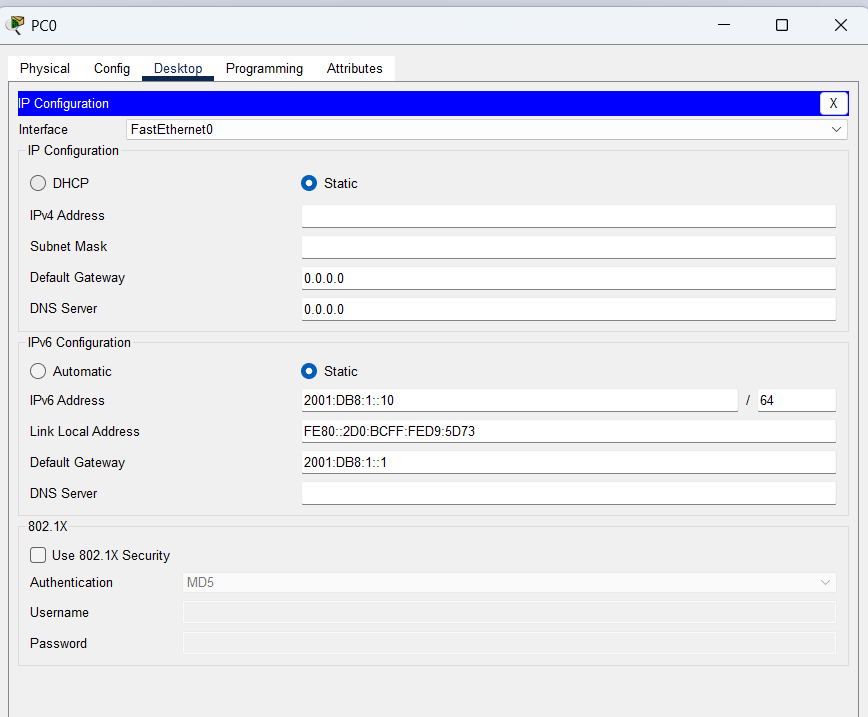

### PC1 Right Wing Interface Configuration Profile
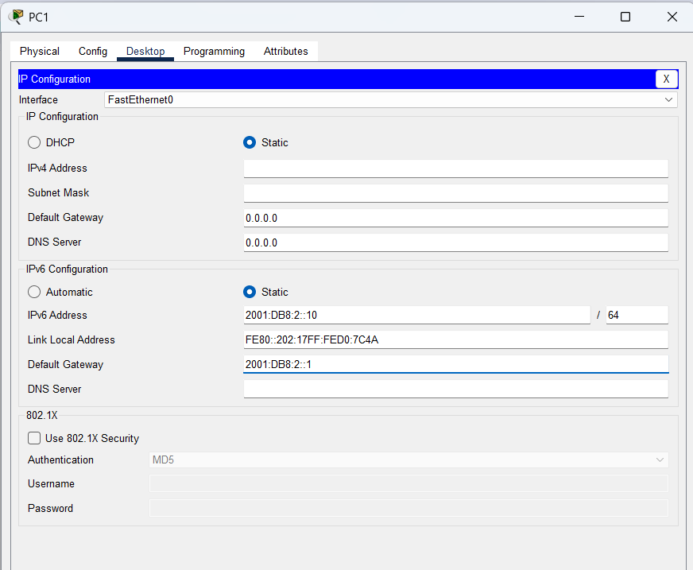

---

# 🔎 Dynamic Core Diagnostics & Address Verification

## 1. Baseline Link Summary Properties Check
Confirm basic hardware line status metrics are up/up across core interfaces.

### Router R1 Port Assignments Confirmation
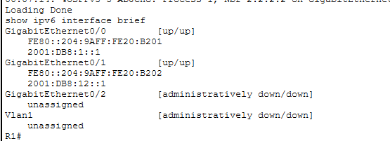

### Router R2 Port Assignments Confirmation
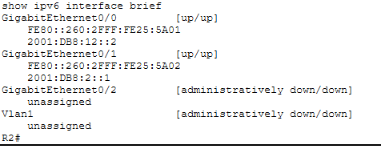

---

## 2. Global OSPFv3 Process Parameter Check
To audit operational send timers, process IDs, and verification of manual Router IDs inside active configuration profiles:

### Router R1 Process ID Verification Block
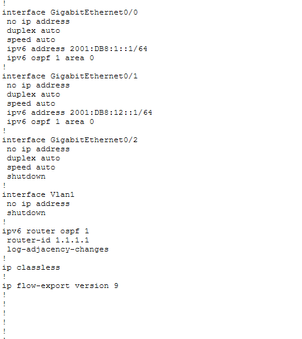

### Router R2 Process ID Verification Block
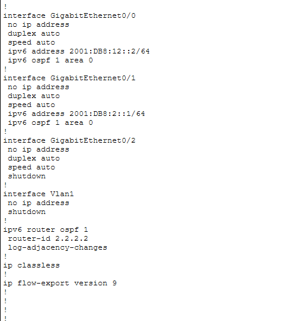

---

## 3. Synchronized Neighbor Adjacency Verification
To confirm loop-free neighbor status, state machines, and proper neighbor sync (`FULL` states), the link-state table is queried:

```cisco
R1# show ipv6 ospf neighbor
```
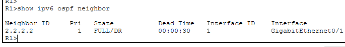

---

```cisco
R2# show ipv6 ospf neighbor
```
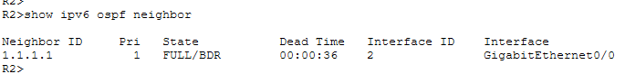

*   **Neighbor State Matrix Check:** The tactical presence of **`FULL/DR`** or **`FULL/BDR`** confirms successful database synchronization across transit boundaries.

---

## 4. IPv6 Routing Table Dynamic Convergence Audit
The link-state routing engine maps were verified using next-generation table lookups:

### Router R1 Converged Routing Table Engine
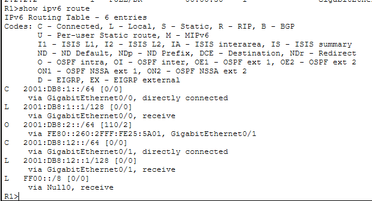

### Router R2 Converged Routing Table Engine
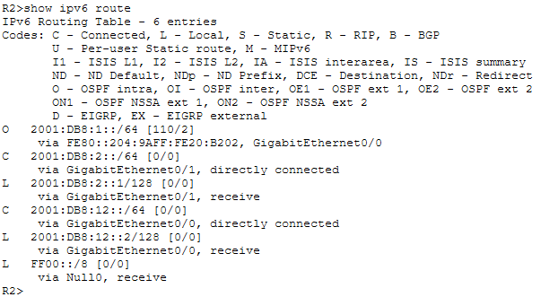

The presence of the character routing code prefix **`O` (OSPF)** validates that remote hexadecimal subnets are dynamically learned and installed into active memory with respective OSPF Administrative Distance (AD = 110) metrics.

---

# 🔒 Data Plane Connectivity & Live ICMPv6 Trace Diagnostics

An end-to-end data packet transmission routine is initiated from **PC0** crossing distinct dynamic gateway points toward **PC1** (`2001:DB8:2::10`). 

```cmd
C:\> ping 2001:DB8:2::10
```
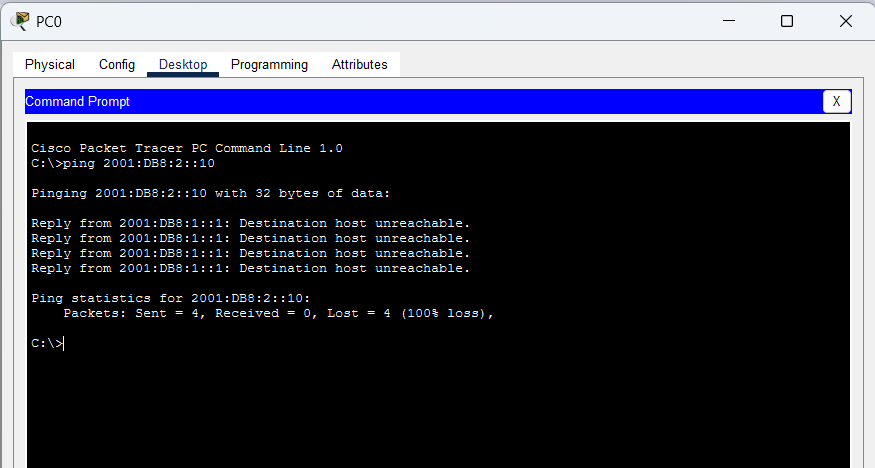

**ICMPv6 Diagnostic Status: ALLOWED & TRANSITED SUCCESSFULLY ✅ (0% packet drop statistics / 100% stable reachability)**

---

# 🔎 OSPFv3 Core Reference Diagnostic Matrix

| Verification Command | Technical Operational Target Purpose |
| :--- | :--- |
| `show ipv6 interface brief` | Print comprehensive database of IPv6 allocations, link-locals, and port line-states |
| `show ipv6 ospf neighbor`   | Verify OSPFv3 active neighbor states, router IDs, interfaces, and adjacencies |
| `show ipv6 route`           | Extract the live converged next-generation layer 3 routing table database engine |
| `show ipv6 route ospf`      | Filter routing table entries to isolate OSPFv3-learned dynamically routed networks |
| `show ipv6 ospf interface`  | View granular cost metrics, operational timers, and interface network types |

---

# ✅ Expected Lab Outcome

After successful deployment:
* The `ipv6 unicast-routing` command triggers the next-generation dynamic routing framework inside core architectures.
* R1 and R2 discover adjacent links over link-local address spaces and safely form stable `FULL` state dependencies.
* The Dijkstra SPF engine calculates optimal forwarding cost metrics to target distant subnets across backbone Area 0.
* End-to-end data communication operates smoothly without manual route injection, maintaining complete 0% loss statistics.

---

## 📂 Lab Files Inventory Checklist

| **File** | **Technical Description** |
| :--- | :--- |
| `README.md` | Comprehensive Lab Technical Documentation (This Document File) |
| `Lab 23 — IPv6 OSPF.pkt` | Authentic Cisco Packet Tracer active next-generation dynamic routing blueprint file |
| `01-Topology.png` | Network topology environment design parallel backbone path layout |
| `02-PC0-IPv6-Configuration.png` | PC0 local hexadecimal address assignment worksheet snapshot |
| `03-PC1-IPv6-Configuration.png` | PC1 local hexadecimal address assignment worksheet snapshot |
| `04-R1-IPv6-Configuration.png` | Router R1 interface assignments confirmation clip |
| `05-R2-IPv6-Configuration.png` | Router R2 interface assignments confirmation clip |
