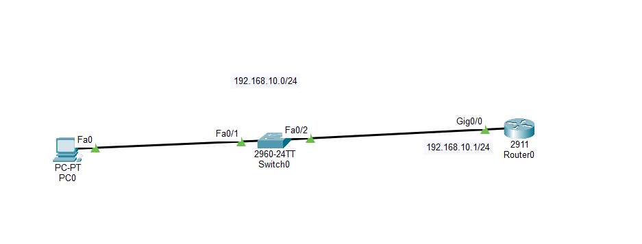
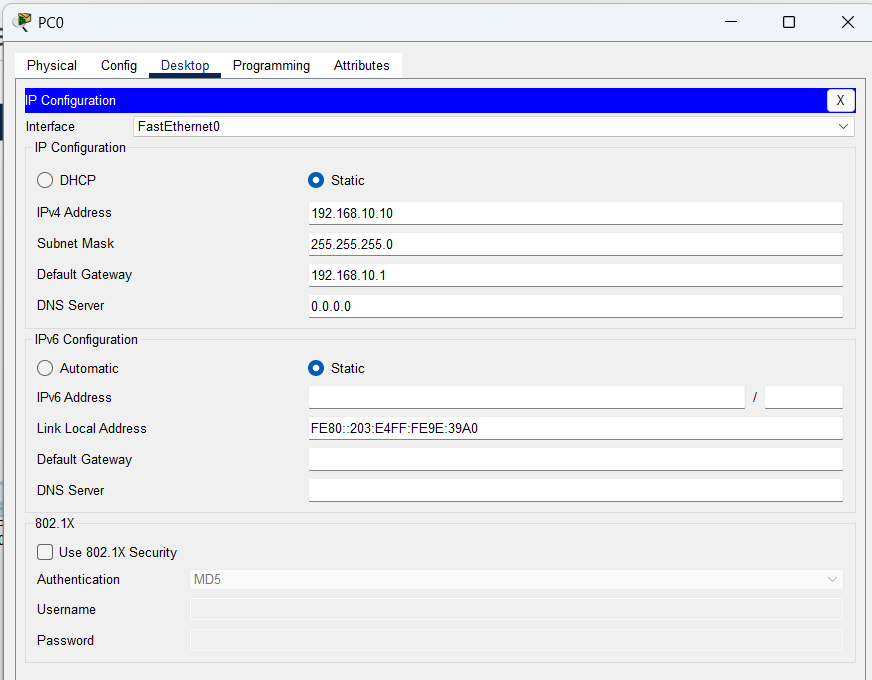
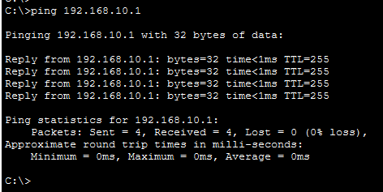
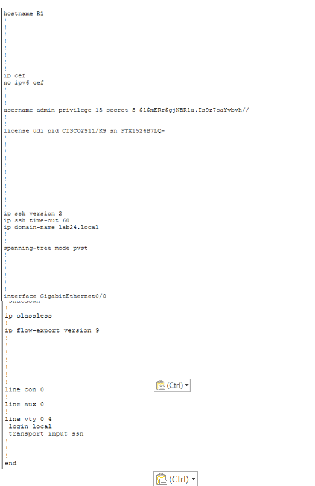
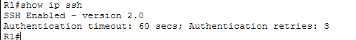
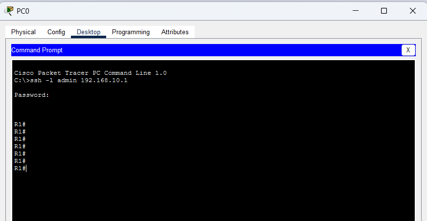

# LAB 24 — Network Core Services: SSH Remote Access Configuration

## 📌 Overview

This lab demonstrates how to configure, secure, and verify **Secure Shell (SSH) Version 2 Remote Access** on a Cisco infrastructure topology using Cisco Packet Tracer.

In traditional network deployments, legacy protocols like Telnet were utilized for device management plane access. However, Telnet transmits all data—including administrative passwords—in plaintext across the wire, making it highly vulnerable to packet sniffing and man-in-the-middle (MITM) interceptions. 

**Secure Shell (SSH)** mitigates this critical security boundary vulnerability by establishing a cryptographically secured shell wrapper that encrypts all management traffic using asymmetric **RSA public-key cryptography**. 

This lab focuses on configuring secure local database authentication, generating multi-bit RSA keys, restricting terminal lines exclusively to encrypted SSH sessions, and establishing outbound administrative connections from local terminal environments.

---

## 🎯 Objectives

The objectives of this lab are to:

* Configure a local area network edge layout integrating a user workspace host and a boundary gateway router in Cisco Packet Tracer.
* Configure precise classless fixed IPv4 addressing properties across host interfaces and local gateway ports.
* Initialize local cryptographic requirements by assigning hostnames and global domain boundaries.
* Generate high-modulus **RSA Cryptographic Keys** to activate the localized secure server process.
* Restrict VTY terminal access lines exclusively to encrypted data streams (`transport input ssh`).
* Validate secure administrative authentication credentials from remote terminal workstation prompts.

---

## 🧪 Lab Environment & Structural Parameters

| Component       | Details             |
| --------------- | ------------------- |
| Simulation Tool | Cisco Packet Tracer |
| Edge Gateway    | Router0 (System Node R1 Host Boundary) |
| Client Switches | Switch0 (Cisco 2960-24TT Series FastEthernet Hub) |
| End Devices     | PC0 (Administrative Client Management Workspace) |
| LAN Subnet      | 192.168.10.0/24 Classless Segment Profile |
| Cryptography    | Asymmetric RSA (Rivest–Shamir–Adleman) with 1024-Bit Modulus |
| Core Protocol   | Secure Shell Version 2 (SSHv2 / SSH 2.0 Encrypted Transport) |

---

# 🌐 Network Topology

The production architecture implements a secured local access management segment connected straight to the gateway core boundary interface to check protocol encryption parameters:



### 📊 Structural Subnet Allocation Blueprint
*   **Inside LAN Management Segment (Area 1 Zone):** `192.168.10.0/24`
    *   PC0 Host IP Interface Profile: `192.168.10.10/24` (Gateway: `192.168.10.1`)
    *   R1 (Router0) Local LAN Gateway Port: `192.168.10.1/24` on interface `Gig0/0`

---

# ⚙️ Secure Shell (SSHv2) Operational Configuration Scripts

To instantiate encrypted session layers, interface IP bounds are defined, a secure local domain name is declared, local administrative accounts are generated, multi-bit keys are compiled, and VTY lines are locked.

### 📝 Core Command Script (Executed on Gateway Router R1)
```cisco
enable
configure terminal

! Step 1: Assign local identity parameters
hostname R1

! Step 2: Configure local gateway port settings
interface GigabitEthernet0/0
 ip address 192.168.10.1 255.255.255.0
 no shutdown
exit

! Step 3: Establish global domain mapping boundary parameters
ip domain-name lab24.local

! Step 4: Create localized administrative profile carrying absolute privileges (Level 15)
username admin privilege 15 secret Cisco@123

! Step 5: Compile asymmetric RSA public-private key blocks (Mandates minimum 768-bit for SSHv2)
crypto key generate rsa modulus 1024

! Step 6: Force global protocol standard to version 2
ip ssh version 2

! Step 7: Secure VTY management lines to enforce local lookups and restrict plaintext bypass
line vty 0 4
 login local
 transport input ssh
exit

end
write memory
```

---

# 🖥 "Host Profile Validations

Manual static network attributes provisioned locally across administrative host computing layers:

### PC0 Management Workspace IP Configuration Profile


---

# 🔎 Dynamic Core Diagnostics & Address Verification

## 1. Gateway Interface Deployment Check
Confirm active interface line command scripts and line protocol up/up states.


---

## 2. Inbound Data Plane Edge Reachability Verification
Before initializing remote access configurations, basic line-level transit operations are evaluated from PC0:
```cmd
C:\> ping 192.168.10.1
```


**ICMP Connectivity Status: SUCCESSFUL ✅ (0% packet drop statistics)**

---

## 3. Global Encryption Rules Validation Check
Verifying the running layer 3 system parameters confirms that user data databases and cryptographic VTY line constraints have compiled cleanly.
```cisco
R1# show running-config
```


---

## 4. Secure Shell Version Engine Audit
To verify that the secure process has initialized and is running the optimal 2.0 version standard, the server status is audited:
```cisco
R1# show ip ssh
```


---

# 🔒 Management Plane Security & Remote Session Verification

To execute remote validation, an outbound encrypted shell connection is initiated from the client command line targeting the gateway IP interface. The gateway challenges the packet, matches it against local database privileges, and unlocks the prompt securely.

```cmd
C:\> ssh -l admin 192.168.10.1
```


**SSH Session Status: CONNECTED SUCCESSFULLY ✅ (Secure Level 15 `R1#` privilege prompt acquired)**

---

# 🔎 Secure Shell Service Diagnostics Reference Guide

| Verification Command | Technical Operational Target Purpose |
| :--- | :--- |
| `show ip interface brief` | Audit active hardware interface states and IP tracking address maps across the chassis |
| `show ip ssh` | Print active global SSH server status properties, versions, and timeout parameters |
| `show ssh`    | View live active inbound user management shell sessions connected to the gateway |
| `show running-config \| section line` | Parse terminal line authentication states and restricted transport input definitions |
| `ssh -l <username> <Target-IP>` | Initiate remote encrypted management tunnel from automated client platforms |

---

# ✅ Expected Lab Outcome

After successful deployment:
* Hostname and domain records combine to successfully initialize the RSA certificate matrix.
* VTY lines reject all insecure Telnet communication packets, preventing plaintext data sniffing.
* Admin credential packets are handled inside an asymmetric cryptographic wrapper, ensuring management plane isolation.
* Host workstation PC0 acquires full Level 15 privilege access prompts over a single secure remote session line.

---

## 📂 Lab Files Inventory Checklist

| **File** | **Technical Description** |
| :--- | :--- |
| `README.md` | Comprehensive Lab Technical Documentation (This Document File) |
| `Lab 24 - SSH Remote Access.pkt` | Authentic Cisco Packet Tracer secure remote access infrastructure sandbox net-file |
| `01-Topology.png` | Network topology environment design backbone path layout |
| `02-R1-Interface-Configuration .. png` | Router R1 interface status summaries output capture (Double-space matching) |
| `03-PCO-IP-Configuration.png` | PC0 host private management network assignment worksheet snapshot (Zero-matched asset) |
| `04-PCO-Ping-Test.png` | Outbound host transport baseline connection confirmation capture (Zero-matched asset) |
| `05-R1-SSH-Configuration.png` | Global VTY transport input and local administrative database verification clip |
| `06-SSH-Version-Verification.png` | Active encrypted dynamic server version status log |
| `07-PCO-SSH-Login-Success.png` | Complete remote session connection and login prompt acquisition snapshot |

---

## 📚 CCNA 200-301 Curriculum Series
This lab profile tracks a primary component block of the **CCNA Practical Management Plane Security and Services Infrastructure Series**.

## 🏁 Lab Status
**COMPLETED ✅**
