# LAB 25 — Layer 2 Security: Switch Port Security Configuration

## 📌 Overview

This lab demonstrates the configuration, verification, violation testing, and recovery of **Cisco Switch Port Security** using Cisco Packet Tracer.

Port Security is a Layer 2 security feature that helps restrict unauthorized devices from accessing a switch access port by controlling the MAC addresses allowed on that interface.

In this lab, Port Security is configured on **FastEthernet0/1** of **SW1** with a maximum of **1 secure MAC address**. **Sticky MAC learning** is enabled to dynamically learn the authorized host's MAC address. A different host is then connected to the secured port to intentionally trigger a security violation. The resulting **err-disabled** state is verified, followed by manual interface recovery and a final connectivity test.

---

## 🎯 Objectives

The objectives of this lab are to:

* Configure IPv4 addressing on two PCs.
* Configure an access port on a Cisco Catalyst switch.
* Enable Port Security on FastEthernet0/1.
* Restrict the port to a maximum of one MAC address.
* Enable Sticky MAC address learning.
* Verify the learned secure MAC address.
* Perform a normal connectivity test.
* Simulate an unauthorized device connection.
* Trigger a Port Security violation.
* Verify the resulting err-disabled state.
* Recover the secured interface using `shutdown` and `no shutdown`.
* Verify connectivity after recovery.

---

# 🧪 Lab Environment & Hardware

| Component                    | Details                                          |
| ---------------------------- | ------------------------------------------------ |
| Simulation Tool              | Cisco Packet Tracer                              |
| Switch                       | SW1 — Cisco Catalyst 2960-24TT                   |
| End Devices                  | PC0 — Trusted Host, PC1 — Unauthorized Test Host |
| Secured Interface            | FastEthernet0/1                                  |
| Normal Host Interface        | FastEthernet0/2                                  |
| VLAN                         | VLAN 1                                           |
| Security Method              | Sticky MAC Port Security                         |
| Maximum Secure MAC Addresses | 1                                                |
| Violation Mode               | Shutdown                                         |
| Violation Result             | Err-disabled                                     |

---

# 🌐 Network Topology

### Normal Topology

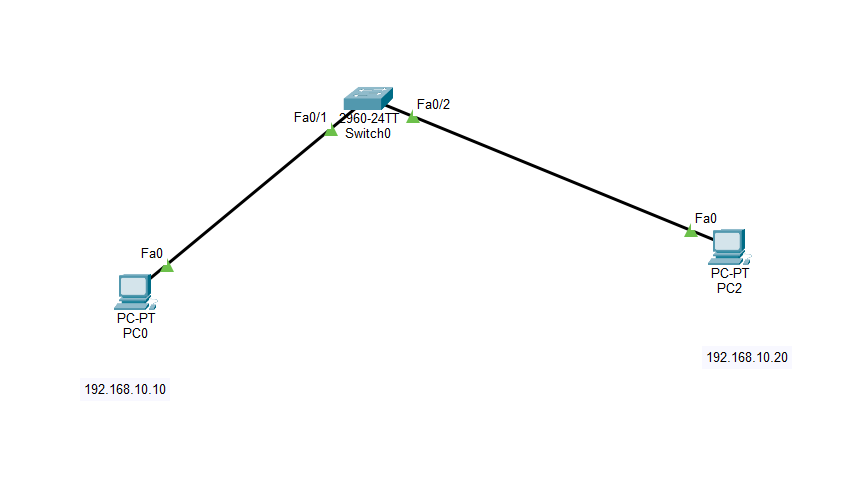

---

## 📊 IP Addressing Plan

| Device | Interface    | IP Address    | Subnet Mask   | Default Gateway |
| ------ | ------------ | ------------- | ------------- | --------------- |
| PC0    | FastEthernet | 192.168.10.10 | 255.255.255.0 | Not Required    |
| PC1    | FastEthernet | 192.168.10.20 | 255.255.255.0 | Not Required    |

Both PCs are connected to the same Layer 2 network and subnet. Therefore, a default gateway is not required for communication between PC0 and PC1.

---

# 🖥️ Host Configuration

## 1. PC0 IP Configuration

PC0 is configured as the trusted host.

```text
IP Address:    192.168.10.10
Subnet Mask:   255.255.255.0
Gateway:       Not Required
```

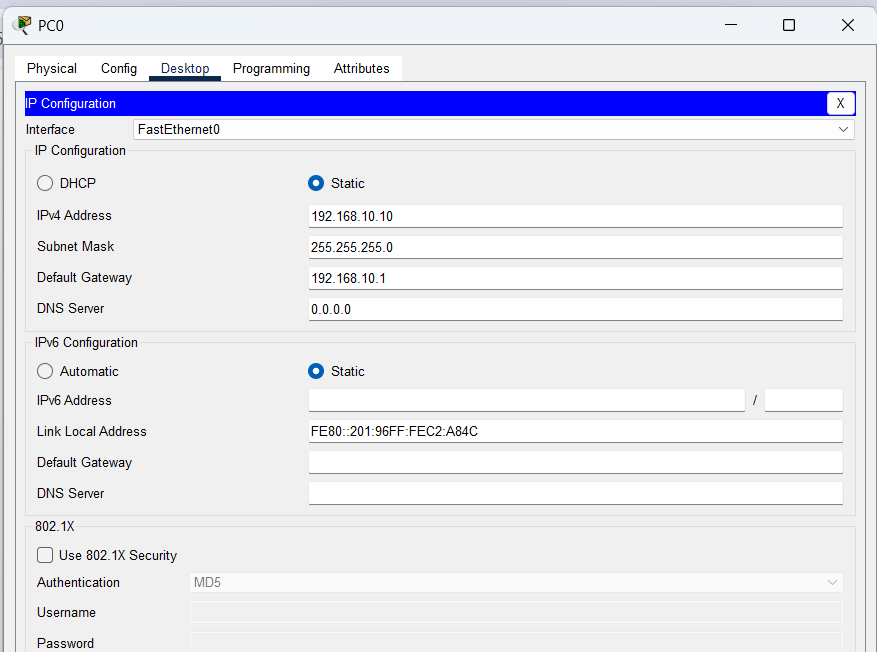

---

## 2. PC1 IP Configuration

PC1 is used as the second host and unauthorized test device during the Port Security violation test.

```text
IP Address:    192.168.10.20
Subnet Mask:   255.255.255.0
Gateway:       Not Required
```

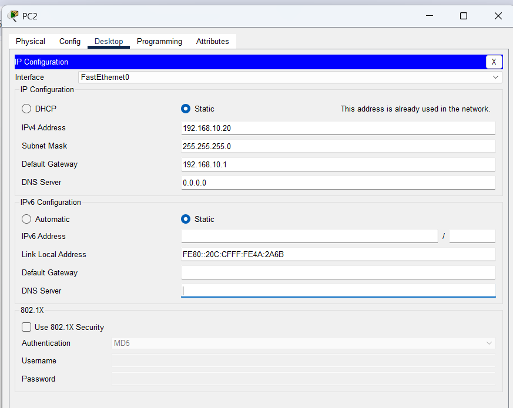

---

# 🔒 Switch Port Security Configuration

Port Security is configured on **SW1 FastEthernet0/1**, where PC0 is initially connected.

## Configuration Commands

```cisco
enable
configure terminal
hostname SW1

interface fastethernet 0/1
 switchport mode access
 switchport port-security
 switchport port-security maximum 1
 switchport port-security mac-address sticky
 switchport port-security violation shutdown
exit

end
write memory
```

## Command Explanation

| Command                                       | Purpose                                                              |
| --------------------------------------------- | -------------------------------------------------------------------- |
| `switchport mode access`                      | Configures the interface as an access port                           |
| `switchport port-security`                    | Enables Port Security                                                |
| `switchport port-security maximum 1`          | Allows a maximum of one secure MAC address                           |
| `switchport port-security mac-address sticky` | Dynamically learns and stores the MAC address                        |
| `switchport port-security violation shutdown` | Places the port into a shutdown/err-disabled state after a violation |

### SW1 Port Security Configuration

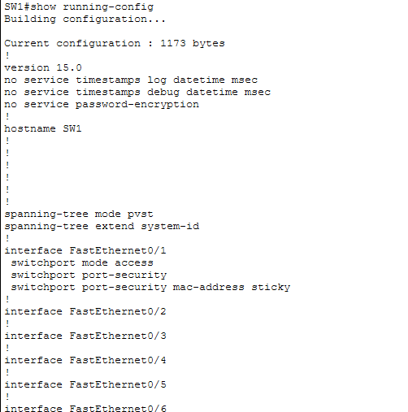

---

# 🔑 Sticky MAC Address Learning

After PC0 generates traffic through Fa0/1, SW1 dynamically learns PC0's source MAC address using Sticky MAC learning.

Verification command:

```cisco
show port-security interface fastethernet 0/1
```

Expected important values:

```text
Port Security              : Enabled
Port Status                : Secure-up
Maximum MAC Addresses      : 1
Total MAC Addresses        : 1
Sticky MAC Addresses       : 1
Security Violation Count   : 0
```

### Sticky MAC Address

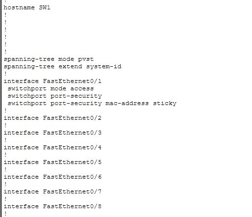

---

# 🧪 Normal Connectivity Test

Before performing the security violation test, normal connectivity between PC0 and PC1 is verified.

From PC0:

```cmd
ping 192.168.10.20
```

Expected result:

```text
Reply from 192.168.10.20
```

The successful ping confirms that the hosts can communicate normally before the violation test.

### Normal Ping Test

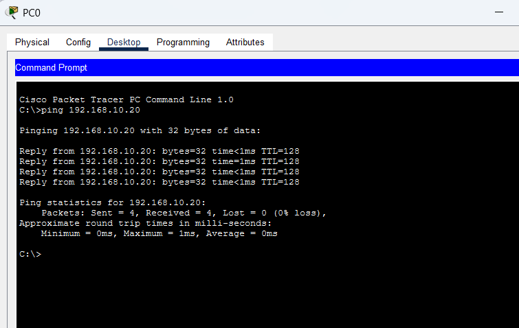

---

# 🔎 Port Security Verification

The Port Security state of Fa0/1 is verified before the violation test.

```cisco
show port-security interface fastethernet 0/1
```

Expected state:

```text
Port Security              : Enabled
Port Status                : Secure-up
Violation Mode             : Shutdown
Maximum MAC Addresses      : 1
Total MAC Addresses        : 1
Configured MAC Addresses   : 0
Sticky MAC Addresses       : 1
Security Violation Count   : 0
```

### Port Security Verification

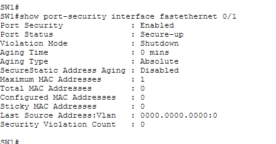

---

# 🚫 Port Security Violation Test

## 1. Simulating an Unauthorized Device

To simulate an unauthorized device attempting to access the secured switch port:

1. Disconnect **PC0** from `Fa0/1`.
2. Disconnect **PC1** from `Fa0/2`.
3. Temporarily connect **PC1** to `Fa0/1`.
4. Generate traffic from PC1.
5. SW1 detects that PC1 has a different MAC address from the Sticky MAC address learned from PC0.

Because the maximum secure MAC address limit is set to **1**, the different MAC address causes a Port Security violation.

Example switch messages:

```text
%PM-4-ERR_DISABLE: psecure-violation error detected on Fa0/1,
putting Fa0/1 in err-disable state.
```

```text
%PORT_SECURITY-2-PSECURE_VIOLATION:
Security violation occurred
```

---

# 🚨 Err-Disabled Interface Verification

After the violation, verify the switch interface status:

```cisco
show interfaces status
```

Expected:

```text
Fa0/1    err-disabled
```

Detailed interface verification:

```cisco
show interfaces fastethernet 0/1
```

Expected:

```text
FastEthernet0/1 is down, line protocol is down (err-disabled)
```

### Interface Err-Disabled

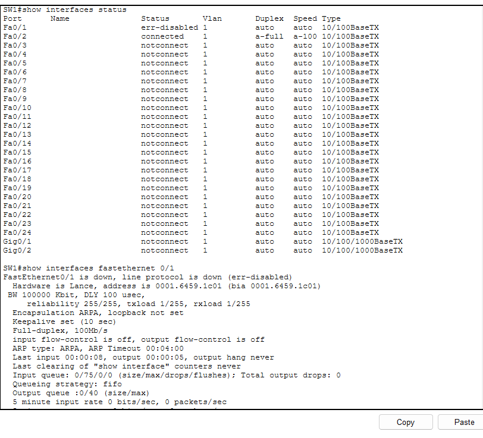

---

# 🔥 Port Security Violation Verification

The Port Security security counters are checked after the unauthorized MAC address is detected.

```cisco
show port-security interface fastethernet 0/1
```

The observed violation state includes:

```text
Port Security              : Enabled
Port Status                : Secure-shutdown
Violation Mode             : Shutdown
Maximum MAC Addresses      : 1
Total MAC Addresses        : 1
Sticky MAC Addresses       : 1
Security Violation Count   : 1
```

Example observed unauthorized MAC address:

```text
Last Source Address:Vlan   : 0001.4264.C576:1
Security Violation Count   : 1
```

This confirms that SW1 detected a different MAC address attempting to access the secured port.

### Port Security Violation

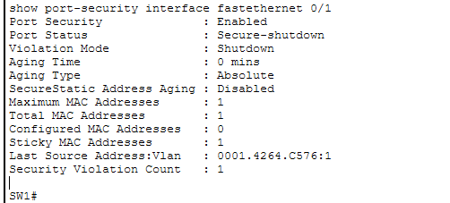

---

# 🔧 Port Security Recovery

After the violation test:

1. Disconnect PC1 from `Fa0/1`.
2. Reconnect PC0 to `Fa0/1`.
3. Reconnect PC1 to `Fa0/2`.
4. Recover Fa0/1 manually.

The topology should return to:

```text
PC0 ─── Fa0/1 ─── SW1 ─── Fa0/2 ─── PC1
```

## Recovery Commands

```cisco
enable
configure terminal
interface fastethernet 0/1
shutdown
no shutdown
exit
end
```

The `shutdown` / `no shutdown` sequence manually resets the affected interface and allows the port to return to an operational state.

### Port Security Recovery

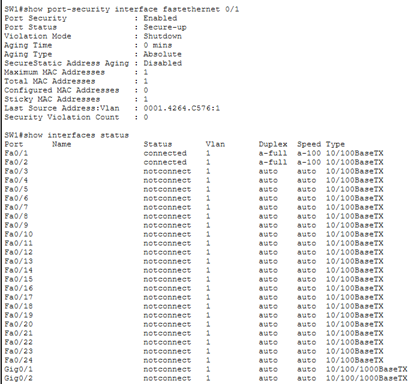

---

# ✅ Final Connectivity Verification

After recovering Fa0/1, verify connectivity again from PC0.

```cmd
ping 192.168.10.20
```

A successful result should show:

```text
Reply from 192.168.10.20
```

The successful recovery ping confirms that:

* Fa0/1 has returned to an operational state.
* PC0 is connected to the secured interface.
* Port Security remains enabled.
* Normal network connectivity has been restored.

### Recovery Ping Test

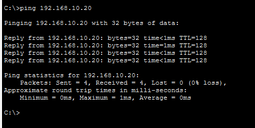

---

# 🔎 Verification Commands

| Command                                  | Purpose                                                  |
| ---------------------------------------- | -------------------------------------------------------- |
| `show port-security`                     | Displays Port Security status across switch interfaces   |
| `show port-security interface fa0/1`     | Displays detailed Port Security information for Fa0/1    |
| `show port-security address`             | Displays secure MAC addresses learned by Port Security   |
| `show interfaces status`                 | Displays the operational state of switch interfaces      |
| `show interfaces fa0/1`                  | Displays detailed interface status and error information |
| `show mac address-table interface fa0/1` | Displays MAC addresses learned on Fa0/1                  |
| `ping <Destination-IP>`                  | Verifies IP connectivity between hosts                   |

---

# 📊 Lab Verification Summary

| Test / Configuration            | Result             |
| ------------------------------- | ------------------ |
| PC0 IP Address                  | `192.168.10.10/24` |
| PC1 IP Address                  | `192.168.10.20/24` |
| Port Security                   | Enabled            |
| Secured Port                    | `Fa0/1`            |
| Maximum MAC Addresses           | `1`                |
| Sticky MAC                      | Enabled            |
| Sticky MAC Learned              | `1`                |
| Normal Connectivity             | Successful         |
| Violation Mode                  | Shutdown           |
| Security Violation              | Detected           |
| Violation Count                 | `1`                |
| Interface State After Violation | `err-disabled`     |
| Manual Recovery                 | Successful         |
| Final Connectivity              | Successful         |

---

# 🧠 Key Concepts Learned

### 1. Port Security

Port Security restricts access to a switch port based on MAC addresses.

### 2. Sticky MAC Learning

Sticky MAC allows the switch to dynamically learn a MAC address and associate it with the secured interface.

### 3. Maximum MAC Address Limit

Setting:

```cisco
switchport port-security maximum 1
```

allows only one secure MAC address on the interface.

### 4. Violation Shutdown Mode

With:

```cisco
switchport port-security violation shutdown
```

a security violation causes the interface to enter an **err-disabled / secure-shutdown** state.

### 5. Manual Recovery

The affected interface can be manually restored using:

```cisco
shutdown
no shutdown
```

---

# 🏁 Expected Lab Outcome

After completing this lab:

* SW1 has Port Security enabled on `Fa0/1`.
* PC0's MAC address is dynamically learned using Sticky MAC.
* Only one secure MAC address is permitted.
* A different MAC address connected to `Fa0/1` triggers a security violation.
* The switch places `Fa0/1` into an `err-disabled` state.
* The violation counter increases to `1`.
* The interface is manually recovered.
* PC0 and PC1 regain normal connectivity.

This demonstrates a practical Layer 2 access-port security mechanism using Cisco Switch Port Security.

---

# 📂 Lab Files

```text
25-Lab - Port Security/
│
├── 01-Topology.png
├── 02-PC0-IP-Configuration.png
├── 03-PC1-IP-Configuration.png
├── 04-SW1-Port-Security-Configuration.png
├── 05-Sticky-MAC-Address.png
├── 06-Normal-Ping-Test.png
├── 07-Port-Security-Verification.png
├── 08-Interface-ErrDisabled.png
├── 09-Port-Security-Violation.png
├── 10-Port-Security-Recovery.png
├── 11-Recovery-Ping-Test.png
├── Lab 25 - Port Security.pkt
└── README.md
```

---

## 📸 Screenshot Index

| #  | Screenshot                               | Description                         |
| -- | ---------------------------------------- | ----------------------------------- |
| 01 | `01-Topology.png`                        | Complete network topology           |
| 02 | `02-PC0-IP-Configuration.png`            | PC0 IPv4 configuration              |
| 03 | `03-PC1-IP-Configuration.png`            | PC1 IPv4 configuration              |
| 04 | `04-SW1-Port-Security-Configuration.png` | SW1 Port Security configuration     |
| 05 | `05-Sticky-MAC-Address.png`              | Sticky MAC learning verification    |
| 06 | `06-Normal-Ping-Test.png`                | Normal PC0-to-PC1 connectivity      |
| 07 | `07-Port-Security-Verification.png`      | Port Security baseline verification |
| 08 | `08-Interface-ErrDisabled.png`           | Err-disabled interface verification |
| 09 | `09-Port-Security-Violation.png`         | Security violation verification     |
| 10 | `10-Port-Security-Recovery.png`          | Manual interface recovery           |
| 11 | `11-Recovery-Ping-Test.png`              | Final connectivity verification     |

---

