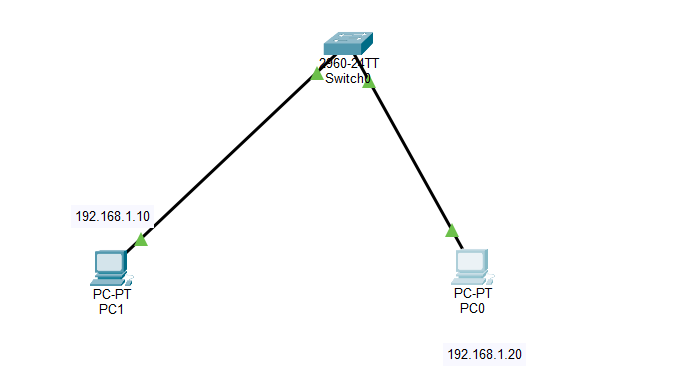

# CCNA 200-301 Practical Lab Documentation

## LAB 01 — Basic Cisco Switch Configuration

## 1. Objective

Configure a Cisco switch with basic initial configuration and access-security settings, then verify the configuration and Layer 2 connectivity using Cisco Packet Tracer.

## 2. Lab Environment

| Component | Details |
|---|---|
| Simulation Tool | Cisco Packet Tracer |
| Network Device | Cisco Switch |
| Switch Hostname | SW1 |
| Topology | PC0 — SW1 — PC1 |
| Layer | Layer 2 |

## 3. Network Topology



## 4. Configuration Performed

- Configured the switch hostname as SW1.
- Configured an enable secret for privileged EXEC mode.
- Configured a Message of the Day (MOTD) banner: **"Authorized Users Only"**.
- Configured console-line password authentication.
- Enabled login on the console line.
- Enabled login on the VTY lines (0–4 and 5–15).
- Verified the switch running configuration.

## 5. Key Configuration Commands

```bash
enable
configure terminal
hostname sw1

enable secret <PASSWORD>

banner motd #Authorized Users Only#

line console 0
password <PASSWORD>
login
exit

line vty 0 4
login
exit

line vty 5 15
login
exit

Note: Passwords and encrypted secret values are intentionally omitted from the public documentation.

6. Verification Commands
show running-config — verified the active switch configuration.
show interfaces status — verified switch-port status.
ping <destination-IP> — verified connectivity between connected PCs.
7. Connectivity Verification

PC-to-PC connectivity was successfully verified using ICMP ping.

Ping Result
Packets Sent: 4
Packets Received: 4
Packet Loss: 0%
8. Expected Result

The switch should display the configured hostname, security settings, MOTD banner, console/VTY login configuration, and connected interfaces.

Connected PCs in the same Layer 2 network should successfully communicate using ICMP ping.

9. GitHub Project Files
Basic Switch + PC Connectivity.pkt — Complete Cisco Packet Tracer lab file containing the topology and device configuration.
README.md — Lab objective, configuration summary, and verification details.
topology.png — Screenshot of the completed network topology.
ping-success.png — Screenshot proving successful connectivity.
10. Security Note

Do not publish real passwords, enable-secret hashes, private keys, or other credentials in GitHub screenshots or documentation. The .pkt lab should use lab-only credentials.

11. Skills Demonstrated
Cisco IOS CLI
Basic switch initialization
Hostname configuration
Privileged EXEC security
Console access configuration
VTY line configuration
MOTD banner configuration
Basic network verification and troubleshooting
12. Lab Status

LAB 01 — COMPLETED ✅
