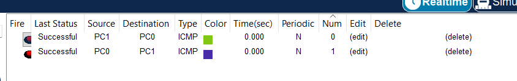

# LAB 01 — Basic Cisco Switch Configuration

<<<<<<< HEAD
## 📌 Overview
=======
### 1. Objective
>>>>>>> ddd5ac8 (Add Lab 02 VLAN access port configuration)

This lab demonstrates the basic initial configuration and access-security settings of a Cisco Layer 2 switch using Cisco Packet Tracer.

<<<<<<< HEAD
The lab also verifies Layer 2 connectivity between two PCs connected through the switch.
=======
### 2. Lab Environment
>>>>>>> ddd5ac8 (Add Lab 02 VLAN access port configuration)

---

<<<<<<< HEAD
## 🎯 Objective
=======
### 3. Network Topology
>>>>>>> ddd5ac8 (Add Lab 02 VLAN access port configuration)

The objectives of this lab are to:

<<<<<<< HEAD
* Configure a Cisco switch hostname.
* Configure an enable secret for privileged EXEC mode.
* Configure a Message of the Day (MOTD) banner.
* Configure console-line password authentication.
* Enable login authentication on the console line.
* Configure VTY lines for remote access.
* Verify the switch running configuration.
* Verify switch-port status.
* Test Layer 2 connectivity between connected PCs using ICMP ping.
=======
### 4. Configuration Performed
>>>>>>> ddd5ac8 (Add Lab 02 VLAN access port configuration)

---

<<<<<<< HEAD
## 🧪 Lab Environment

| Component       | Details              |
| --------------- | -------------------- |
| Simulation Tool | Cisco Packet Tracer  |
| Network Device  | Cisco Layer 2 Switch |
| Switch Hostname | SW1                  |
| End Devices     | PC0, PC1             |
| Topology        | PC0 — SW1 — PC1      |
| Network Layer   | Layer 2              |

---

## 🌐 Network Topology


**Topology:** `PC0 — SW1 — PC1`

---

## ⚙️ Configuration Performed

The following configurations were performed on the Cisco switch:

* Hostname configured as `SW1`
* Enable secret configured
* MOTD banner configured
* Console password authentication configured
* Console login enabled
* VTY lines 0–4 configured
* VTY lines 5–15 configured
* Running configuration verified
* Switch-port status verified
* PC-to-PC connectivity tested using ICMP ping

---

## 💻 Key Configuration Commands

```cisco
=======
### 5. Key Configuration Commands

>>>>>>> ddd5ac8 (Add Lab 02 VLAN access port configuration)
enable
configure terminal

hostname SW1

enable secret <PASSWORD>

banner motd #Authorized Users Only#

line console 0
password <PASSWORD>
login
exit

line vty 0 4
login
exit

line vty 5 15
login
exit
```

<<<<<<< HEAD
> **Note:** Passwords and encrypted secret values are intentionally omitted from this public documentation.

---
=======
Note: Passwords and encrypted secret values are intentionally omitted from the public documentation.
### 6. Verification Commands

- `show running-config` — verified the active switch configuration.
- `show interfaces status` — verified switch-port status.
- `ping <destination-IP>` — verified connectivity between connected PCs.

### 7. Connectivity Verification
>>>>>>> ddd5ac8 (Add Lab 02 VLAN access port configuration)

## 🔎 Verification

<<<<<<< HEAD
### 1. Verify Running Configuration
=======


#### Ping Result

- **Packets Sent:** 4
- **Packets Received:** 4
- **Packet Loss:** 0%

### 8. Expected Result
>>>>>>> ddd5ac8 (Add Lab 02 VLAN access port configuration)

```cisco
show running-config
```

Used to verify the active switch configuration, including:

* Hostname
* Enable secret
* MOTD banner
* Console configuration
* VTY configuration

---

### 2. Verify Switch Port Status

```cisco
show interfaces status
```

Used to verify the operational status of connected switch interfaces.

---

### 3. Test PC Connectivity

```text
ping <destination-IP>
```

The ping test was used to verify successful Layer 2 connectivity between the connected PCs.

---

## 📸 Connectivity Verification


The screenshot above demonstrates successful ICMP connectivity between the connected PCs.

---

## ✅ Expected Result

After completing the configuration:

* The switch should display the hostname `SW1`.
* The MOTD banner should display **"Authorized Users Only"**.
* Privileged EXEC mode should be protected with an enable secret.
* Console access should require authentication.
* VTY lines should be configured for login authentication.
* Connected switch interfaces should be operational.
* PC0 and PC1 should successfully communicate through the switch.

---

## 🔐 Security Note

Do not publish the following information in a public GitHub repository:

* Real passwords
* Enable-secret hashes
* Private keys
* API keys
* Authentication tokens
* Other sensitive credentials

Only use **lab-only credentials** in Cisco Packet Tracer files.

---

## 🛠️ Skills Demonstrated

* Cisco IOS CLI
* Basic Cisco switch configuration
* Switch hostname configuration
* Privileged EXEC security
* Enable secret configuration
* Console-line authentication
* VTY-line configuration
* MOTD banner configuration
* Layer 2 connectivity verification
* Basic network troubleshooting
* Cisco Packet Tracer

---

## 📂 Lab Files

| File               | Description                                 |
| ------------------ | ------------------------------------------- |
| `README.md`        | Lab documentation and configuration details |
| `topology.png`     | Completed network topology                  |
| `ping-success.png` | Successful PC connectivity verification     |
| `Lab-01.pkt`       | Cisco Packet Tracer lab file                |

---

## 📚 CCNA 200-301

This lab is part of my **CCNA 200-301 Networking Lab Series**, covering fundamental Cisco networking concepts including:

* Basic Switch Configuration
* VLANs
* Trunking
* Inter-VLAN Routing
* DHCP
* Network Connectivity
* Cisco IOS Configuration

**Lab Status:** ✅ Completed

<<<<<<< HEAD


=======
### 9. GitHub Project Files

- `Basic Switch + PC Connectivity.pkt`
- `README.md`
- `topology.png`
- `ping-success.png`

### 10. Security Note

Do not publish real passwords, enable-secret hashes, private keys, or other credentials in GitHub screenshots or documentation.

### 11. Skills Demonstrated

- Cisco IOS CLI
- Basic switch initialization
- Hostname configuration
- Privileged EXEC security
- Console access configuration
- VTY line configuration
- MOTD banner configuration
- Basic network verification and troubleshooting

### 12. Lab Status

**LAB 01 — COMPLETED ✅**
>>>>>>> ddd5ac8 (Add Lab 02 VLAN access port configuration)
