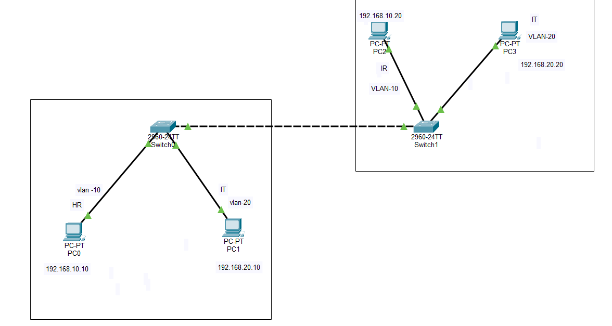
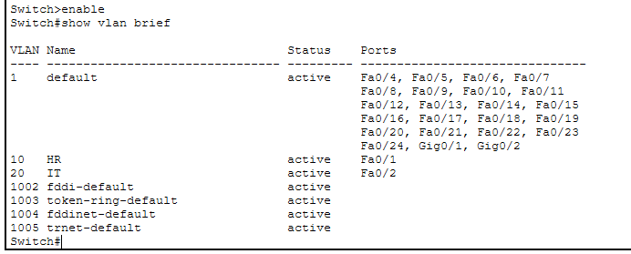

# LAB 03 — Trunking (802.1Q)

## 📌 Overview

This lab demonstrates IEEE 802.1Q VLAN trunking between two Cisco Layer 2 switches using Cisco Packet Tracer.

VLAN 10 and VLAN 20 are configured on both switches. An 802.1Q trunk link is established between the switches to carry traffic from multiple VLANs across the inter-switch connection.

---

## 🎯 Objective

The objectives of this lab are to:

* Create VLAN 10 and VLAN 20 on both switches.
* Assign end devices to the appropriate VLANs.
* Configure access ports for connected PCs.
* Configure the inter-switch link as an IEEE 802.1Q trunk.
* Allow VLAN 10 and VLAN 20 across the trunk.
* Verify VLAN configuration on both switches.
* Verify trunk operation on both switches.
* Test same-VLAN connectivity across the trunk.
* Verify Layer 2 VLAN segmentation.

---

## 🧪 Lab Environment

| Component       | Details                      |
| --------------- | ---------------------------- |
| Simulation Tool | Cisco Packet Tracer          |
| Network Devices | 2 × Cisco 2960-24TT Switches |
| Switches        | Switch0 and Switch1          |
| VLANs           | VLAN 10 and VLAN 20          |
| Trunk Protocol  | IEEE 802.1Q                  |
| Network Layer   | Layer 2                      |
| Topology        | Switch0 ↔ Switch1            |

---

## 🌐 Network Topology



### IP Addressing

| Device |    VLAN | IP Address    |
| ------ | ------: | ------------- |
| PC0    | VLAN 10 | 192.168.10.10 |
| PC2    | VLAN 10 | 192.168.10.20 |
| PC1    | VLAN 20 | 192.168.20.10 |
| PC3    | VLAN 20 | 192.168.20.20 |

### VLAN Assignment

| VLAN    | Devices  | Network         |
| ------- | -------- | --------------- |
| VLAN 10 | PC0, PC2 | 192.168.10.0/24 |
| VLAN 20 | PC1, PC3 | 192.168.20.0/24 |

---

## 🔗 Network Design

```text
                    802.1Q TRUNK
        ┌─────────────────────────────┐
        │      VLAN 10, VLAN 20       │
        │                             │
   Switch0 ======================= Switch1
      │                               │
   ┌──┴──┐                         ┌──┴──┐
   │     │                         │     │
  PC0   PC1                       PC2   PC3
 VLAN10 VLAN20                   VLAN10 VLAN20
   │     │                         │     │
 .10.10 .20.10                  .10.20 .20.20
```

---

## ⚙️ Configuration Performed

The following configurations were performed on both switches:

* VLAN 10 created.
* VLAN 20 created.
* PC-facing interfaces configured as access ports.
* VLAN 10 assigned to the appropriate access ports.
* VLAN 20 assigned to the appropriate access ports.
* Inter-switch link configured as a trunk.
* IEEE 802.1Q trunking enabled.
* VLAN 10 and VLAN 20 allowed across the trunk.
* VLAN configuration verified.
* Trunk configuration verified.
* Connectivity tested between same-VLAN devices.

---

# 1. VLAN Configuration

## Create VLAN 10

```cisco
enable
configure terminal

vlan 10
name VLAN10
exit
```

## Create VLAN 20

```cisco
vlan 20
name VLAN20
exit
```

The same VLANs were configured on both switches.

---

# 2. Access Port Configuration

Ports connected to end devices were configured as static access ports.

## VLAN 10

```cisco
interface <VLAN10-PORT>
switchport mode access
switchport access vlan 10
exit
```

## VLAN 20

```cisco
interface <VLAN20-PORT>
switchport mode access
switchport access vlan 20
exit
```

---

# 3. Trunk Configuration

The inter-switch connection was configured as an IEEE 802.1Q trunk.

```cisco
interface <INTER-SWITCH-PORT>
switchport mode trunk
switchport trunk allowed vlan 10,20
exit
```

The corresponding interface on the second switch was configured as a trunk as well.

> **Note:** The exact interface numbers depend on the ports used in the Packet Tracer topology.

---

# 4. Verification

## VLAN Verification — Switch 1

```cisco
show vlan brief
```



The output verifies the presence of VLAN 10 and VLAN 20 and their assigned access ports.

---

## VLAN Verification — Switch 2

```cisco
show vlan brief
```


Both switches should contain the required VLANs.

---

## Trunk Verification — Switch 1

```cisco
show interfaces trunk
```


The output should show the inter-switch interface operating in trunking mode with IEEE 802.1Q encapsulation.

---

## Trunk Verification — Switch 2

```cisco
show interfaces trunk
```


The trunk should be operational on the second switch as well.

---

# 5. Running Configuration Verification

## Switch 1

```cisco
show running-config
```


The configuration should include:

```cisco
switchport mode trunk
switchport trunk allowed vlan 10,20
```

---

## Switch 2

```cisco
show running-config
```


This confirms that the trunk configuration is also present on the second switch.

---

# 6. Connectivity Testing

Same-VLAN devices should be able to communicate across the trunk.

### VLAN 10

PC0:

```text
192.168.10.10
```

PC2:

```text
192.168.10.20
```

Test:

```text
ping 192.168.10.20
```

Expected result:

```text
Packets Sent: 4
Packets Received: 4
Packet Loss: 0%
```

### VLAN 20

PC1:

```text
192.168.20.10
```

PC3:

```text
192.168.20.20
```

Test:

```text
ping 192.168.20.20
```

Expected result:

```text
Packets Sent: 4
Packets Received: 4
Packet Loss: 0%
```

---

## 📸 VLAN Connectivity Test


The connectivity test demonstrates successful communication between devices belonging to the same VLAN across the trunk.

Communication between VLAN 10 and VLAN 20 is expected to fail because this is a Layer 2 switching environment without inter-VLAN routing.

---

# 7. Expected Result

After completing the configuration:

* VLAN 10 exists on both switches.
* VLAN 20 exists on both switches.
* PC-facing ports operate as access ports.
* The inter-switch link operates as an IEEE 802.1Q trunk.
* VLAN 10 traffic can cross the trunk.
* VLAN 20 traffic can cross the trunk.
* PC0 can communicate with PC2.
* PC1 can communicate with PC3.
* VLAN 10 and VLAN 20 remain logically separated.

---

# 🔐 Security and Network Design Notes

The trunk link should only be configured on interfaces intended for switch-to-switch communication.

In this lab:

```text
Switch0 ↔ Switch1
```

is the trunk connection, while PC-facing interfaces remain access ports.

Only the required VLANs are allowed on the trunk:

```cisco
switchport trunk allowed vlan 10,20
```

This reduces unnecessary VLAN propagation across the trunk.

---

# 🛠️ Skills Demonstrated

* Cisco IOS CLI
* VLAN creation
* VLAN assignment
* Access-port configuration
* IEEE 802.1Q trunking
* Inter-switch connectivity
* VLAN segmentation
* Trunk verification
* Layer 2 troubleshooting
* `show vlan brief`
* `show interfaces trunk`
* `show running-config`
* ICMP connectivity testing
* Cisco Packet Tracer

---

# 📂 Lab Files

| File                           | Description                      |
| ------------------------------ | -------------------------------- |
| `README.md`                    | Lab documentation                |
| `Lab-03-Trunking-802.1Q.pkt`   | Cisco Packet Tracer lab file     |
| `topology.png`                 | Complete network topology        |
| `vlan-verification.png`        | VLAN verification — Switch 1     |
| `vlan-verification-sw2.png`    | VLAN verification — Switch 2     |
| `trunk-verification.png`       | Trunk verification — Switch 1    |
| `trunk-verification-sw2.png`   | Trunk verification — Switch 2    |
| `trunk-running-config.png`     | Running configuration — Switch 1 |
| `trunk-running-config-sw2.png` | Running configuration — Switch 2 |
| `vlan-connectivity-test.png`   | VLAN connectivity verification   |

---

# 📚 CCNA 200-301

This lab is part of my **CCNA 200-301 Networking Lab Series**.

### Topics Covered

* VLANs
* Access Ports
* IEEE 802.1Q Trunking
* Inter-Switch Connectivity
* VLAN Segmentation
* Layer 2 Switching
* Network Verification

**Lab Status:** ✅ COMPLETED
