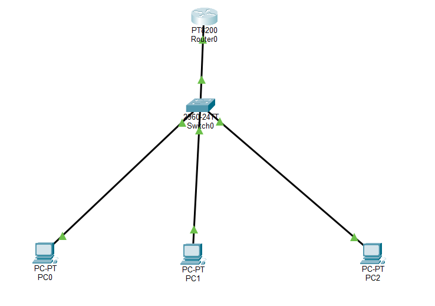
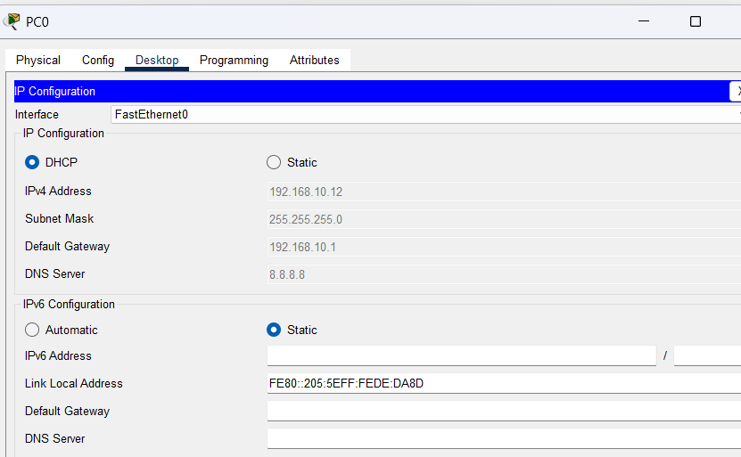
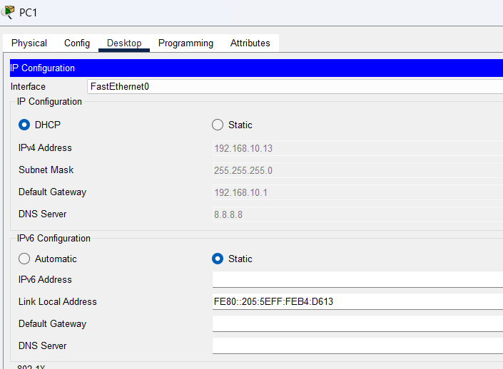
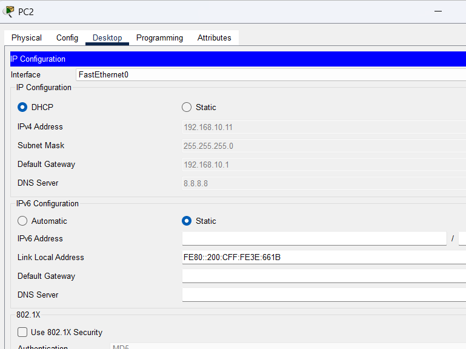
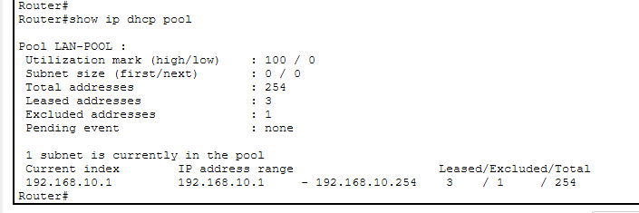
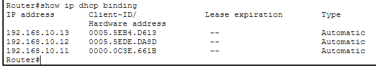
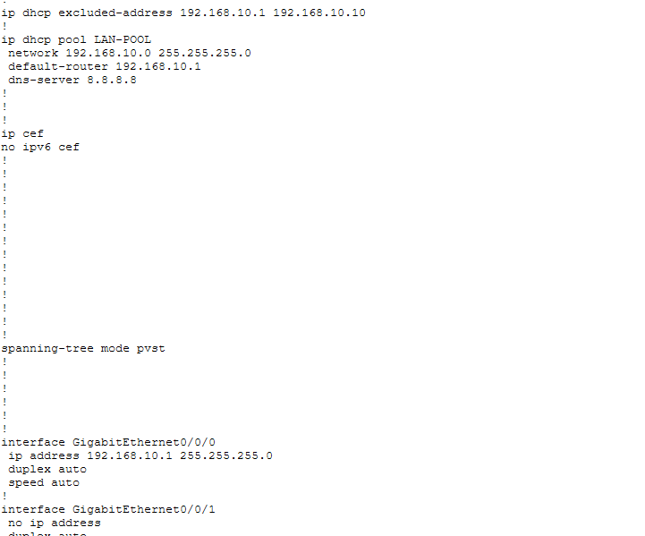
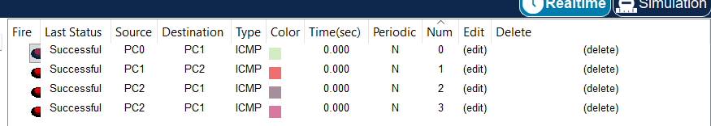

# LAB 05 — DHCP Server Using Cisco Router

## 📌 Overview

This lab demonstrates how to configure a **Cisco router as a DHCP server** using Cisco Packet Tracer.

The router automatically provides IP addressing information to PCs connected through a Cisco Layer 2 switch. The DHCP configuration includes an IP address pool, excluded addresses, default gateway, and DNS server.

The lab also verifies DHCP address assignment and connectivity between the connected PCs.

---

## 🎯 Objective

The objectives of this lab are to:

* Configure a Cisco router as a DHCP server.
* Configure a DHCP address pool.
* Configure excluded IP addresses.
* Configure the default gateway.
* Configure a DNS server.
* Configure PCs to obtain IP addresses dynamically.
* Verify DHCP pool configuration.
* Verify DHCP address bindings.
* Verify DHCP-assigned IP configuration on client PCs.
* Test connectivity between PCs using ICMP.
* Verify the router's running configuration.

---

## 🧪 Lab Environment

| Component       | Details             |
| --------------- | ------------------- |
| Simulation Tool | Cisco Packet Tracer |
| Router          | Cisco PT Router     |
| Switch          | Cisco 2960-24TT     |
| End Devices     | PC0, PC1, PC2       |
| Network Type    | Local Area Network  |
| DHCP Server     | Cisco Router        |
| Network         | 192.168.10.0/24     |
| Default Gateway | 192.168.10.1        |
| DNS Server      | 8.8.8.8             |

---

# 🌐 Network Topology



### Topology

```text
                    Router0
                 DHCP Server
                192.168.10.1
                      |
                      |
                   Switch0
                 /    |    \
               PC0   PC1   PC2
              DHCP  DHCP  DHCP
```

The Cisco router acts as the **DHCP server and default gateway** for the LAN.

---

# 🗂️ IP Addressing

| Device  | Interface | IP Address      | Assignment |
| ------- | --------- | --------------- | ---------- |
| Router0 | G0/0/0    | 192.168.10.1/24 | Static     |
| PC0     | NIC       | DHCP            | Dynamic    |
| PC1     | NIC       | DHCP            | Dynamic    |
| PC2     | NIC       | DHCP            | Dynamic    |

### DHCP Network

```text
Network:          192.168.10.0/24
Subnet Mask:      255.255.255.0
Default Gateway:  192.168.10.1
DNS Server:       8.8.8.8
```

---

# ⚙️ DHCP Configuration

## 1. Configure Excluded Addresses

The router reserves addresses `192.168.10.1` through `192.168.10.10` so that these addresses are not dynamically assigned to clients.

```cisco
ip dhcp excluded-address 192.168.10.1 192.168.10.10
```

### Reserved Range

```text
192.168.10.1 – 192.168.10.10
```

Therefore, DHCP clients can receive addresses beginning from:

```text
192.168.10.11
```

---

## 2. Configure DHCP Pool

A DHCP pool named `LAN-POOL` was configured on the router.

```cisco
ip dhcp pool LAN-POOL
 network 192.168.10.0 255.255.255.0
 default-router 192.168.10.1
 dns-server 8.8.8.8
```

### DHCP Pool Parameters

| Parameter       | Configuration                  |
| --------------- | ------------------------------ |
| Pool Name       | LAN-POOL                       |
| Network         | 192.168.10.0/24                |
| Subnet Mask     | 255.255.255.0                  |
| Default Gateway | 192.168.10.1                   |
| DNS Server      | 8.8.8.8                        |
| Excluded Range  | 192.168.10.1 – 192.168.10.10   |
| DHCP Range      | 192.168.10.11 – 192.168.10.254 |

---

# 🔹 Router Interface Configuration

The router's LAN-facing interface was configured as:

```cisco
interface GigabitEthernet0/0/0
 ip address 192.168.10.1 255.255.255.0
 duplex auto
 speed auto
```

The interface provides Layer 3 connectivity between the router and the LAN.

---

# 💻 Complete Configuration

The main configuration used in this lab:

```cisco
enable
configure terminal

ip dhcp excluded-address 192.168.10.1 192.168.10.10

ip dhcp pool LAN-POOL
 network 192.168.10.0 255.255.255.0
 default-router 192.168.10.1
 dns-server 8.8.8.8

interface GigabitEthernet0/0/0
 ip address 192.168.10.1 255.255.255.0
 no shutdown

end
```

---

# 🖥️ Configure Client PCs for DHCP

Each PC was configured to obtain its network configuration automatically.

In Cisco Packet Tracer:

```text
PC → Desktop → IP Configuration → DHCP
```

After selecting **DHCP**, the PC automatically receives:

* IP address
* Subnet mask
* Default gateway
* DNS server

---

# 📸 PC0 DHCP Configuration



PC0 successfully obtained its network configuration using DHCP.

---

# 📸 PC1 DHCP Configuration



PC1 successfully obtained its network configuration using DHCP.

---

# 📸 PC2 DHCP Configuration



PC2 successfully obtained its network configuration using DHCP.

---

# 🔎 Verification

## 1. Verify Router Interface

```cisco
show ip interface brief
```

This verifies the IP address and operational status of the router interfaces.

Expected LAN interface:

```text
GigabitEthernet0/0/0
IP Address: 192.168.10.1
```

---

## 2. Verify DHCP Pool

```cisco
show ip dhcp pool
```

This command verifies the configured DHCP pool.



The output should show the `LAN-POOL` configuration and the `192.168.10.0/24` network.

---

## 3. Verify DHCP Bindings

```cisco
show ip dhcp binding
```

This command displays the IP addresses currently leased to DHCP clients.



The DHCP binding table provides evidence that the router has assigned IP addresses to the PCs.

---

## 4. Verify Running Configuration

```cisco
show running-config
```



The running configuration was reviewed to verify:

* DHCP excluded addresses
* DHCP pool
* Network address
* Default gateway
* DNS server
* Router interface configuration

---

# 🌐 Connectivity Testing

After DHCP successfully assigned IP addresses, connectivity between the PCs was tested using **ICMP**.

### Connectivity Tests

```text
PC0 → PC1
PC1 → PC2
PC2 → PC1
PC2 → PC1
```

All configured ICMP tests were completed successfully.



### Result

**ICMP Connectivity: SUCCESSFUL ✅**

The successful tests demonstrate that the PCs received valid network configurations and can communicate across the LAN.

---

# 🔄 How DHCP Works

The DHCP process allows network clients to automatically obtain their IP configuration.

The basic DHCP process is:

```text
DHCP Discover
      ↓
DHCP Offer
      ↓
DHCP Request
      ↓
DHCP ACK
```

### 1. DHCP Discover

The client broadcasts a request to discover an available DHCP server.

### 2. DHCP Offer

The Cisco router offers an available IP address from the DHCP pool.

### 3. DHCP Request

The client requests the offered IP configuration.

### 4. DHCP ACK

The router confirms the DHCP lease and provides the client with its network configuration.

---

# 🧩 Network Design

```text
                    Cisco Router
                 DHCP Server/Gateway
                    192.168.10.1
                          |
                          |
                    192.168.10.0/24
                          |
                       Switch0
                    /      |      \
                  /        |        \
                PC0       PC1       PC2
               DHCP      DHCP      DHCP
```

The router performs two main functions:

1. **DHCP Server**
2. **Default Gateway**

The switch provides Layer 2 connectivity between the router and client PCs.

---

# 🔎 Verification Commands Summary

| Command                   | Purpose                                       |
| ------------------------- | --------------------------------------------- |
| `show ip interface brief` | Verify router interface status and IP address |
| `show ip dhcp pool`       | Verify DHCP pool configuration                |
| `show ip dhcp binding`    | View DHCP-assigned addresses                  |
| `show running-config`     | Verify active router configuration            |
| `ping 192.168.10.1`       | Test gateway connectivity                     |
| `ping <PC-IP>`            | Test PC-to-PC connectivity                    |

---

# ✅ Expected Result

After completing the lab:

* Cisco Router successfully operates as a DHCP server.
* DHCP pool `LAN-POOL` is configured.
* `192.168.10.1–192.168.10.10` are excluded from DHCP allocation.
* PC0 receives an IP address automatically.
* PC1 receives an IP address automatically.
* PC2 receives an IP address automatically.
* Clients receive the correct subnet mask.
* Clients receive `192.168.10.1` as the default gateway.
* Clients receive `8.8.8.8` as the DNS server.
* DHCP bindings are visible on the router.
* PC-to-PC ICMP connectivity is successful.
* The complete configuration can be verified using Cisco IOS commands.

---

# 🛠️ Skills Demonstrated

* Cisco IOS CLI
* DHCP server configuration
* DHCP pool configuration
* DHCP excluded addresses
* IP addressing
* Subnetting
* Default gateway configuration
* DNS configuration
* Cisco router configuration
* Cisco switch connectivity
* Dynamic IP address assignment
* DHCP troubleshooting
* ICMP connectivity testing
* Cisco Packet Tracer
* Network verification

---

# 📂 Lab Files

| File                        | Description                        |
| --------------------------- | ---------------------------------- |
| `README.md`                 | Lab documentation                  |
| `Lab-05-DHCP-Server.pkt`    | Cisco Packet Tracer lab            |
| `topology.png`              | Network topology                   |
| `router-running-config.png` | Router running configuration       |
| `dhcp-pool.png`             | DHCP pool verification             |
| `dhcp-binding.png`          | DHCP binding verification          |
| `pc0-ip-configuration.png`  | PC0 DHCP IP configuration          |
| `pc1-ip-configuration.png`  | PC1 DHCP IP configuration          |
| `pc2-ip-configuration.png`  | PC2 DHCP IP configuration          |
| `connectivity-test.png`     | Successful ICMP connectivity tests |

---

# 🔐 Security Considerations

This lab is designed for a simulated CCNA networking environment.

For production networks, additional security controls should be considered, including:

* DHCP Snooping
* Dynamic ARP Inspection
* Port Security
* VLAN Segmentation
* Access Control Lists
* Secure device management
* Configuration backups

Do not publish real passwords, private keys, API keys, authentication tokens, or other sensitive information in the GitHub repository.

---

# 📚 CCNA 200-301

This lab is part of my **CCNA 200-301 Practical Networking Lab Series**.

### Topics Covered

* DHCP
* Cisco IOS
* IP Addressing
* Subnetting
* DHCP Address Allocation
* Default Gateway
* DNS
* Router Configuration
* Layer 2 Switching
* Network Troubleshooting
* ICMP Connectivity
* Cisco Packet Tracer

---

## 🏁 Lab Status

**COMPLETED ✅**
